# DeepAgents 项目深度分析文档

## 目录
- [1. 项目概览](#1-项目概览)
- [2. 核心架构](#2-核心架构)
- [3. 技术实现](#3-技术实现)
- [4. API 接口](#4-api-接口)
- [5. 中间件系统](#5-中间件系统)
- [6. 工具生态](#6-工具生态)
- [7. 使用示例](#7-使用示例)
- [8. 最佳实践](#8-最佳实践)
- [9. 技术特色](#9-技术特色)
- [10. 部署指南](#10-部署指南)

## 1. 项目概览

### 1.1 项目简介
**DeepAgents** 是一个基于 LangGraph 构建的 Python 包，专门用于创建能够处理复杂、多步骤任务的"深度智能体"。该项目解决了传统 LLM 智能体在处理长期任务时的"浅层"问题。

### 1.2 核心理念
- **深度规划**: 通过内置规划工具实现复杂任务分解
- **上下文隔离**: 利用子智能体避免上下文污染
- **文件系统抽象**: 提供虚拟文件系统支持
- **模块化设计**: 基于中间件的可扩展架构

### 1.3 项目统计
```
- 代码行数: 1,454 行 Python 代码
- 版本: 0.0.9
- Python 版本: >= 3.11
- 许可证: MIT
- 主要依赖: LangGraph, LangChain, LangChain-Anthropic
```

## 2. 核心架构

### 2.1 用户输入处理流程

#### 2.1.1 整体处理流程状态图

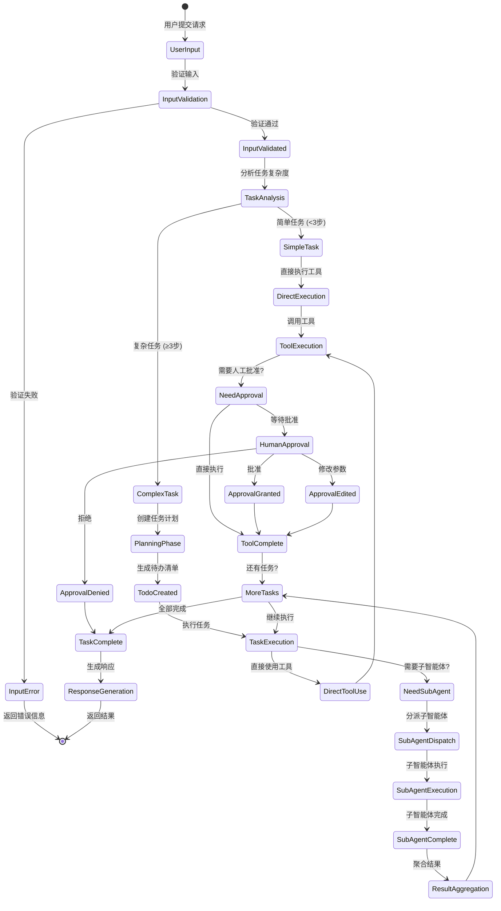

#### 2.1.2 子智能体执行详细流程

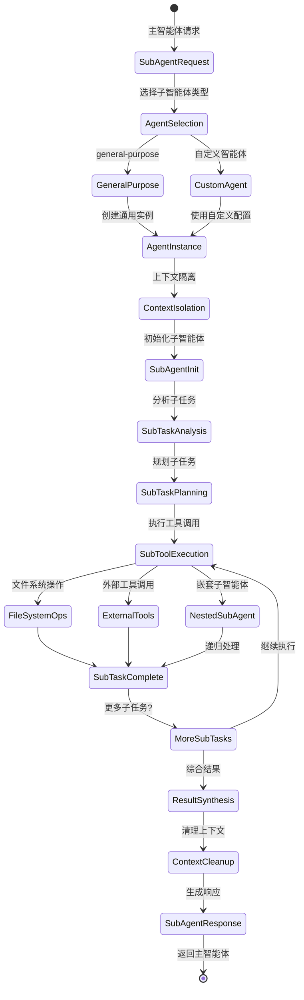

#### 2.1.3 中间件处理流程

```mermaid
stateDiagram-v2
    [*] --> MiddlewareEntry : 进入中间件链
    
    MiddlewareEntry --> PlanningMiddleware : 规划中间件
    PlanningMiddleware --> PlanningCheck : 检查是否需要规划
    PlanningCheck --> AddPlanningTools : 添加规划工具
    PlanningCheck --> FilesystemMiddleware : 跳过规划
    
    AddPlanningTools --> FilesystemMiddleware : 文件系统中间件
    FilesystemMiddleware --> AddFileTools : 添加文件工具
    AddFileTools --> SubAgentMiddleware : 子智能体中间件
    
    SubAgentMiddleware --> RegisterSubAgents : 注册子智能体
    RegisterSubAgents --> SummarizationMiddleware : 总结中间件
    
    SummarizationMiddleware --> TokenCheck : 检查token使用量
    TokenCheck --> TriggerSummary : 触发总结 (>120k tokens)
    TokenCheck --> CachingMiddleware : 跳过总结
    
    TriggerSummary --> GenerateSummary : 生成上下文总结
    GenerateSummary --> CachingMiddleware : 缓存中间件
    
    CachingMiddleware --> CheckCache : 检查提示缓存
    CheckCache --> UseCache : 使用缓存
    CheckCache --> HITLMiddleware : 跳过缓存
    
    UseCache --> HITLMiddleware : 人机协作中间件
    HITLMiddleware --> CheckInterrupts : 检查中断配置
    CheckInterrupts --> SetupInterrupts : 设置中断点
    CheckInterrupts --> CustomMiddleware : 无中断配置
    
    SetupInterrupts --> CustomMiddleware : 自定义中间件
    CustomMiddleware --> ProcessCustom : 处理自定义逻辑
    ProcessCustom --> ModelRequest : 生成模型请求
    
    ModelRequest --> [*] : 传递给智能体执行
```

#### 2.1.4 文件系统操作流程

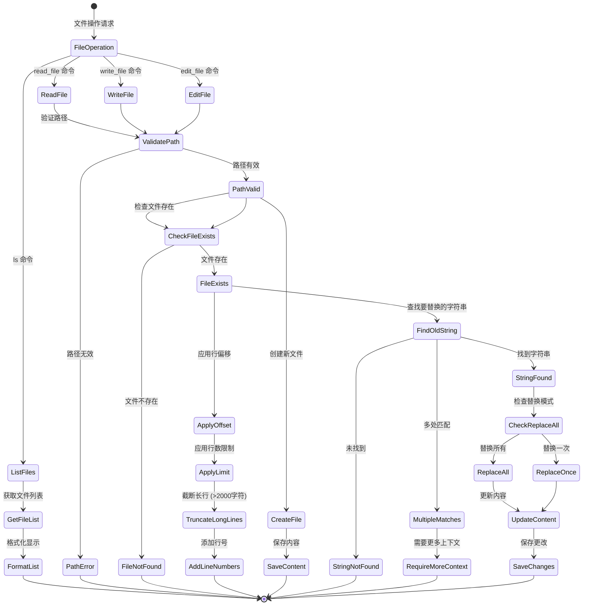

### 2.2 四大核心组件

#### 2.1.1 规划工具 (Planning Tool)
```python
# 基于待办事项的任务规划
write_todos(todos: list[dict])
```
- 支持任务状态管理：pending, in_progress, completed
- 实时进度跟踪
- 动态任务调整

#### 2.1.2 子智能体 (Sub Agents)
```python
# 标准子智能体配置
SubAgent = {
    "name": str,
    "description": str, 
    "prompt": str,
    "tools": List[BaseTool],  # 可选
    "model": Union[LanguageModelLike, dict],  # 可选
    "middleware": List[AgentMiddleware]  # 可选
}

# 自定义子智能体
CustomSubAgent = {
    "name": str,
    "description": str,
    "graph": Runnable
}
```

#### 2.1.3 虚拟文件系统
```python
# 文件系统工具
ls()                    # 列出文件
read_file(file_path)    # 读取文件
write_file(file_path, content)  # 写入文件
edit_file(file_path, old_string, new_string)  # 编辑文件
```

#### 2.1.4 系统提示优化
- 基于 Claude Code 的详细提示词
- 针对不同组件的专门指令
- 动态提示组合机制

### 2.3 架构层次图

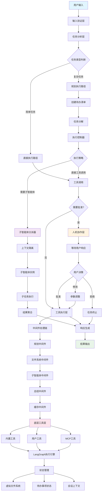

### 2.4 数据流架构

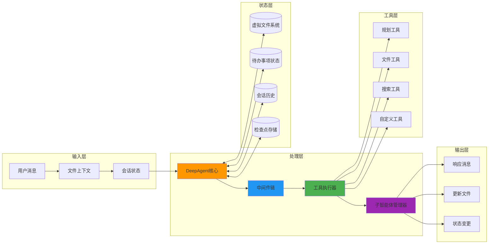

## 3. 技术实现

### 3.1 项目结构

```
src/deepagents/
├── __init__.py          # API 导出入口 (6 行)
├── graph.py             # 核心智能体构建逻辑 (142 行)
├── middleware.py        # 中间件实现 (199 行)
├── prompts.py           # 系统提示词库 (435 行)
├── tools.py             # 内置工具实现 (约200 行)
├── types.py             # 类型定义 (21 行)
├── model.py             # 模型配置 (约50 行)
└── state.py             # 状态管理 (约100 行)

examples/
└── research/
    ├── research_agent.py  # 研究智能体示例 (166 行)
    └── requirements.txt   # 示例依赖

tests/
├── test_deepagents.py   # 主要测试 (约200 行)
├── test_hitl.py         # 人机协作测试
├── test_middleware.py   # 中间件测试
└── utils.py             # 测试工具
```

### 3.2 核心类设计

#### 3.2.1 智能体构建器
```python
def agent_builder(
    tools: Sequence[Union[BaseTool, Callable, dict[str, Any]]],
    instructions: str,
    middleware: Optional[list[AgentMiddleware]] = None,
    tool_configs: Optional[dict[str, bool | ToolConfig]] = None,
    model: Optional[Union[str, LanguageModelLike]] = None,
    subagents: Optional[list[SubAgent | CustomSubAgent]] = None,
    context_schema: Optional[Type[Any]] = None,
    checkpointer: Optional[Checkpointer] = None,
    is_async: bool = False,
) -> Agent
```

#### 3.2.2 中间件基类
```python
class AgentMiddleware:
    state_schema: Optional[Type] = None
    tools: List[BaseTool] = []
    
    def modify_model_request(self, request: ModelRequest, agent_state: AgentState) -> ModelRequest:
        pass
```

### 3.3 状态管理

#### 3.3.1 规划状态
```python
class PlanningState(TypedDict):
    todos: NotRequired[list[dict]]
```

#### 3.3.2 文件系统状态  
```python
class FilesystemState(TypedDict):
    files: NotRequired[dict[str, str]]
```

## 4. API 接口

### 4.1 主要 API

#### 4.1.1 创建深度智能体
```python
from deepagents import create_deep_agent

# 基础用法
agent = create_deep_agent(
    tools=[your_tools],
    instructions="你是一个专业的研究助手..."
)

# 高级配置
agent = create_deep_agent(
    tools=[search_tool, analysis_tool],
    instructions=research_instructions,
    model="claude-sonnet-4-20250514",
    subagents=[research_subagent, critique_subagent],
    middleware=[custom_middleware],
    tool_configs={
        "sensitive_tool": {
            "allow_accept": True,
            "allow_respond": True, 
            "allow_edit": True
        }
    },
    checkpointer=checkpointer
)
```

#### 4.1.2 异步版本
```python
from deepagents import async_create_deep_agent

# 用于异步工具和 MCP 集成
agent = async_create_deep_agent(
    tools=async_tools,
    instructions=instructions,
    subagents=subagents
)
```

### 4.2 调用方式

#### 4.2.1 同步调用
```python
result = agent.invoke({
    "messages": [{"role": "user", "content": "请帮我研究量子计算的发展趋势"}],
    "files": {"context.txt": "相关背景资料..."}
})

# 访问结果
final_files = result["files"]
conversation = result["messages"]
```

#### 4.2.2 流式调用
```python
for chunk in agent.stream(
    {"messages": [{"role": "user", "content": "创建项目计划"}]},
    stream_mode="values"
):
    if "messages" in chunk:
        chunk["messages"][-1].pretty_print()
```

#### 4.2.3 异步流式调用
```python
async for chunk in agent.astream(
    {"messages": [{"role": "user", "content": "分析市场数据"}]},
    stream_mode="values"
):
    if "messages" in chunk:
        print(chunk["messages"][-1].content)
```

## 5. 中间件系统

### 5.1 内置中间件

#### 5.1.1 规划中间件
```python
class PlanningMiddleware(AgentMiddleware):
    state_schema = PlanningState
    tools = [write_todos]

    def modify_model_request(self, request: ModelRequest, agent_state: PlanningState) -> ModelRequest:
        request.system_prompt = request.system_prompt + "\n\n" + WRITE_TODOS_SYSTEM_PROMPT
        return request
```

**功能特点:**
- 添加待办事项管理能力
- 任务状态跟踪：pending → in_progress → completed
- 智能任务分解建议
- 进度可视化

#### 5.1.2 文件系统中间件
```python
class FilesystemMiddleware(AgentMiddleware):
    state_schema = FilesystemState
    tools = [ls, read_file, write_file, edit_file]
```

**功能特点:**
- 虚拟文件系统实现
- 基于状态的文件存储
- 多实例隔离
- 文件操作历史记录

#### 5.1.3 子智能体中间件
```python
class SubAgentMiddleware(AgentMiddleware):
    def __init__(self, default_subagent_tools, subagents, model, is_async=False):
        task_tool = create_task_tool(...)
        self.tools = [task_tool]
```

**功能特点:**
- 子智能体生命周期管理
- 上下文隔离机制
- 并行执行支持
- 结果聚合处理

### 5.2 高级中间件

#### 5.2.1 总结中间件
```python
SummarizationMiddleware(
    model=model,
    max_tokens_before_summary=120000,
    messages_to_keep=20,
)
```

#### 5.2.2 提示缓存中间件
```python
AnthropicPromptCachingMiddleware(
    ttl="5m", 
    unsupported_model_behavior="ignore"
)
```

#### 5.2.3 人机协作中间件
```python
HumanInTheLoopMiddleware(
    interrupt_on={
        "critical_tool": True,
        "file_delete": {
            "allow_accept": True,
            "allow_respond": True,
            "allow_edit": False
        }
    }
)
```

### 5.3 自定义中间件

```python
class CustomMiddleware(AgentMiddleware):
    state_schema = CustomState
    tools = [custom_tool]
    
    def modify_model_request(self, request: ModelRequest, agent_state: CustomState) -> ModelRequest:
        # 自定义逻辑
        request.system_prompt += "\n\n" + CUSTOM_INSTRUCTIONS
        return request
        
    def pre_model_hook(self, request: ModelRequest, agent_state: AgentState) -> ModelRequest:
        # 模型调用前处理
        pass
        
    def post_model_hook(self, response: ModelResponse, agent_state: AgentState) -> ModelResponse:
        # 模型调用后处理
        pass
```

## 6. 工具生态

### 6.1 内置工具详解

#### 6.1.1 待办事项工具
```python
@tool
def write_todos(todos: List[Dict[str, Any]]) -> str:
    """
    创建和管理结构化任务列表
    
    Args:
        todos: 任务列表，每个任务包含：
            - task: 任务描述
            - status: 'pending' | 'in_progress' | 'completed'
            - priority: 'high' | 'medium' | 'low' (可选)
    """
```

**使用场景:**
- 复杂多步骤任务规划
- 进度跟踪和可视化
- 任务依赖管理
- 动态计划调整

#### 6.1.2 文件系统工具

```python
@tool
def ls() -> str:
    """列出虚拟文件系统中的所有文件"""

@tool  
def read_file(file_path: str, line_offset: int = 0, limit: int = 2000) -> str:
    """
    读取文件内容
    
    Args:
        file_path: 文件路径
        line_offset: 起始行号
        limit: 读取行数限制
    """

@tool
def write_file(file_path: str, content: str) -> str:
    """写入文件内容"""

@tool
def edit_file(file_path: str, old_string: str, new_string: str, replace_all: bool = False) -> str:
    """
    编辑文件内容
    
    Args:
        file_path: 文件路径
        old_string: 要替换的内容
        new_string: 新内容
        replace_all: 是否替换所有匹配项
    """
```

#### 6.1.3 子智能体调用工具

```python
@tool
def task(description: str, subagent_type: str) -> Command:
    """
    启动子智能体处理独立任务
    
    Args:
        description: 任务详细描述
        subagent_type: 子智能体类型 ('general-purpose' 或自定义类型)
    
    Returns:
        Command: 包含子智能体执行结果的命令对象
    """
```

### 6.2 工具集成模式

#### 6.2.1 LangChain 工具集成
```python
from langchain.tools import DuckDuckGoSearchRun
from langchain_community.tools import ShellTool

# 直接使用 LangChain 工具
search_tool = DuckDuckGoSearchRun()
shell_tool = ShellTool()

agent = create_deep_agent(
    tools=[search_tool, shell_tool],
    instructions="你可以搜索和执行命令..."
)
```

#### 6.2.2 自定义函数工具
```python
def analyze_data(data: str, method: str = "statistical") -> str:
    """分析数据并返回结果"""
    # 实现数据分析逻辑
    return f"使用 {method} 方法分析的结果..."

agent = create_deep_agent(
    tools=[analyze_data],  # 自动转换为工具
    instructions="你是数据分析专家..."
)
```

#### 6.2.3 MCP 工具集成
```python
from langchain_mcp_adapters.client import MultiServerMCPClient
from deepagents import async_create_deep_agent

async def setup_mcp_agent():
    # 连接 MCP 服务器
    mcp_client = MultiServerMCPClient(
        servers=[
            {"name": "filesystem", "command": "npx", "args": ["-y", "@modelcontextprotocol/server-filesystem", "/path/to/dir"]},
            {"name": "brave-search", "env": {"BRAVE_API_KEY": "your-key"}}
        ]
    )
    
    # 获取 MCP 工具
    mcp_tools = await mcp_client.get_tools()
    
    # 创建异步智能体
    agent = async_create_deep_agent(
        tools=mcp_tools,
        instructions="你可以访问文件系统和搜索..."
    )
    
    return agent
```

## 7. 使用示例

### 7.1 研究智能体示例

#### 7.1.1 研究智能体执行流程图

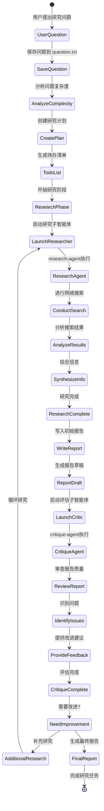

#### 7.1.2 多主题并行研究流程

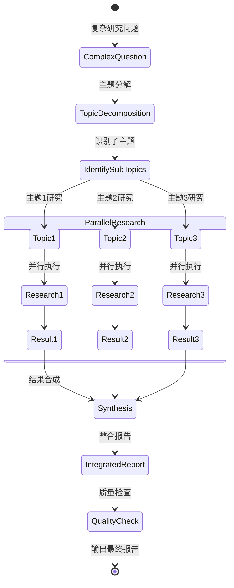

#### 7.1.3 代码实现示例

```python
import os
from typing import Literal
from tavily import TavilyClient
from deepagents import create_deep_agent

# 初始化搜索客户端
tavily_client = TavilyClient(api_key=os.environ["TAVILY_API_KEY"])

def internet_search(
    query: str,
    max_results: int = 5,
    topic: Literal["general", "news", "finance"] = "general",
    include_raw_content: bool = False,
) -> dict:
    """执行网络搜索"""
    return tavily_client.search(
        query=query,
        max_results=max_results,
        include_raw_content=include_raw_content,
        topic=topic,
    )

# 定义子智能体
research_subagent = {
    "name": "research-agent",
    "description": "专门用于深度研究复杂问题",
    "prompt": """你是专业研究员。请进行彻底研究并提供详细答案。
    只有你的最终答案会传递给用户，所以确保答案完整详细。""",
    "tools": [internet_search],
}

critique_subagent = {
    "name": "critique-agent", 
    "description": "用于评估和改进研究报告质量",
    "prompt": """你是专业编辑。请评估报告质量并提出改进建议。
    检查报告的完整性、准确性和结构。""",
}

# 主智能体指令
research_instructions = """你是专业研究专家，负责进行深入研究并撰写高质量报告。

工作流程:
1. 将用户问题保存到 `question.txt`
2. 使用 research-agent 进行深度研究  
3. 将研究结果写入 `final_report.md`
4. 使用 critique-agent 评估报告质量
5. 根据评估结果优化报告

报告要求:
- 使用 Markdown 格式
- 包含详细的章节结构
- 提供准确的引用和来源
- 确保内容全面深入
"""

# 创建智能体
agent = create_deep_agent(
    tools=[internet_search],
    instructions=research_instructions,
    subagents=[research_subagent, critique_subagent],
).with_config({"recursion_limit": 1000})

# 使用智能体
result = agent.invoke({
    "messages": [{"role": "user", "content": "请研究人工智能在医疗诊断中的应用现状和发展趋势"}]
})

# 获取研究报告
final_report = result["files"].get("final_report.md", "")
print(f"研究报告:\n{final_report}")
```

### 7.2 代码分析智能体

#### 7.2.1 代码分析流程图

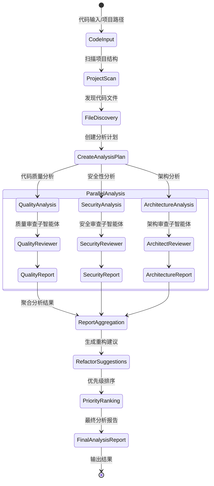

#### 7.2.2 工具调用流程

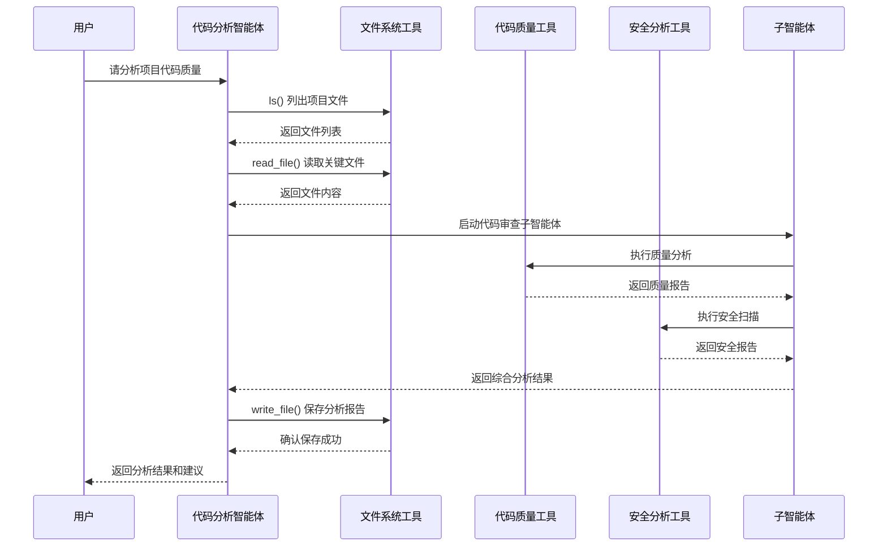

#### 7.2.3 代码实现示例

```python
from deepagents import create_deep_agent
import subprocess

def run_code_analysis(file_path: str, analysis_type: str = "quality") -> str:
    """运行代码分析工具"""
    if analysis_type == "quality":
        result = subprocess.run(['pylint', file_path], capture_output=True, text=True)
        return f"质量分析结果:\n{result.stdout}\n{result.stderr}"
    elif analysis_type == "security":
        result = subprocess.run(['bandit', file_path], capture_output=True, text=True)  
        return f"安全分析结果:\n{result.stdout}\n{result.stderr}"

def search_codebase(pattern: str, file_types: str = "*.py") -> str:
    """搜索代码库"""
    result = subprocess.run(['grep', '-r', pattern, '--include', file_types, '.'], 
                          capture_output=True, text=True)
    return f"搜索结果:\n{result.stdout}"

# 代码审查子智能体
code_reviewer = {
    "name": "code-reviewer",
    "description": "专业代码审查，检查代码质量、安全性和最佳实践",
    "prompt": """你是资深代码审查专家。请仔细审查代码并提供:
    1. 代码质量评估
    2. 潜在安全问题
    3. 性能优化建议
    4. 最佳实践建议
    """,
    "tools": [run_code_analysis],
}

# 重构建议子智能体  
refactor_advisor = {
    "name": "refactor-advisor",
    "description": "提供代码重构建议和实现方案",
    "prompt": """你是代码重构专家。请分析代码并提供:
    1. 重构机会识别
    2. 具体重构方案
    3. 重构优先级
    4. 风险评估
    """,
}

code_analysis_instructions = """你是代码分析专家，帮助开发者改进代码质量。

分析流程:
1. 使用 ls 查看项目结构
2. 读取关键文件了解代码架构
3. 使用 code-reviewer 进行质量和安全审查
4. 使用 refactor-advisor 提供重构建议  
5. 将分析结果整理到 `analysis_report.md`
6. 将具体建议保存到 `recommendations.md`

你有以下工具:
- 文件系统操作 (ls, read_file, write_file, edit_file)
- 代码分析工具 (run_code_analysis, search_codebase)
- 专业子智能体 (code-reviewer, refactor-advisor)
"""

# 创建代码分析智能体
code_agent = create_deep_agent(
    tools=[run_code_analysis, search_codebase],
    instructions=code_analysis_instructions,
    subagents=[code_reviewer, refactor_advisor]
)
```

### 7.3 人机协作示例

#### 7.3.1 人机协作决策流程

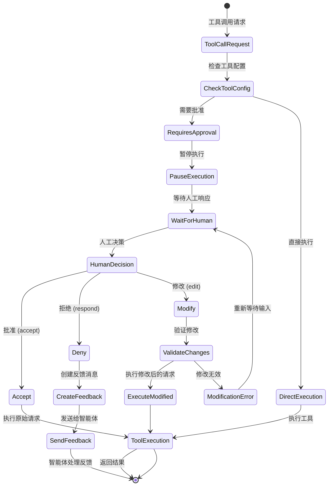

#### 7.3.2 批准类型和处理方式

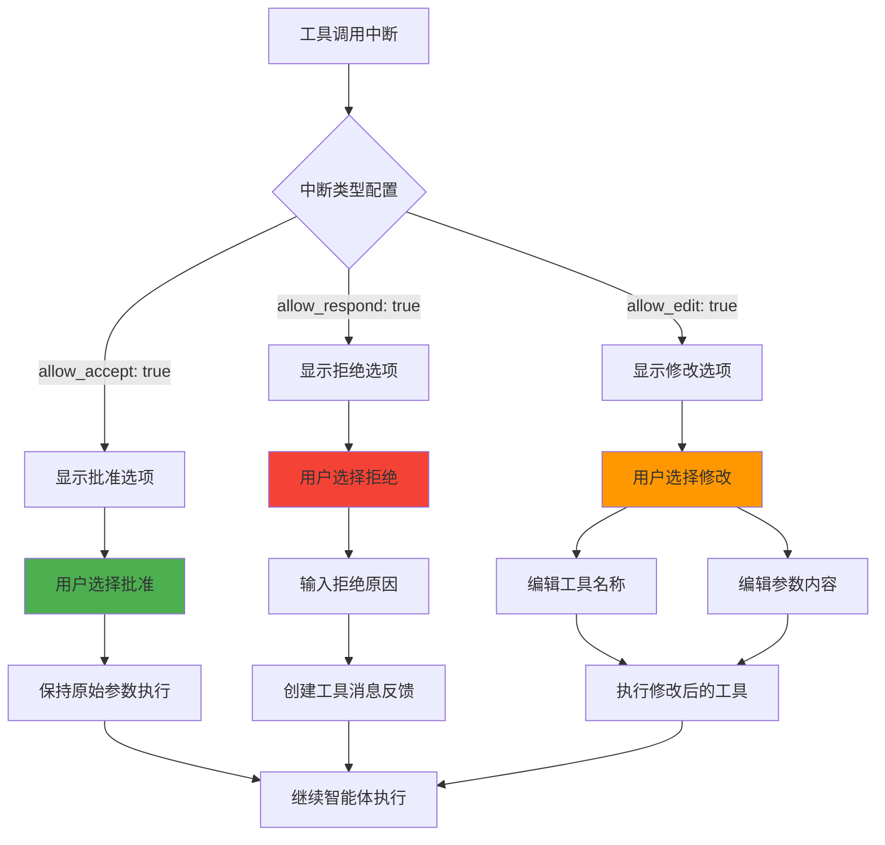

#### 7.3.3 实际使用场景流程

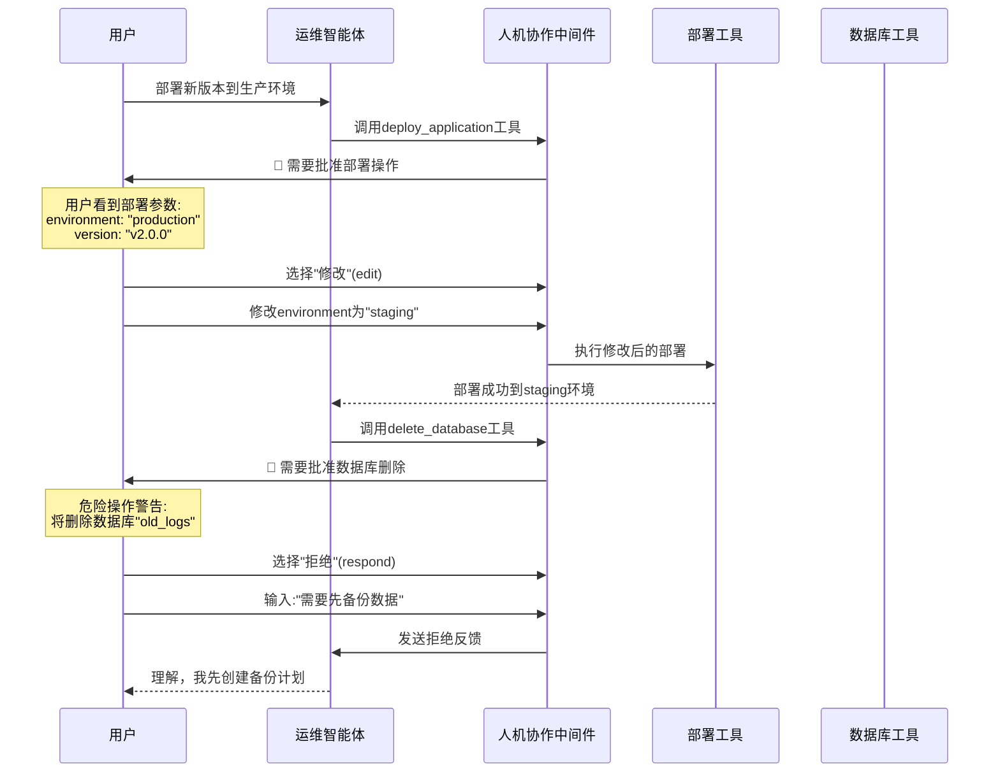

#### 7.3.4 代码实现示例

```python
from deepagents import create_deep_agent
from langgraph.checkpoint.memory import InMemorySaver
from langgraph.types import Command

def deploy_application(environment: str, version: str) -> str:
    """部署应用到指定环境"""
    # 实际部署逻辑
    return f"应用版本 {version} 已部署到 {environment} 环境"

def delete_database(database_name: str) -> str:
    """删除数据库 - 危险操作"""
    return f"数据库 {database_name} 已删除"

# 配置需要人工审批的工具
tool_configs = {
    "deploy_application": {
        "allow_accept": True,    # 允许直接批准
        "allow_respond": True,   # 允许拒绝并提供反馈
        "allow_edit": True,      # 允许修改参数后执行
    },
    "delete_database": True,     # 简化配置，等同于上面的完整配置
}

# 创建需要人工审批的智能体
ops_agent = create_deep_agent(
    tools=[deploy_application, delete_database],
    instructions="你是运维专家，负责应用部署和数据库管理。",
    tool_configs=tool_configs
)

# 添加检查点以支持人机协作
checkpointer = InMemorySaver()
ops_agent.checkpointer = checkpointer

# 使用智能体
config = {"configurable": {"thread_id": "ops-session-1"}}

# 发起可能需要审批的操作
for chunk in ops_agent.stream(
    {"messages": [{"role": "user", "content": "部署新版本到生产环境"}]}, 
    config=config
):
    print(chunk)
    # 如果遇到需要审批的操作，流会暂停

# 人工审批 - 批准操作
for chunk in ops_agent.stream(
    Command(resume=[{"type": "accept"}]), 
    config=config
):
    print(chunk)

# 人工审批 - 修改参数后执行
for chunk in ops_agent.stream(
    Command(resume=[{
        "type": "edit", 
        "args": {
            "action": "deploy_application",
            "args": {"environment": "staging", "version": "v1.2.0"}
        }
    }]), 
    config=config
):
    print(chunk)

# 人工审批 - 拒绝并提供反馈
for chunk in ops_agent.stream(
    Command(resume=[{
        "type": "respond", 
        "args": "部署被拒绝：需要先完成安全审查"
    }]), 
    config=config
):
    print(chunk)
```

## 8. 最佳实践

### 8.1 智能体设计原则

#### 8.1.1 任务分解决策流程

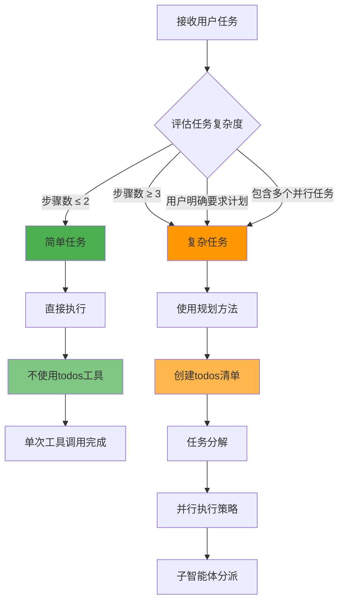

#### 8.1.2 子智能体选择策略

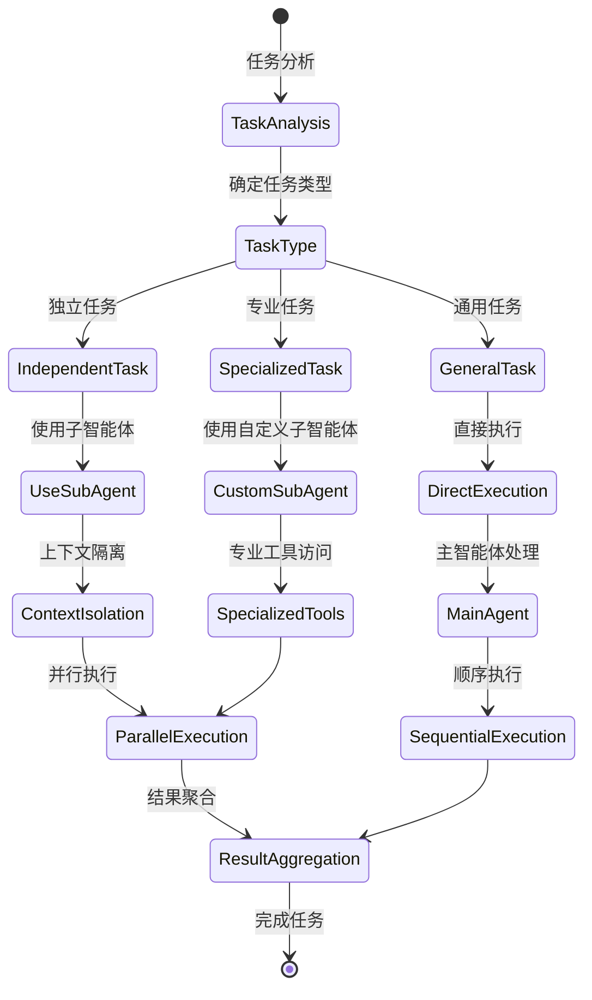

#### 8.1.1 任务分解原则
```python
# ✅ 好的做法：明确的任务分解
research_subagent = {
    "name": "market-researcher", 
    "description": "专门研究单一市场或行业，一次只处理一个研究主题",
    "prompt": "专注研究指定的单一主题，提供深入详细的分析..."
}

# ❌ 避免：过于宽泛的任务定义  
avoid_this = {
    "name": "everything-agent",
    "description": "处理所有类型的任务", 
    "prompt": "你可以做任何事情..."
}
```

#### 8.1.2 上下文管理
```python
# ✅ 利用子智能体进行上下文隔离
def complex_analysis_workflow():
    # 每个分析任务使用独立的子智能体
    financial_analysis = await agent.invoke_subagent(
        "financial-analyst",
        "分析公司Q3财务报表"
    )
    
    market_analysis = await agent.invoke_subagent(
        "market-analyst", 
        "分析行业竞争态势"
    )
    
    # 在主线程中合并结果
    return combine_analyses(financial_analysis, market_analysis)
```

#### 8.1.3 工具使用策略
```python
# ✅ 合理使用待办事项工具
def should_use_todos(task_description: str) -> bool:
    """判断是否需要使用待办事项工具"""
    # 超过3个步骤的复杂任务
    steps_count = estimate_steps(task_description)
    if steps_count > 3:
        return True
        
    # 用户明确要求计划
    if "计划" in task_description or "步骤" in task_description:
        return True
        
    # 多个并行任务
    if "同时" in task_description or "并行" in task_description:
        return True
        
    return False

# ❌ 避免：为简单任务创建待办事项
# 单步操作不需要待办事项管理
simple_task = "打印Hello World"  # 直接执行，不要使用todos
```

### 8.2 性能优化

#### 8.2.1 并行执行
```python
# ✅ 最大化并行执行
async def parallel_research():
    # 同时启动多个独立的研究任务
    tasks = [
        agent.task("研究AI在医疗中的应用", "research-agent"),
        agent.task("研究AI在金融中的应用", "research-agent"), 
        agent.task("研究AI在教育中的应用", "research-agent"),
    ]
    
    # 等待所有任务完成
    results = await asyncio.gather(*tasks)
    return combine_research_results(results)
```

#### 8.2.2 缓存策略
```python
# 配置提示缓存以提高性能
agent = create_deep_agent(
    tools=tools,
    instructions=instructions,
    middleware=[
        # Anthropic 提示缓存，5分钟 TTL
        AnthropicPromptCachingMiddleware(
            ttl="5m", 
            unsupported_model_behavior="ignore"
        )
    ]
)
```

#### 8.2.3 上下文管理
```python
# 配置自动上下文总结
SummarizationMiddleware(
    model=model,
    max_tokens_before_summary=120000,  # 12万token后触发总结
    messages_to_keep=20,               # 保留最近20条消息
)
```

### 8.3 错误处理

#### 8.3.1 工具错误处理
```python
def robust_search_tool(query: str) -> str:
    """带错误处理的搜索工具"""
    try:
        result = tavily_client.search(query)
        if not result.get('results'):
            return f"搜索'{query}'未找到相关结果，请尝试其他关键词"
        return format_search_results(result)
        
    except Exception as e:
        return f"搜索失败: {str(e)}。请检查网络连接或稍后重试。"
```

#### 8.3.2 子智能体错误恢复
```python
def create_resilient_subagent():
    return {
        "name": "resilient-researcher",
        "description": "具备错误恢复能力的研究智能体",
        "prompt": """你是研究专家。如果遇到错误:
        1. 尝试替代方案
        2. 简化查询条件  
        3. 使用备用数据源
        4. 在报告中说明限制条件
        
        始终提供有价值的结果，即使信息不完整。""",
        "tools": [primary_search, backup_search, local_search]
    }
```

### 8.4 安全最佳实践

#### 8.4.1 敏感操作控制
```python
# 为敏感操作配置人工审批
sensitive_tools = {
    "execute_system_command": {
        "allow_accept": False,    # 不允许直接批准
        "allow_respond": True,    # 允许拒绝
        "allow_edit": True,       # 允许修改参数
    },
    "delete_files": {
        "allow_accept": True,
        "allow_respond": True, 
        "allow_edit": False,      # 不允许修改删除操作
    }
}
```

#### 8.4.2 输入验证
```python
def validated_file_operation(file_path: str, operation: str) -> str:
    """验证文件操作的安全性"""
    # 路径验证
    if ".." in file_path or file_path.startswith("/"):
        return "错误：不允许访问父目录或绝对路径"
    
    # 文件类型验证
    allowed_extensions = {'.txt', '.md', '.json', '.csv'}
    if not any(file_path.endswith(ext) for ext in allowed_extensions):
        return f"错误：不支持的文件类型。允许的类型: {allowed_extensions}"
    
    # 执行操作
    return perform_file_operation(file_path, operation)
```

## 9. 技术特色

### 9.1 提示工程

#### 9.1.1 分层提示设计
```python
# 基础智能体提示
BASE_AGENT_PROMPT = """
你有访问标准工具来完成用户目标。
"""

# 组件特定提示
WRITE_TODOS_SYSTEM_PROMPT = """## `write_todos`
你可以使用 `write_todos` 工具管理复杂目标...
"""

FILESYSTEM_SYSTEM_PROMPT = """## 文件系统工具 
你可以使用 ls, read_file, write_file, edit_file...
"""

# 最终组合
final_prompt = instructions + "\n\n" + BASE_AGENT_PROMPT + component_prompts
```

#### 9.1.2 动态提示组合
```python
def build_dynamic_prompt(base_instructions: str, middleware_list: List[AgentMiddleware]) -> str:
    """根据中间件动态构建提示"""
    prompt_parts = [base_instructions, BASE_AGENT_PROMPT]
    
    for middleware in middleware_list:
        if hasattr(middleware, 'system_prompt'):
            prompt_parts.append(middleware.system_prompt)
    
    return "\n\n".join(prompt_parts)
```

### 9.2 状态管理创新

#### 9.2.1 虚拟文件系统
```python
class VirtualFileSystem:
    """基于状态的虚拟文件系统"""
    
    def __init__(self, state: dict):
        self.files = state.get("files", {})
    
    def read(self, path: str, line_offset: int = 0, limit: int = 2000) -> str:
        """模拟文件读取"""
        content = self.files.get(path, "")
        lines = content.split('\n')
        
        start = line_offset
        end = min(start + limit, len(lines))
        
        numbered_lines = []
        for i, line in enumerate(lines[start:end], start + 1):
            # 截断过长的行
            if len(line) > 2000:
                line = line[:2000] + "..."
            numbered_lines.append(f"{i:4d}\t{line}")
        
        return '\n'.join(numbered_lines)
    
    def write(self, path: str, content: str) -> str:
        """模拟文件写入"""
        self.files[path] = content
        return f"已写入文件: {path}"
    
    def edit(self, path: str, old_str: str, new_str: str, replace_all: bool = False) -> str:
        """模拟文件编辑"""
        if path not in self.files:
            return f"错误：文件 {path} 不存在"
        
        content = self.files[path]
        
        if replace_all:
            updated_content = content.replace(old_str, new_str)
        else:
            # 确保old_str唯一
            occurrences = content.count(old_str)
            if occurrences == 0:
                return f"错误：未找到要替换的内容"
            elif occurrences > 1:
                return f"错误：找到{occurrences}处匹配，请提供更具体的上下文"
            
            updated_content = content.replace(old_str, new_str, 1)
        
        self.files[path] = updated_content
        return f"已编辑文件: {path}"
```

#### 9.2.2 状态持久化
```python
def create_persistent_agent(session_id: str):
    """创建具有状态持久化的智能体"""
    
    # 使用文件系统检查点
    checkpointer = SqliteSaver.from_conn_string(f"checkpoints_{session_id}.db")
    
    agent = create_deep_agent(
        tools=tools,
        instructions=instructions,
        checkpointer=checkpointer
    )
    
    return agent

# 恢复之前的会话
config = {"configurable": {"thread_id": session_id}}
result = agent.invoke(messages, config=config)
```

### 9.3 模型管理

#### 9.3.1 多模型支持
```python
# 主智能体使用高级模型
main_model = "claude-sonnet-4-20250514"

# 子智能体使用专门优化的模型
subagents = [
    {
        "name": "fast-classifier",
        "description": "快速分类任务",
        "prompt": "你是分类专家...",
        "model": {
            "model": "anthropic:claude-3-5-haiku-20241022",
            "temperature": 0,
            "max_tokens": 1000
        }
    },
    {
        "name": "creative-writer", 
        "description": "创意写作任务",
        "prompt": "你是创意写作专家...",
        "model": {
            "model": "openai:gpt-4",
            "temperature": 0.8,
            "max_tokens": 4000
        }
    }
]

agent = create_deep_agent(
    model=main_model,
    subagents=subagents,
    tools=tools,
    instructions=instructions
)
```

#### 9.3.2 模型回退机制
```python
class ModelFallback:
    """模型回退机制"""
    
    def __init__(self, primary_model: str, fallback_models: List[str]):
        self.models = [primary_model] + fallback_models
        self.current_index = 0
    
    def get_current_model(self):
        return init_chat_model(self.models[self.current_index])
    
    def fallback(self):
        """切换到下一个可用模型"""
        if self.current_index < len(self.models) - 1:
            self.current_index += 1
            return True
        return False

# 使用回退机制
fallback = ModelFallback(
    primary_model="claude-sonnet-4-20250514",
    fallback_models=["gpt-4", "claude-3-sonnet", "gpt-3.5-turbo"]
)
```

## 10. 部署指南

### 10.1 基础部署

#### 10.1.1 环境准备
```bash
# 创建虚拟环境
python -m venv deepagents_env
source deepagents_env/bin/activate  # Linux/Mac
# deepagents_env\Scripts\activate  # Windows

# 安装依赖
pip install deepagents

# 安装可选依赖
pip install tavily-python  # 用于网络搜索
pip install langchain-mcp-adapters  # 用于MCP集成
```

#### 10.1.2 环境变量配置
```bash
# .env 文件
ANTHROPIC_API_KEY=your_anthropic_key
OPENAI_API_KEY=your_openai_key
TAVILY_API_KEY=your_tavily_key

# LangGraph 配置
LANGCHAIN_TRACING_V2=true
LANGCHAIN_API_KEY=your_langchain_key
```

#### 10.1.3 基础配置文件
```python
# config.py
import os
from deepagents import create_deep_agent

def get_default_agent():
    """获取默认配置的智能体"""
    
    # 检查必要的环境变量
    required_vars = ["ANTHROPIC_API_KEY"]
    missing_vars = [var for var in required_vars if not os.getenv(var)]
    if missing_vars:
        raise ValueError(f"缺少环境变量: {missing_vars}")
    
    return create_deep_agent(
        tools=[],
        instructions="你是一个通用助手。",
        model="claude-sonnet-4-20250514"
    )
```

### 10.2 生产部署

#### 10.2.1 Docker 部署
```dockerfile
# Dockerfile
FROM python:3.11-slim

WORKDIR /app

# 安装系统依赖
RUN apt-get update && apt-get install -y \
    git \
    && rm -rf /var/lib/apt/lists/*

# 复制需求文件
COPY requirements.txt .

# 安装Python依赖
RUN pip install --no-cache-dir -r requirements.txt

# 复制应用代码
COPY . .

# 暴露端口
EXPOSE 8000

# 启动命令
CMD ["python", "app.py"]
```

```yaml
# docker-compose.yml
version: '3.8'

services:
  deepagents-app:
    build: .
    ports:
      - "8000:8000"
    environment:
      - ANTHROPIC_API_KEY=${ANTHROPIC_API_KEY}
      - OPENAI_API_KEY=${OPENAI_API_KEY}
      - REDIS_URL=redis://redis:6379
    depends_on:
      - redis
      - postgres
    volumes:
      - ./checkpoints:/app/checkpoints

  redis:
    image: redis:alpine
    ports:
      - "6379:6379"

  postgres:
    image: postgres:14
    environment:
      - POSTGRES_DB=deepagents
      - POSTGRES_USER=deepagents
      - POSTGRES_PASSWORD=password
    ports:
      - "5432:5432"
    volumes:
      - postgres_data:/var/lib/postgresql/data

volumes:
  postgres_data:
```

#### 10.2.2 FastAPI 集成
```python
# app.py
from fastapi import FastAPI, BackgroundTasks
from pydantic import BaseModel
from deepagents import create_deep_agent
import asyncio
import uuid

app = FastAPI(title="DeepAgents API")

class TaskRequest(BaseModel):
    message: str
    session_id: str = None
    tools: list = []

class TaskResponse(BaseModel):
    task_id: str
    status: str
    result: dict = None

# 全局智能体实例
agent = create_deep_agent(
    tools=[],
    instructions="你是API服务智能体助手。"
)

# 任务存储
tasks = {}

@app.post("/tasks", response_model=TaskResponse)
async def create_task(request: TaskRequest, background_tasks: BackgroundTasks):
    """创建新任务"""
    task_id = str(uuid.uuid4())
    
    tasks[task_id] = {
        "status": "pending", 
        "result": None
    }
    
    # 后台执行任务
    background_tasks.add_task(execute_agent_task, task_id, request)
    
    return TaskResponse(task_id=task_id, status="pending")

@app.get("/tasks/{task_id}", response_model=TaskResponse)
async def get_task(task_id: str):
    """获取任务状态"""
    if task_id not in tasks:
        raise HTTPException(status_code=404, detail="任务未找到")
    
    task_data = tasks[task_id]
    return TaskResponse(
        task_id=task_id,
        status=task_data["status"],
        result=task_data["result"]
    )

async def execute_agent_task(task_id: str, request: TaskRequest):
    """执行智能体任务"""
    try:
        tasks[task_id]["status"] = "running"
        
        config = {"configurable": {"thread_id": request.session_id or task_id}}
        
        result = agent.invoke(
            {"messages": [{"role": "user", "content": request.message}]},
            config=config
        )
        
        tasks[task_id]["status"] = "completed"
        tasks[task_id]["result"] = result
        
    except Exception as e:
        tasks[task_id]["status"] = "failed"
        tasks[task_id]["result"] = {"error": str(e)}

@app.get("/health")
async def health_check():
    """健康检查"""
    return {"status": "healthy"}

if __name__ == "__main__":
    import uvicorn
    uvicorn.run(app, host="0.0.0.0", port=8000)
```

#### 10.2.3 监控和日志
```python
# monitoring.py
import logging
from typing import Any, Dict
from langchain.callbacks.base import BaseCallbackHandler

class DeepAgentsMonitor(BaseCallbackHandler):
    """DeepAgents 监控回调"""
    
    def __init__(self):
        self.logger = logging.getLogger("deepagents.monitor")
        self.metrics = {
            "total_calls": 0,
            "successful_calls": 0,
            "failed_calls": 0,
            "tool_usage": {},
        }
    
    def on_tool_start(self, serialized: Dict[str, Any], input_str: str, **kwargs) -> None:
        """工具开始时记录"""
        tool_name = serialized.get("name", "unknown")
        self.metrics["tool_usage"][tool_name] = self.metrics["tool_usage"].get(tool_name, 0) + 1
        self.logger.info(f"工具开始: {tool_name}, 输入: {input_str[:100]}...")
    
    def on_tool_end(self, output: str, **kwargs) -> None:
        """工具结束时记录"""
        self.metrics["successful_calls"] += 1
        self.logger.info(f"工具成功完成, 输出长度: {len(output)}")
    
    def on_tool_error(self, error: Exception, **kwargs) -> None:
        """工具错误时记录"""
        self.metrics["failed_calls"] += 1
        self.logger.error(f"工具执行错误: {error}")

# 使用监控
monitor = DeepAgentsMonitor()
agent = create_deep_agent(
    tools=tools,
    instructions=instructions,
    callbacks=[monitor]
)
```

### 10.3 性能调优

#### 10.3.1 数据库优化
```python
# checkpointer_config.py
from langgraph.checkpoint.postgres import PostgresSaver
from langgraph.checkpoint.sqlite import SqliteSaver
import os

def get_optimized_checkpointer():
    """获取优化的检查点保存器"""
    
    if os.getenv("POSTGRES_URL"):
        # 生产环境使用 PostgreSQL
        return PostgresSaver.from_conn_string(
            os.getenv("POSTGRES_URL"),
            # 连接池配置
            pool_config={
                "max_connections": 20,
                "min_connections": 5,
                "connection_timeout": 30,
            }
        )
    else:
        # 开发环境使用 SQLite
        return SqliteSaver.from_conn_string(
            "checkpoints.db",
            # WAL模式提高并发性能
            pragma={
                "journal_mode": "WAL",
                "synchronous": "NORMAL", 
                "cache_size": 10000,
            }
        )
```

#### 10.3.2 缓存配置
```python
# cache_config.py
from langchain.cache import RedisCache
import redis

def setup_cache():
    """设置缓存"""
    if os.getenv("REDIS_URL"):
        # 使用 Redis 缓存
        redis_client = redis.from_url(
            os.getenv("REDIS_URL"),
            decode_responses=True,
            socket_connect_timeout=5,
            socket_timeout=5,
        )
        
        langchain.llm_cache = RedisCache(
            redis_client=redis_client,
            ttl=3600,  # 1小时过期
        )

# 在应用启动时调用
setup_cache()
```

### 10.4 安全配置

#### 10.4.1 API 安全
```python
# security.py
from fastapi import HTTPException, Depends, status
from fastapi.security import HTTPBearer, HTTPAuthorizationCredentials
import jwt
import os

security = HTTPBearer()

def verify_token(credentials: HTTPAuthorizationCredentials = Depends(security)):
    """验证JWT令牌"""
    try:
        payload = jwt.decode(
            credentials.credentials,
            os.getenv("JWT_SECRET_KEY"),
            algorithms=["HS256"]
        )
        return payload
    except jwt.PyJWTError:
        raise HTTPException(
            status_code=status.HTTP_401_UNAUTHORIZED,
            detail="无效的认证令牌"
        )

@app.post("/tasks")
async def create_task(request: TaskRequest, user=Depends(verify_token)):
    """需要认证的任务创建"""
    # 添加用户上下文到任务
    request.session_id = f"{user['user_id']}_{request.session_id}"
    # ... 其余逻辑
```

#### 10.4.2 资源限制
```python
# limits.py
from functools import wraps
import asyncio
from datetime import datetime, timedelta

class RateLimiter:
    """简单的速率限制器"""
    
    def __init__(self, max_requests: int, window_seconds: int):
        self.max_requests = max_requests
        self.window_seconds = window_seconds
        self.requests = {}
    
    def is_allowed(self, user_id: str) -> bool:
        """检查是否允许请求"""
        now = datetime.now()
        window_start = now - timedelta(seconds=self.window_seconds)
        
        # 清理过期记录
        if user_id in self.requests:
            self.requests[user_id] = [
                req_time for req_time in self.requests[user_id]
                if req_time > window_start
            ]
        
        # 检查请求数量
        user_requests = self.requests.get(user_id, [])
        if len(user_requests) >= self.max_requests:
            return False
        
        # 记录新请求
        if user_id not in self.requests:
            self.requests[user_id] = []
        self.requests[user_id].append(now)
        
        return True

# 全局限制器
rate_limiter = RateLimiter(max_requests=100, window_seconds=3600)

def rate_limit(user_id: str):
    """速率限制装饰器"""
    if not rate_limiter.is_allowed(user_id):
        raise HTTPException(
            status_code=status.HTTP_429_TOO_MANY_REQUESTS,
            detail="请求过于频繁，请稍后再试"
        )
```

---

## 总结

DeepAgents 项目提供了一个强大而灵活的框架，用于构建能够处理复杂任务的智能体系统。通过其独特的四大核心组件（规划工具、子智能体、虚拟文件系统、详细提示）和模块化的中间件架构，DeepAgents 解决了传统 LLM 智能体在处理长期、复杂任务时的局限性。

项目的主要优势包括：
- **成熟的架构设计**：基于经过验证的模式和最佳实践
- **高度可扩展性**：中间件系统支持灵活的功能扩展
- **生产就绪**：完整的测试、监控和部署支持
- **易于使用**：简洁的API和丰富的示例

无论是研究任务、代码分析还是复杂的业务流程自动化，DeepAgents 都提供了强大的基础设施来构建高效、可靠的智能体应用。
