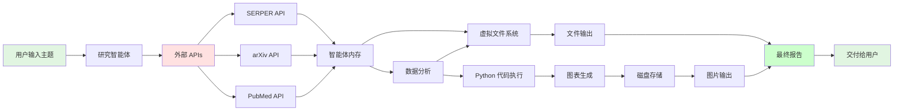

# 研究智能体工作流程

本文档描述了基于 Deep Agents 架构的研究智能体完整工作流程，从用户输入研究主题到生成最终研究报告的全过程。

## 系统架构概览

研究智能体是一个集成多种工具的自主系统，能够执行端到端的研究任务。

### 核心组件

- **Deep Agent 框架**: 提供任务规划、子任务管理、文件系统
- **LLM 引擎**: 推理和决策核心（默认 GPT-4）
- **工具集成**: 13+ 个专业工具
- **持久化存储**: 虚拟文件系统 + 磁盘持久化

## 完整工作流程

```mermaid
graph TD
    Start([用户输入研究主题]) --> Init[初始化研究智能体]

    Init --> LoadTools[加载工具集]
    LoadTools --> WebSearch[网络搜索工具<br/>SERPER API]
    LoadTools --> Academic[学术搜索工具<br/>arXiv, PubMed]
    LoadTools --> DataAnalysis[数据分析工具<br/>pandas, numpy]
    LoadTools --> WebContent[网页内容工具<br/>BeautifulSoup]
    LoadTools --> CodeExec[代码执行工具<br/>Python]
    LoadTools --> DeepTools[Deep Agents工具<br/>Planning, FileSystem, SubAgent]

    WebSearch --> ToolsReady{工具加载完成}
    Academic --> ToolsReady
    DataAnalysis --> ToolsReady
    WebContent --> ToolsReady
    CodeExec --> ToolsReady
    DeepTools --> ToolsReady

    ToolsReady --> CreateAgent[创建 Deep Agent<br/>max_steps=50]
    CreateAgent --> StartTask[开始执行研究任务]

    StartTask --> Phase1[阶段1: 研究规划]

    Phase1 --> P1_WriteTodos[使用 write_todos 工具]
    P1_WriteTodos --> P1_Plan[生成研究计划<br/>llm_agent_research_plan.md]
    P1_Plan --> P1_WriteFile[使用 write_file 保存计划]
    P1_WriteFile --> Phase2[阶段2: 信息收集]

    Phase2 --> P2_WebSearch[使用 web_search 工具]
    P2_WebSearch --> P2_WebResults[收集行业报告和市场分析]
    P2_WebResults --> P2_SaveWeb[保存到 data/web_search_results.md]

    P2_SaveWeb --> P2_Academic[使用 arxiv_search, pubmed_search]
    P2_Academic --> P2_Papers[收集学术论文和预印本]
    P2_Papers --> P2_SaveAcademic[保存到 data/academic_papers.md]

    P2_SaveAcademic --> P2_Content[使用 fetch_content 工具]
    P2_Content --> P2_WebData[抓取技术博客和文档]
    P2_WebData --> P2_SaveContent[保存到 data/web_content.md]

    P2_SaveContent --> Phase3[阶段3: 数据分析]

    Phase3 --> P3_Analyze[使用 analyze_data 工具]
    P3_Analyze --> P3_Trends[分析技术发展趋势]
    P3_Trends --> P3_Stats[统计分析和相关性]
    P3_Stats --> P3_SaveAnalysis[保存到 data/analysis_results.md]

    P3_SaveAnalysis --> P3_Code[使用 execute_code 工具]
    P3_Code --> P3_Python[执行 Python 数据分析代码]
    P3_Python --> P3_Plots[创建 matplotlib 图表]
    P3_Plots --> P3_AutoSave[自动保存图表到<br/>workspace/images/]
    P3_AutoSave --> P3_SaveCode[保存代码到<br/>code/analysis_scripts.py]

    P3_SaveCode --> Phase4[阶段4: 报告生成]

    Phase4 --> P4_Integrate[整合所有收集的信息]
    P4_Integrate --> P4_Structure[构建报告结构]
    P4_Structure --> P4_WriteReport[使用 write_file 工具]
    P4_WriteReport --> P4_Content1[添加研究内容和分析]
    P4_Content1 --> P4_Content2[嵌入图表引用 Markdown格式]
    P4_Content2 --> P4_Content3[添加结论和建议]
    P4_Content3 --> P4_Final[生成 final_report.md]

    P4_Final --> CheckComplete{检查完成标准}

    CheckComplete -->|缺少文件| P4_Missing[继续完成缺失步骤]
    P4_Missing --> Phase1

    CheckComplete -->|所有文件完成| Terminate[使用 terminate 工具结束]

    Terminate --> Output[输出最终结果]

    Output --> End([完成])

    style Start fill:#e1f5e1
    style End fill:#e1f5e1
    style Phase1 fill:#fff4e1
    style Phase2 fill:#e1f0ff
    style Phase3 fill:#ffe1f0
    style Phase4 fill:#f0e1ff
    style P3_AutoSave fill:#ffcccc
    style P4_Final fill:#ccffcc
```



## 详细步骤说明

### 阶段 1: 研究规划

**目标**: 制定详细的研究计划和时间线

**使用工具**:
- `write_todos`: 创建任务清单和时间线
- `write_file`: 保存研究计划文档

**输出文件**:
- `llm_agent_research_plan.md`: 包含研究目标、范围、方法和预期输出

**关键点**:
- 分解复杂任务为可管理的步骤
- 设定优先级和依赖关系
- 明确数据收集策略

---

### 阶段 2: 信息收集

**目标**: 从多个来源收集全面的研究资料

#### 2.1 网络搜索

**使用工具**: `web_search`

**功能**:
- 使用 SERPER API 搜索最新行业报告
- 收集市场分析和技术趋势信息
- 获取权威媒体报道

**输出文件**: `data/web_search_results.md`

**数据内容**:
- 搜索结果摘要
- 来源链接和引用
- 关键发现总结

#### 2.2 学术文献研究

**使用工具**:
- `arxiv_search`: 搜索 arXiv 预印本论文
- `pubmed_search`: 搜索 PubMed 生物医学文献
- `scholar_search`: 学术论文综合搜索

**功能**:
- 搜索相关学术论文
- 分析技术突破和研究方向
- 收集引用数据和影响力指标

**输出文件**: `data/academic_papers.md`

**数据内容**:
- 论文标题、作者、发表时间
- 摘要和关键发现
- 引用次数和影响力评估

#### 2.3 网页内容深度分析

**使用工具**: `fetch_content`

**功能**:
- 抓取重要技术博客和文档内容
- 分析官方发布和技术规格
- 提取关键技术细节

**输出文件**: `data/web_content.md`

**数据内容**:
- 网页完整内容
- 结构化提取的关键信息
- 技术细节和规格

---

### 阶段 3: 数据分析

**目标**: 对收集的数据进行深度分析，生成洞察

#### 3.1 趋势分析

**使用工具**: `analyze_data`

**功能**:
- 分析技术发展趋势数据
- 进行统计分析和相关性分析
- 生成数据驱动的洞察

**输出文件**: `data/analysis_results.md`

**分析类型**:
- 时间序列分析
- 相关性分析
- 趋势预测

#### 3.2 代码执行和可视化

**使用工具**: `execute_code`

**功能**:
- 执行 Python 数据分析代码
- 使用 pandas、numpy 进行计算
- 使用 matplotlib 创建图表
- **自动保存图表到 `workspace/images/`**

**输出文件**:
- `code/analysis_scripts.py`: Python 分析代码
- `code/results.txt`: 执行结果
- `workspace/images/plot_*.png`: 自动保存的图表

**图表类型**:
- 时间序列图
- 柱状图和饼图
- 散点图和热力图
- 趋势拟合图

**关键特性**:
- matplotlib 后端自动配置为 'Agg'（非交互式）
- 所有打开的图形自动保存
- 高分辨率输出（300 DPI）
- 自动生成唯一文件名（时间戳）

---

### 阶段 4: 报告生成

**目标**: 整合所有信息，生成专业研究报告

**使用工具**: `write_file`

**输出文件**: `final_report.md`

**报告结构**:

```markdown
# 研究主题

## 执行摘要
- 研究背景和目标
- 核心发现
- 主要结论

## 技术发展历程
- 历史演进
- 关键里程碑
- 技术突破

## 学术研究进展
- 重要论文综述
- 研究方向分析
- 学术影响力

## 市场趋势分析
- 市场规模和增长
- 应用场景
- 主要参与者

## 数据分析与可视化


## 未来展望
- 技术趋势预测
- 潜在挑战
- 发展机遇

## 结论与建议
- 核心洞察
- 行动建议
- 研究局限性

## 参考文献
- 网络资源引用
- 学术论文引用
- 数据来源说明
```

**报告特点**:
- 完整的 Markdown 格式
- 嵌入式图表引用
- 可验证的信息来源
- 数据驱动的结论

---

## 完成标准检查

智能体在结束任务前会检查以下文件是否都已创建：

```
✅ llm_agent_research_plan.md     - 研究计划
✅ data/web_search_results.md     - 网络搜索结果
✅ data/academic_papers.md        - 学术文献
✅ data/analysis_results.md       - 数据分析结果
✅ final_report.md                - 最终研究报告
```

额外生成的文件（可选但推荐）：

```
data/web_content.md               - 网页内容分析
code/analysis_scripts.py          - 分析代码
code/results.txt                  - 代码执行结果
workspace/images/plot_*.png       - 数据可视化图表
```

---

## 工具使用统计

| 工具类型 | 工具数量 | 用途 |
|---------|---------|------|
| 网络搜索 | 2 | web_search, scholar_search |
| 学术搜索 | 2 | arxiv_search, pubmed_search |
| 数据分析 | 1 | analyze_data |
| 网页抓取 | 1 | fetch_content |
| 代码执行 | 1 | execute_code |
| Deep Agents | 6 | write_todos, read_todos, complete_todo, ls, read_file, write_file, edit_file |
| 系统工具 | 1 | terminate |
| **总计** | **13+** | |

---

## 数据流转图



---

## 执行控制

### 最大步数限制

```python
agent.max_steps = 50
```

- 防止无限循环
- 确保任务在合理时间内完成
- 典型完整研究任务需要 30-45 步

### 步数分配估算

| 阶段 | 预计步数 | 说明 |
|-----|---------|------|
| 研究规划 | 2-3 | 创建和保存计划 |
| 网络搜索 | 3-5 | 多次搜索和保存 |
| 学术搜索 | 3-5 | arXiv + PubMed |
| 网页抓取 | 2-4 | 抓取关键内容 |
| 数据分析 | 3-5 | 分析和保存结果 |
| 代码执行 | 4-6 | 多个图表生成 |
| 文件保存 | 5-8 | 保存所有中间结果 |
| 报告生成 | 3-5 | 整合和编写报告 |
| 检查和终止 | 2-3 | 验证完成标准 |
| **总计** | **27-44** | 典型范围 |

---

## 持久化存储

### 文件系统架构

```
workspace/
├── llm_agent_research_plan.md        # 研究计划
├── data/                             # 数据收集
│   ├── web_search_results.md
│   ├── academic_papers.md
│   ├── analysis_results.md
│   └── web_content.md
├── code/                             # 代码和结果
│   ├── analysis_scripts.py
│   └── results.txt
├── images/                           # 图表（自动生成）
│   ├── plot_1759201785051_0.png
│   ├── plot_1759201785052_0.png
│   └── ...
└── final_report.md                   # 最终报告
```

### 存储机制

1. **虚拟文件系统 (VFS)**
   - 内存中存储当前会话文件
   - 提供 ls, read_file, write_file, edit_file 操作

2. **磁盘持久化**
   - 所有 write_file 操作自动保存到磁盘
   - 启动时自动加载已有文件
   - 支持子目录结构

3. **图片自动保存**
   - 代码执行工具自动检测 matplotlib 图形
   - 自动保存到 workspace/images/
   - 高分辨率 PNG 格式 (300 DPI)

---

## 错误处理和恢复

### 工具加载失败

```python
try:
    tools.extend(create_search_tools())
    print("✅ 已加载网络搜索工具")
except Exception as e:
    print(f"⚠️ 网络搜索工具加载失败: {e}")
    # 继续加载其他工具
```

### 部分功能降级

- 如果某个工具不可用，智能体会使用其他可用工具
- 例如：网络搜索失败时，仍可使用学术搜索

### 中断恢复

- 文件已持久化到磁盘
- 可从 workspace/ 目录恢复部分结果
- 重新运行时会加载已有文件

---

## 使用示例

### 基本用法

```bash
# 使用默认主题
uv run python examples/research_agent_demo.py

# 指定研究主题
uv run python examples/research_agent_demo.py --topic "Transformer架构的演进"

# 测试工具连接
uv run python examples/research_agent_demo.py --test-tools
```

### 环境配置

```bash
# .env 文件配置
OPENAI_API_KEY=your_openai_key
SERPER_API_KEY=your_serper_key
```

### 输出示例

```
🤖 Deep Agents - 研究智能体
📅 启动时间: 2025-09-30 11:00:00
🔑 API Keys 状态:
  • SERPER_API_KEY: ✅ 已配置
  • OPENAI_API_KEY: ✅ 已配置

✅ 已加载网络搜索工具 (SERPER API)
✅ 已加载学术搜索工具 (arXiv, PubMed)
✅ 已加载数据分析工具 (pandas, numpy)
✅ 已加载网页内容分析工具 (BeautifulSoup)
✅ 已加载代码执行工具 (Python)

🔧 总计加载 13 个工具

🚀 开始全面研究: LLM的发展历程
========================================

[执行过程...]

✅ 研究任务完成!
========================================
📊 执行统计:
执行步数: 35/50
消息数量: 72

📁 生成的文件:
• llm_agent_research_plan.md: 1163 字符
• data/web_search_results.md: 5842 字符
• data/academic_papers.md: 4521 字符
• data/analysis_results.md: 3214 字符
• final_report.md: 12456 字符

🎉 研究智能体演示成功!
```

---

## 性能优化建议

### 1. 并行工具调用

- 多个独立搜索可以并行执行
- 减少总执行时间

### 2. 结果缓存

- 相同查询结果可以复用
- 减少 API 调用次数

### 3. 增量保存

- 每完成一步立即保存
- 避免数据丢失

### 4. 资源限制

```python
# 代码执行超时
timeout = 30  # 秒

# 图片大小限制
plt.figure(figsize=(10, 6))  # 推荐尺寸

# 搜索结果数量
max_results = 10  # 避免过多结果
```

---

## 扩展和定制

### 添加新工具

```python
from myagent.tool.base_tool import BaseTool, ToolResult

class CustomTool(BaseTool):
    name: str = "custom_tool"
    description: str = "自定义工具描述"

    async def execute(self, **kwargs) -> ToolResult:
        # 实现工具逻辑
        return ToolResult(output="结果")

# 添加到智能体
tools.append(CustomTool())
```

### 自定义研究任务

修改 `research_task` 变量，添加：
- 特定的研究目标
- 专业领域要求
- 输出格式定制
- 额外的分析步骤

### 调整 LLM 配置

```python
agent = create_deep_agent(
    tools=tools,
    name="research_agent",
    description="...",
    llm_config={
        "model": "gpt-4",
        "temperature": 0.7,
        "max_tokens": 4096
    }
)
```

---

## 总结

研究智能体工作流程实现了：

✅ **端到端自动化**: 从问题到报告全流程自动化
✅ **多源数据整合**: 网络、学术、内容多维度信息收集
✅ **智能数据分析**: 自动统计分析和可视化
✅ **持久化存储**: 所有结果和图表自动保存
✅ **高质量输出**: 专业格式的研究报告
✅ **可扩展架构**: 易于添加新工具和定制流程

该系统适用于：
- 技术趋势研究
- 市场分析报告
- 学术文献综述
- 竞品分析
- 行业洞察报告
