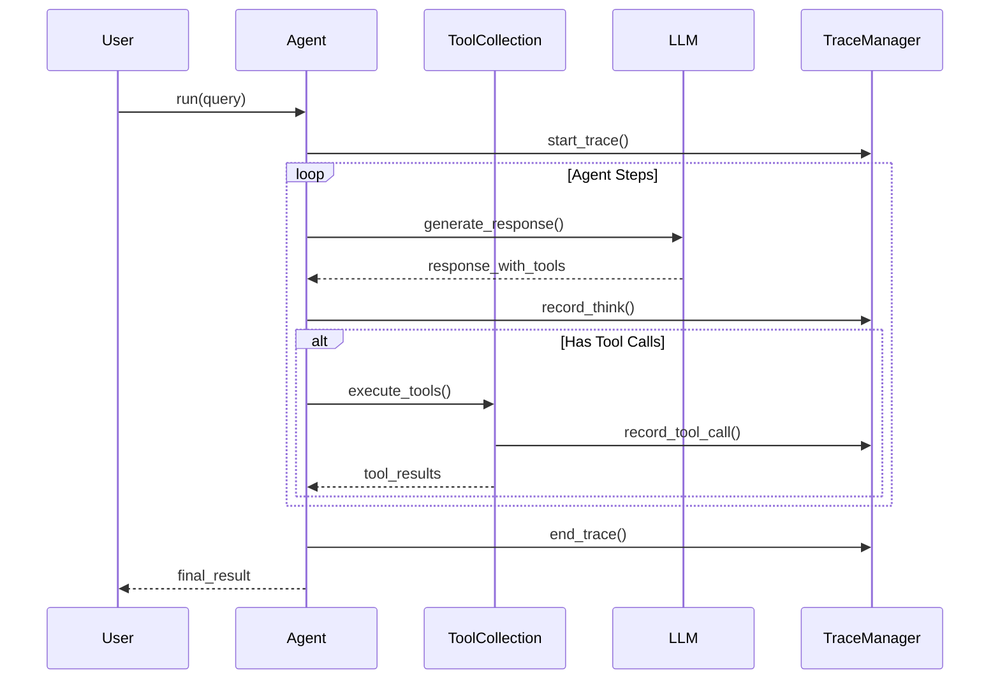
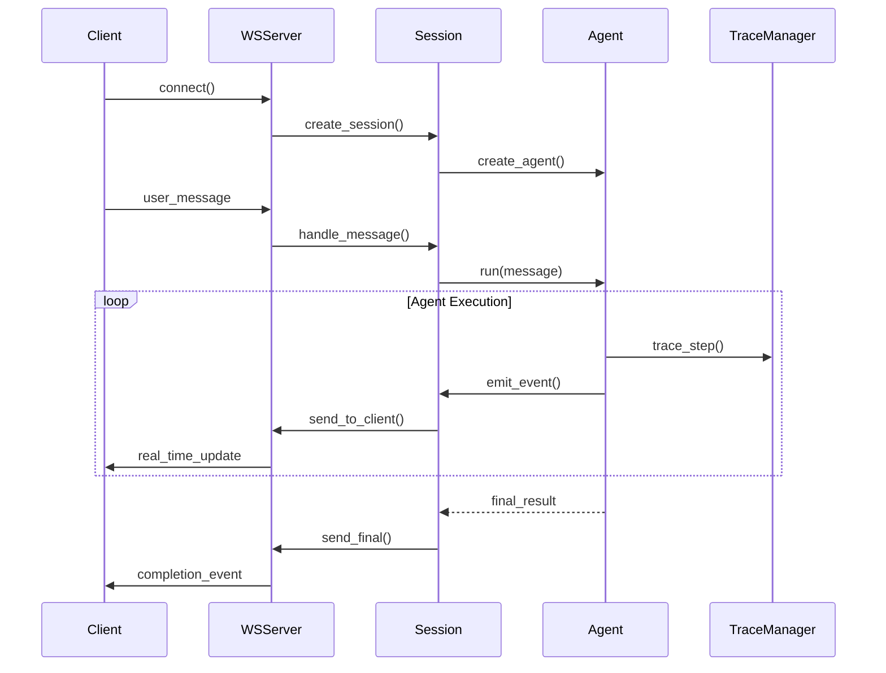
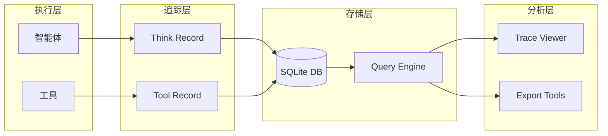

# MyAgent 系统架构

MyAgent 是一个轻量级的工具感知 LLM 智能体构建框架，提供完整的追踪功能和 WebSocket 服务器支持。

## 核心架构概览

```mermaid
graph TB
    subgraph "MyAgent Framework"
        subgraph "Agent Core"
            Factory[Agent Factory]
            BaseAgent[Base Agent]
            ReActAgent[ReAct Agent]
            ToolCallAgent[ToolCall Agent]
        end

        subgraph "Middleware Layer"
            DeepAgent[Deep Agent]
            PlanningMW[Planning Middleware]
            FileSystemMW[FileSystem Middleware]
            SubAgentMW[SubAgent Middleware]
        end

        subgraph "Tool System"
            BaseTool[Base Tool]
            ToolCollection[Tool Collection]
            Terminate[Terminate Tool]

            subgraph "Deep Agent Tools"
                PlanningTools[Planning Tools]
                FileSystemTools[FileSystem Tools]
                SubAgentTools[SubAgent Tools]
            end

            subgraph "Research Tools"
                WebSearch[Web Search]
                Academic[Academic Search]
                DataAnalysis[Data Analysis]
                WebContent[Web Content]
                CodeExec[Code Execution]
            end
        end

        subgraph "LLM Integration"
            LLM[LLM Client]
            Config[Configuration]
            Logger[Logger]
        end

        subgraph "Tracing System"
            TraceManager[Trace Manager]
            TraceModels[Trace Models]
            Storage[SQLite Storage]
            QueryEngine[Query Engine]
            Decorators[Trace Decorators]
        end

        subgraph "WebSocket Server"
            WSServer[WebSocket Server]
            Session[Agent Session]
            Events[Event System]
            StateManager[State Manager]
            Utils[WS Utils]
        end

        subgraph "CLI & Examples"
            CLI[CLI Server]
            Examples[Example Agents]
        end
    end

    subgraph "External Integrations"
        OpenAI[OpenAI API]
        SERPER[SERPER API]
        ArXiv[ArXiv API]
        PubMed[PubMed API]
        WebClients[Web Clients]
        TraceViewer[Trace Viewer]
    end
    
    %% Core Agent Flow
    Factory --> BaseAgent
    Factory --> ReActAgent
    Factory --> ToolCallAgent
    Factory --> DeepAgent

    %% Middleware Integration
    DeepAgent --> PlanningMW
    DeepAgent --> FileSystemMW
    DeepAgent --> SubAgentMW
    DeepAgent --> ToolCallAgent

    %% Tool Integration
    BaseAgent --> ToolCollection
    ToolCollection --> BaseTool
    ToolCollection --> Terminate

    PlanningMW --> PlanningTools
    FileSystemMW --> FileSystemTools
    SubAgentMW --> SubAgentTools

    ToolCollection --> PlanningTools
    ToolCollection --> FileSystemTools
    ToolCollection --> SubAgentTools
    ToolCollection --> WebSearch
    ToolCollection --> Academic
    ToolCollection --> DataAnalysis
    ToolCollection --> WebContent
    ToolCollection --> CodeExec

    %% LLM Integration
    BaseAgent --> LLM
    LLM --> Config
    LLM --> OpenAI

    %% External API Integration
    WebSearch --> SERPER
    Academic --> ArXiv
    Academic --> PubMed

    %% Tracing Integration
    BaseAgent --> TraceManager
    TraceManager --> TraceModels
    TraceManager --> Storage
    TraceManager --> QueryEngine
    Decorators --> TraceManager

    %% WebSocket Integration
    WSServer --> Session
    Session --> BaseAgent
    WSServer --> Events
    WSServer --> StateManager
    WSServer --> Utils
    CLI --> WSServer
    WebClients --> WSServer

    %% External Connections
    Storage --> TraceViewer
    Examples --> BaseAgent
    
    classDef coreAgent fill:#e1f5fe
    classDef middleware fill:#fff9c4
    classDef toolSystem fill:#f3e5f5
    classDef researchTools fill:#c8e6c9
    classDef llmIntegration fill:#e8f5e8
    classDef tracingSystem fill:#fff3e0
    classDef wsServer fill:#fce4ec
    classDef external fill:#f5f5f5

    class Factory,BaseAgent,ReActAgent,ToolCallAgent coreAgent
    class DeepAgent,PlanningMW,FileSystemMW,SubAgentMW middleware
    class BaseTool,ToolCollection,Terminate toolSystem
    class PlanningTools,FileSystemTools,SubAgentTools toolSystem
    class WebSearch,Academic,DataAnalysis,WebContent,CodeExec researchTools
    class LLM,Config,Logger llmIntegration
    class TraceManager,TraceModels,Storage,QueryEngine,Decorators tracingSystem
    class WSServer,Session,Events,StateManager,Utils wsServer
    class OpenAI,SERPER,ArXiv,PubMed,WebClients,TraceViewer external
```



## 系统组件详解

### 1. 智能体核心 (Agent Core)

#### Agent Factory (`myagent/agent/factory.py`)
- 提供 `create_react_agent()` 和 `create_toolcall_agent()` 工厂函数
- 统一的智能体创建入口
- 自动添加终止工具和配置管理

#### Base Agent (`myagent/agent/base.py`)
- 所有智能体的抽象基类
- 定义核心接口和生命周期管理
- 集成追踪和工具调用功能

#### ReAct Agent (`myagent/agent/react.py`)
- 实现 ReAct (Reason + Act) 模式
- 结合推理和行动的智能体实现
- **注意**: 当前版本中 `create_react_agent()` 实际返回 `ToolCallAgent`

#### ToolCall Agent (`myagent/agent/toolcall.py`)
- 直接工具调用智能体
- 无需显式推理步骤的快速执行模式
- 当前主要的智能体实现

### 2. 中间件层 (Middleware Layer)

#### Deep Agent (`myagent/middleware/deep_agent.py`)
- 高级智能体包装器
- 集成规划、文件系统、子智能体能力
- 提供 `create_deep_agent()` 工厂函数

#### Planning Middleware (`myagent/middleware/planning.py`)
- 任务规划和管理能力
- TODO 列表管理
- 任务状态追踪

#### FileSystem Middleware (`myagent/middleware/filesystem.py`)
- 虚拟文件系统能力
- 文件读写编辑操作
- 持久化存储支持

#### SubAgent Middleware (`myagent/middleware/subagent.py`)
- 子智能体创建和管理
- 任务委托和结果聚合
- 层级化任务处理

### 3. 工具系统 (Tool System)

#### 基础工具

**Base Tool** (`myagent/tool/base_tool.py`)
- 所有工具的抽象基类
- 异步执行接口 `async execute()`
- 参数验证和结果封装

**Tool Collection** (`myagent/tool/tool_collection.py`)
- 工具容器和管理器
- 提供工具注册、查找和调用功能
- 支持动态工具加载

**Terminate** (`myagent/tool/terminate.py`)
- 标准终止工具
- 结束智能体执行

#### Deep Agent 工具

**Planning Tools** (`myagent/tool/planning.py`)
- `write_todos`: 创建任务清单
- `read_todos`: 读取任务列表
- `complete_todo`: 标记任务完成

**FileSystem Tools** (`myagent/tool/filesystem.py`)
- `ls`: 列出文件
- `read_file`: 读取文件内容
- `write_file`: 写入文件（支持磁盘持久化）
- `edit_file`: 编辑文件内容

**SubAgent Tools** (`myagent/tool/subagent.py`)
- `create_subagent`: 创建子智能体
- 委托复杂子任务

#### 研究工具 (Research Tools)

**Web Search** (`myagent/tool/web_search.py`)
- `web_search`: SERPER API 网络搜索
- `scholar_search`: 学术论文搜索
- 实时网络信息获取

**Academic Search** (`myagent/tool/academic_search.py`)
- `arxiv_search`: arXiv 预印本搜索
- `pubmed_search`: PubMed 生物医学文献搜索
- 学术资源深度检索

**Data Analysis** (`myagent/tool/data_analysis.py`)
- `analyze_data`: 数据分析和统计
- pandas、numpy 集成
- 趋势分析和可视化

**Web Content** (`myagent/tool/web_content.py`)
- `fetch_content`: 网页内容抓取
- BeautifulSoup HTML 解析
- 结构化内容提取

**Code Execution** (`myagent/tool/code_execution.py`)
- `execute_code`: Python 代码执行
- matplotlib 图表自动保存
- 会话状态持久化
- 支持数据科学库（pandas、numpy、matplotlib）

### 4. 追踪系统 (Tracing System)

#### 扁平化架构设计
```
Think Record ──────► Tool Records
     │                   │
     │                   │
     ▼                   ▼
[推理过程]          [工具执行记录]
```

#### 核心组件

**Trace Manager** (`myagent/trace/manager.py`)
- 追踪生命周期管理
- 会话和执行记录协调

**Trace Models** (`myagent/trace/models.py`)
- `ThinkRecord`: 推理过程记录
- `ToolRecord`: 工具执行记录
- 扁平结构，无中间 Act 层

**Storage** (`myagent/trace/storage.py`)
- SQLite 数据库持久化
- 高效的查询和存储接口

**Query Engine** (`myagent/trace/query.py`)
- 灵活的查询和分析功能
- 支持复杂过滤和聚合

**Decorators** (`myagent/trace/decorators.py`)
- `@trace_agent` 自动追踪装饰器
- 无侵入式追踪集成

### 5. WebSocket 服务器 (WebSocket Server)

#### Server (`myagent/ws/server.py`)
- `AgentWebSocketServer` 核心服务器类
- 实时智能体通信支持
- 多客户端会话管理

#### Session (`myagent/ws/session.py`)
- `AgentSession` 客户端会话管理
- 智能体实例生命周期
- 状态隔离和资源管理

#### Events (`myagent/ws/events.py`)
- 结构化事件系统
- 支持 `UserEvents`, `AgentEvents`, `SystemEvents`
- JSON 消息协议

#### State Manager (`myagent/ws/state_manager.py`)
- 客户端状态存储和管理
- 安全的状态序列化

#### Utils (`myagent/ws/utils.py`)
- WebSocket 连接工具函数
- 消息发送和连接管理

### 6. 持久化存储系统

#### Virtual File System with Disk Persistence (`myagent/tool/filesystem.py`)

**架构设计**
```
内存层 (VirtualFileSystem)
    ↓
磁盘层 (workspace/)
```

**核心功能**
- 双层存储：内存 + 磁盘
- 自动持久化：write_file 自动保存到磁盘
- 启动加载：自动从 workspace/ 加载已有文件
- 目录支持：支持子目录结构

**存储位置**
```
workspace/
├── *.md                    # 文档文件
├── data/                   # 数据目录
│   ├── web_search_results.md
│   ├── academic_papers.md
│   └── analysis_results.md
├── code/                   # 代码目录
│   ├── analysis_scripts.py
│   └── results.txt
└── images/                 # 图片目录
    └── plot_*.png          # matplotlib 自动保存
```

**关键实现**
- `_load_files_from_disk()`: 启动时加载
- `_save_to_disk()`: 写入磁盘
- `write_file()`: 同步内存和磁盘
- `edit_file()`: 编辑后保存

### 7. CLI 和示例 (CLI & Examples)

#### CLI Server (`myagent/cli/server.py`)
- 命令行 WebSocket 服务器启动器
- 配置和部署工具

#### Examples (`examples/`)
- **research_agent_demo.py**: 完整研究智能体演示
- **ws_weather_agent.py**: WebSocket 天气智能体
- **web_search.py**: 网络搜索示例
- 真实工具集成演示

## 数据流架构

### 1. 智能体执行流程



### 2. WebSocket 通信流程



### 3. 追踪数据流



## 关键设计模式

### 1. 工厂模式 (Factory Pattern)
- `create_react_agent()` 和 `create_toolcall_agent()` 提供统一创建接口
- 封装复杂的初始化逻辑

### 2. 策略模式 (Strategy Pattern)
- 不同智能体类型实现相同的 `BaseAgent` 接口
- 工具选择策略 (`ToolChoice`)

### 3. 装饰器模式 (Decorator Pattern)
- `@trace_agent` 无侵入式追踪
- 功能扩展不影响原有代码

### 4. 观察者模式 (Observer Pattern)
- WebSocket 事件系统
- 实时状态更新和通知

### 5. 会话模式 (Session Pattern)
- WebSocket 会话隔离
- 状态管理和资源清理

## 配置和扩展

### 环境变量配置
```bash
OPENAI_API_KEY=your-key
OPENAI_API_BASE=https://api.openai.com/v1
```

### LLM 配置
```python
llm_config = {
    "model": "gpt-4",
    "api_key": "your-key",
    "base_url": "https://api.openai.com/v1",
    "temperature": 0.7
}
```

### 自定义工具开发
```python
class CustomTool(BaseTool):
    name: str = "custom_tool"
    description: str = "Custom tool description"
    user_confirm: bool = False
    
    async def execute(self, **kwargs) -> ToolResult:
        # 实现逻辑
        return ToolResult(...)
```

## 部署和使用

### WebSocket 服务器部署
```bash
# 启动 WebSocket 服务器
uv run python -m myagent.cli.server server agent_file.py --port 8889

# 示例：天气智能体
uv run python -m myagent.cli.server server examples/ws_weather_agent.py --port 8889
```

### 追踪分析
```bash
# 启动追踪查看器
python trace_server.py
```

## 工具统计

### 按类型分类

| 类型 | 数量 | 工具名称 |
|------|------|---------|
| **基础工具** | 1 | terminate |
| **规划工具** | 3 | write_todos, read_todos, complete_todo |
| **文件系统** | 4 | ls, read_file, write_file, edit_file |
| **子智能体** | 1 | create_subagent |
| **网络搜索** | 2 | web_search, scholar_search |
| **学术搜索** | 2 | arxiv_search, pubmed_search |
| **数据分析** | 1 | analyze_data |
| **网页内容** | 1 | fetch_content |
| **代码执行** | 1 | execute_code |
| **总计** | **16** | |

### 外部 API 集成

| API | 用途 | 相关工具 |
|-----|------|---------|
| **OpenAI API** | LLM 推理 | 所有智能体 |
| **SERPER API** | 网络搜索 | web_search, scholar_search |
| **arXiv API** | 学术论文 | arxiv_search |
| **PubMed API** | 生物医学文献 | pubmed_search |

## 新增特性总结

### 1. 中间件架构
- ✅ Deep Agent 中间件层
- ✅ 模块化能力组合
- ✅ 统一工厂函数接口

### 2. 研究工具生态
- ✅ 真实 API 集成（SERPER、arXiv、PubMed）
- ✅ 数据分析和可视化
- ✅ 代码执行能力
- ✅ 网页内容抓取

### 3. 持久化存储
- ✅ 虚拟文件系统 + 磁盘持久化
- ✅ 自动保存 matplotlib 图表
- ✅ 工作空间目录管理
- ✅ 支持子目录结构

### 4. 完整工作流
- ✅ 端到端研究流程
- ✅ 多阶段任务管理
- ✅ 自动化报告生成
- ✅ 文件和图片持久化

## 总结

MyAgent 架构的核心优势：

1. **模块化设计**: 清晰的组件分离和接口定义
2. **扁平化追踪**: 简化的追踪架构，减少复杂性
3. **实时通信**: WebSocket 支持实时交互
4. **易于扩展**: 工厂模式和插件架构支持自定义扩展
5. **完整追踪**: 全生命周期执行追踪和分析
6. **真实集成**: 多个外部 API 的生产级集成
7. **持久化存储**: 双层存储保证数据不丢失
8. **智能工作流**: Deep Agent 架构支持复杂研究任务

该架构支持从简单的本地脚本到复杂的分布式智能体系统的各种使用场景，特别适合需要：
- 多步骤研究和分析
- 数据收集和整合
- 报告自动生成
- 长期任务追踪
- 持久化存储需求

的应用场景。