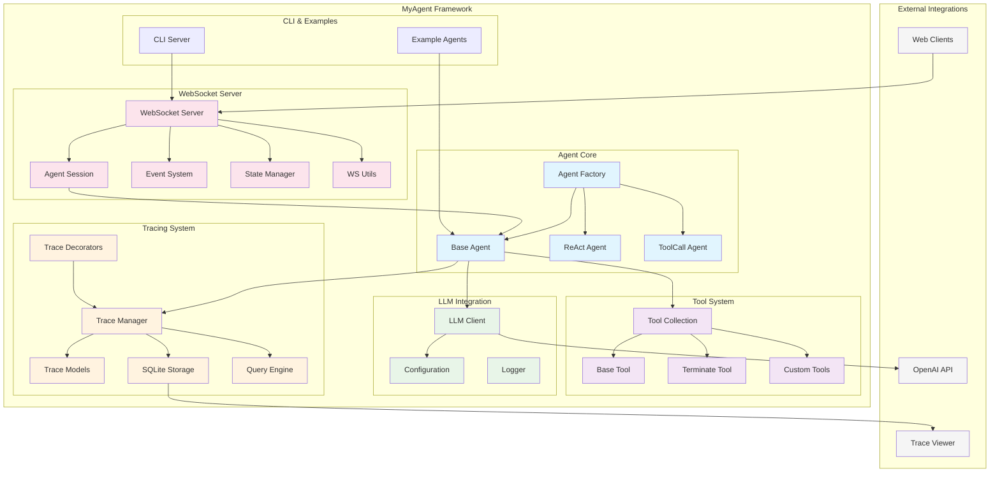
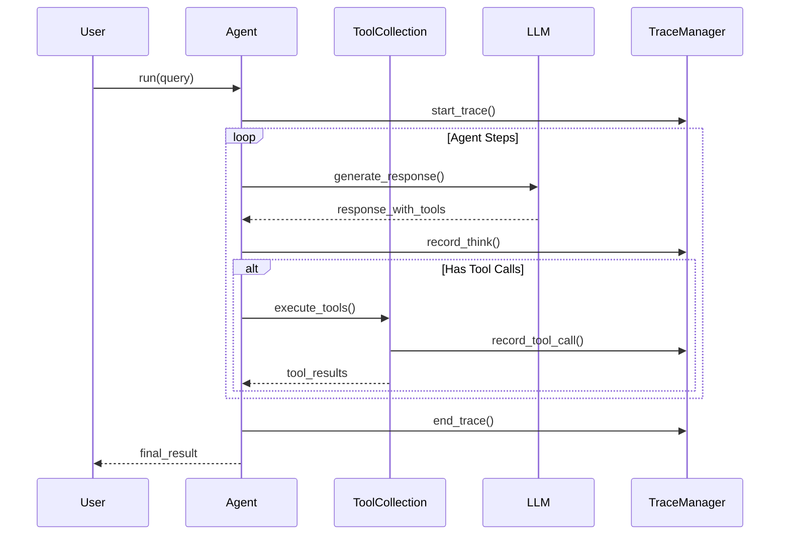
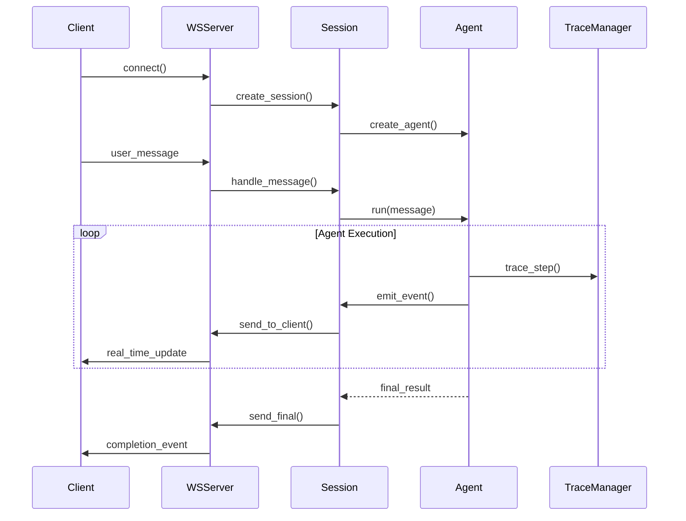
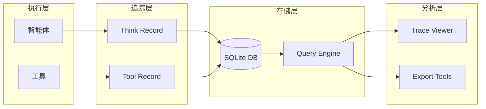

# MyAgent 系统架构

MyAgent 是一个轻量级的工具感知 LLM 智能体构建框架，提供完整的追踪功能和 WebSocket 服务器支持。

## 核心架构概览



## 系统组件详解

### 1. 智能体核心 (Agent Core)

#### Agent Factory (`myagent/agent/factory.py`)
- 提供 `create_react_agent()` 和 `create_toolcall_agent()` 工厂函数
- 统一的智能体创建入口
- 自动添加终止工具和配置管理

#### Base Agent (`myagent/agent/base.py`)
- 所有智能体的抽象基类
- 定义核心接口和生命周期管理
- 集成追踪和工具调用功能

#### ReAct Agent (`myagent/agent/react.py`)
- 实现 ReAct (Reason + Act) 模式
- 结合推理和行动的智能体实现
- **注意**: 当前版本中 `create_react_agent()` 实际返回 `ToolCallAgent`

#### ToolCall Agent (`myagent/agent/toolcall.py`)
- 直接工具调用智能体
- 无需显式推理步骤的快速执行模式
- 当前主要的智能体实现

### 2. 工具系统 (Tool System)

#### Base Tool (`myagent/tool/base_tool.py`)
- 所有工具的抽象基类
- 异步执行接口 `async execute()`
- 参数验证和结果封装

#### Tool Collection (`myagent/tool/tool_collection.py`)
- 工具容器和管理器
- 提供工具注册、查找和调用功能
- 支持动态工具加载

#### 内置工具
- **Terminate** (`myagent/tool/terminate.py`): 标准终止工具
- **Custom Tools**: 用户自定义工具实现

### 3. 追踪系统 (Tracing System)

#### 扁平化架构设计
```
Think Record ──────► Tool Records
     │                   │
     │                   │
     ▼                   ▼
[推理过程]          [工具执行记录]
```

#### 核心组件

**Trace Manager** (`myagent/trace/manager.py`)
- 追踪生命周期管理
- 会话和执行记录协调

**Trace Models** (`myagent/trace/models.py`)
- `ThinkRecord`: 推理过程记录
- `ToolRecord`: 工具执行记录
- 扁平结构，无中间 Act 层

**Storage** (`myagent/trace/storage.py`)
- SQLite 数据库持久化
- 高效的查询和存储接口

**Query Engine** (`myagent/trace/query.py`)
- 灵活的查询和分析功能
- 支持复杂过滤和聚合

**Decorators** (`myagent/trace/decorators.py`)
- `@trace_agent` 自动追踪装饰器
- 无侵入式追踪集成

### 4. WebSocket 服务器 (WebSocket Server)

#### Server (`myagent/ws/server.py`)
- `AgentWebSocketServer` 核心服务器类
- 实时智能体通信支持
- 多客户端会话管理

#### Session (`myagent/ws/session.py`)
- `AgentSession` 客户端会话管理
- 智能体实例生命周期
- 状态隔离和资源管理

#### Events (`myagent/ws/events.py`)
- 结构化事件系统
- 支持 `UserEvents`, `AgentEvents`, `SystemEvents`
- JSON 消息协议

#### State Manager (`myagent/ws/state_manager.py`)
- 客户端状态存储和管理
- 安全的状态序列化

#### Utils (`myagent/ws/utils.py`)
- WebSocket 连接工具函数
- 消息发送和连接管理

### 5. CLI 和示例 (CLI & Examples)

#### CLI Server (`myagent/cli/server.py`)
- 命令行 WebSocket 服务器启动器
- 配置和部署工具

#### Examples (`examples/`)
- 实际使用示例和模板
- WebSocket 集成演示

## 数据流架构

### 1. 智能体执行流程



### 2. WebSocket 通信流程



### 3. 追踪数据流



## 关键设计模式

### 1. 工厂模式 (Factory Pattern)
- `create_react_agent()` 和 `create_toolcall_agent()` 提供统一创建接口
- 封装复杂的初始化逻辑

### 2. 策略模式 (Strategy Pattern)
- 不同智能体类型实现相同的 `BaseAgent` 接口
- 工具选择策略 (`ToolChoice`)

### 3. 装饰器模式 (Decorator Pattern)
- `@trace_agent` 无侵入式追踪
- 功能扩展不影响原有代码

### 4. 观察者模式 (Observer Pattern)
- WebSocket 事件系统
- 实时状态更新和通知

### 5. 会话模式 (Session Pattern)
- WebSocket 会话隔离
- 状态管理和资源清理

## 配置和扩展

### 环境变量配置
```bash
OPENAI_API_KEY=your-key
OPENAI_API_BASE=https://api.openai.com/v1
```

### LLM 配置
```python
llm_config = {
    "model": "gpt-4",
    "api_key": "your-key",
    "base_url": "https://api.openai.com/v1",
    "temperature": 0.7
}
```

### 自定义工具开发
```python
class CustomTool(BaseTool):
    name: str = "custom_tool"
    description: str = "Custom tool description"
    user_confirm: bool = False
    
    async def execute(self, **kwargs) -> ToolResult:
        # 实现逻辑
        return ToolResult(...)
```

## 部署和使用

### WebSocket 服务器部署
```bash
# 启动 WebSocket 服务器
uv run python -m myagent.cli.server server agent_file.py --port 8889

# 示例：天气智能体
uv run python -m myagent.cli.server server examples/ws_weather_agent.py --port 8889
```

### 追踪分析
```bash
# 启动追踪查看器
python trace_server.py
```

## 总结

MyAgent 架构的核心优势：

1. **模块化设计**: 清晰的组件分离和接口定义
2. **扁平化追踪**: 简化的追踪架构，减少复杂性
3. **实时通信**: WebSocket 支持实时交互
4. **易于扩展**: 工厂模式和插件架构支持自定义扩展
5. **完整追踪**: 全生命周期执行追踪和分析

该架构支持从简单的本地脚本到复杂的分布式智能体系统的各种使用场景。