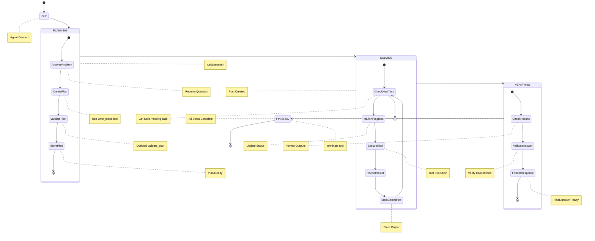
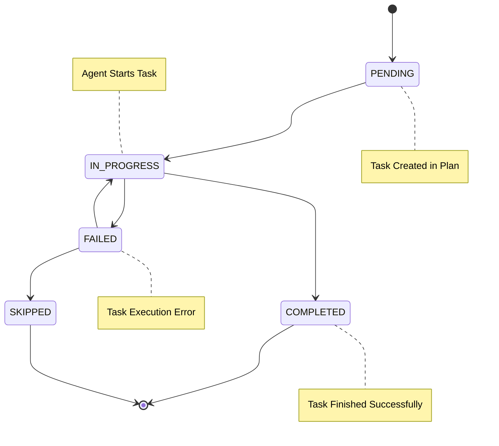
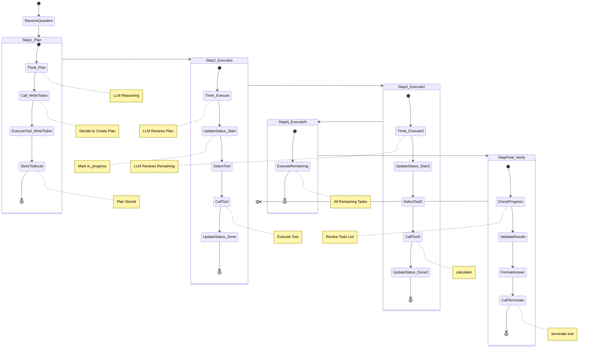
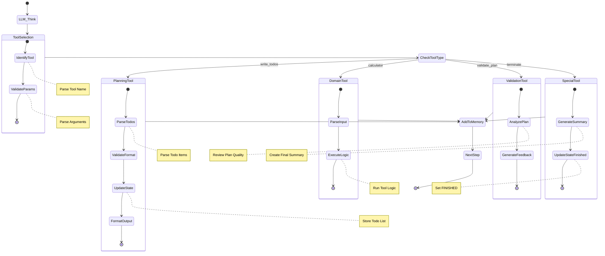
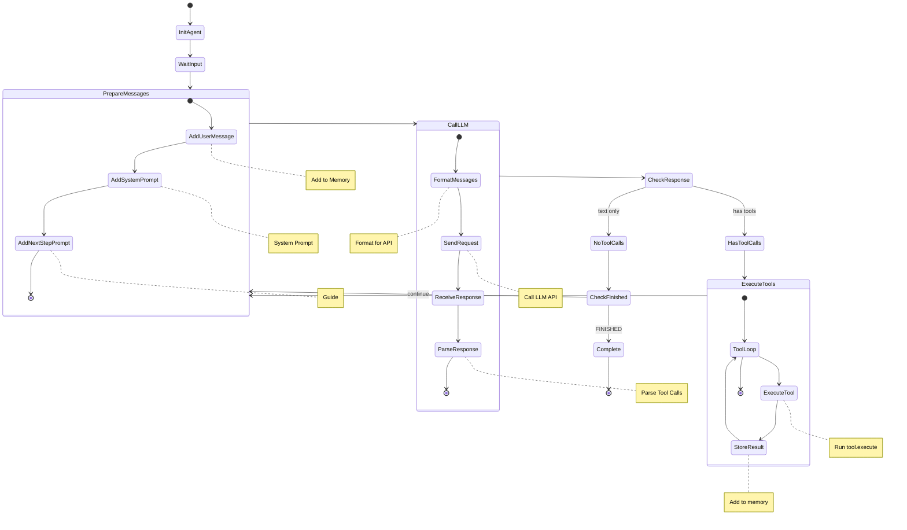
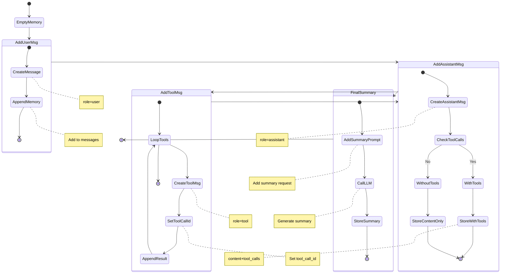
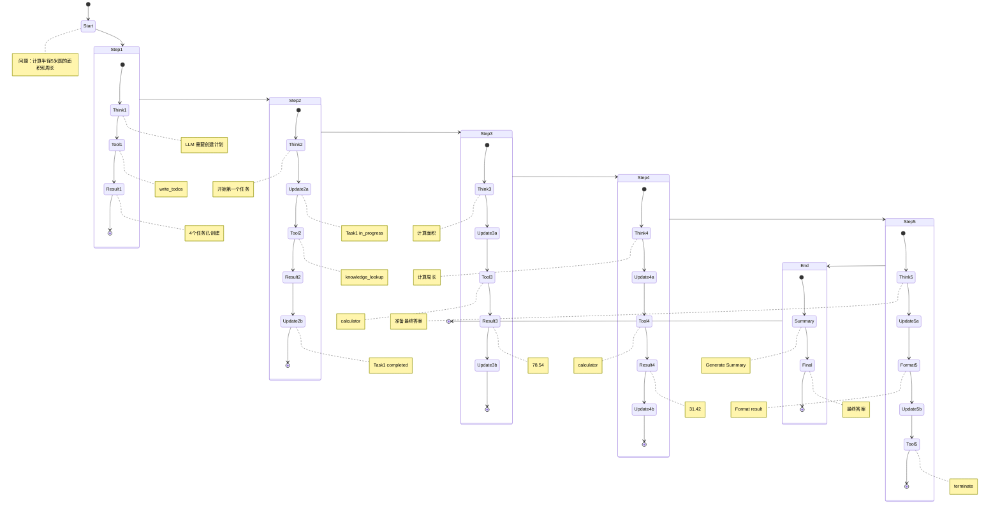
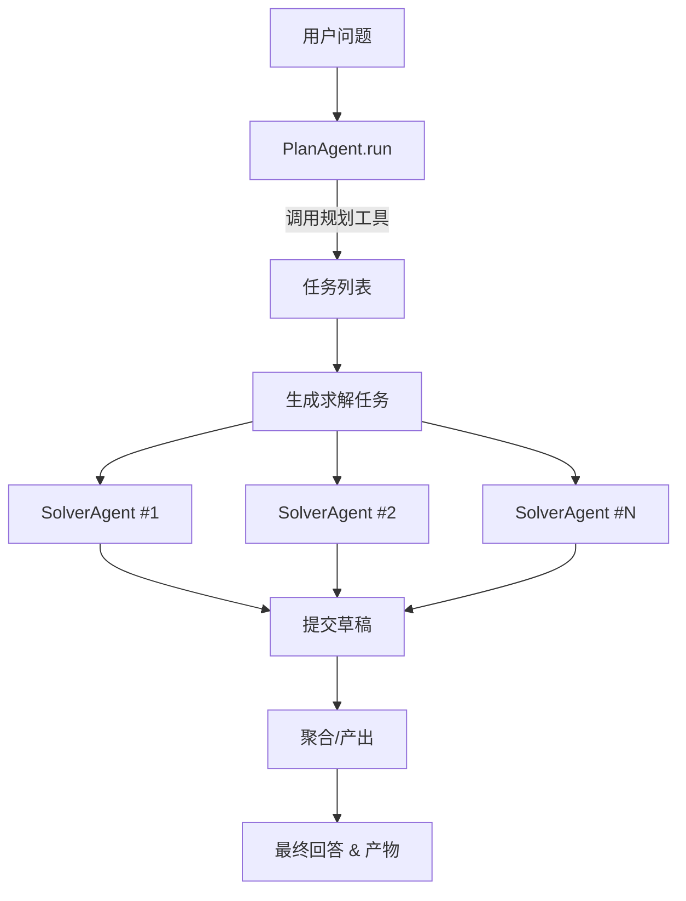
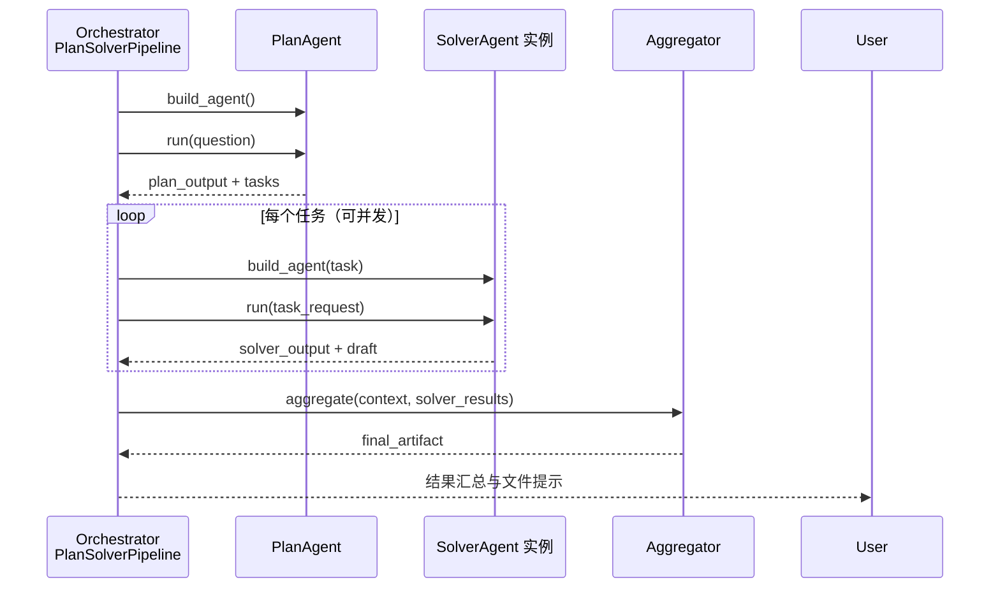

# Plan and Solve Flow Diagrams

这个文档使用 Mermaid 图表展示 Plan and Solve agent 的执行流程。

## 1. 整体状态流程图

## 2. 任务状态转换图

## 3. 详细执行流程图

## 4. 工具调用流程图

## 5. Agent 与 LLM 交互流程

## 6. 内存管理状态图

## 7. 完整示例执行流程（圆形计算）

## 8. Plan-Solver 双阶段架构

新版示例采用 `create_plan_solver` 将规划与求解拆分为两类 Agent，并引入可选聚合器。整体协作如下：

- **PlanAgent** 负责读取需求、探索数据结构并产出结构化任务（例如每页 PPT 的目标与提示）。
- **SolverAgent** 针对单个任务生成成果，可根据任务特征调用不同工具。
- **Aggregator** 在所有 solver 完成后执行一次，可生成报告文件或合并文本。

## 9. `create_plan_solver` 执行时序

> `create_plan_solver` 支持通过 `concurrency` 参数控制并发度，也允许自定义 PlanAgent/SolverAgent 子类以适配不同领域任务。

## 图表说明

### 图表1：整体状态流程
- 展示了 Agent 从创建到完成的三个主要阶段
- PLANNING → SOLVING → VERIFYING

### 图表2：任务状态转换
- 展示了单个任务的状态变化
- PENDING → IN_PROGRESS → COMPLETED

### 图表3：详细执行流程
- 展示了每个步骤的详细操作
- 包括 LLM 推理、工具调用、状态更新

### 图表4：工具调用流程
- 展示了不同工具的执行逻辑
- Planning、Domain、Validation、Special 工具

### 图表5：Agent-LLM 交互
- 展示了 Agent 如何与 LLM 交互
- 消息准备、API 调用、响应处理

### 图表6：内存管理
- 展示了 Memory 中消息的添加和管理
- User、Assistant、Tool 消息的存储

### 图表7：完整示例
- 真实示例的完整执行流程
- 从问题输入到最终答案的全过程

## 使用说明

这些图表可以在支持 Mermaid 的 Markdown 渲染器中查看，例如：
- GitHub
- GitLab
- VS Code (with Mermaid extension)
- Obsidian
- Typora

或者使用在线 Mermaid 编辑器：
- https://mermaid.live/
