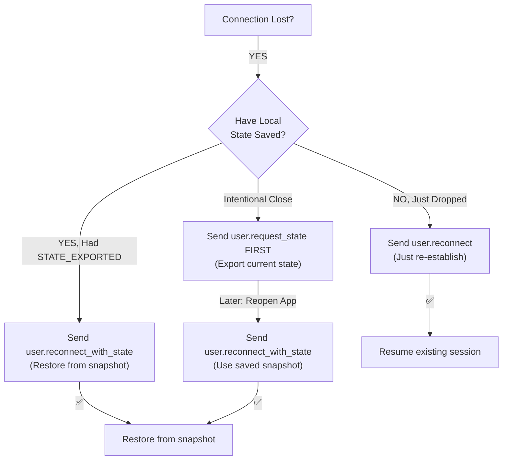
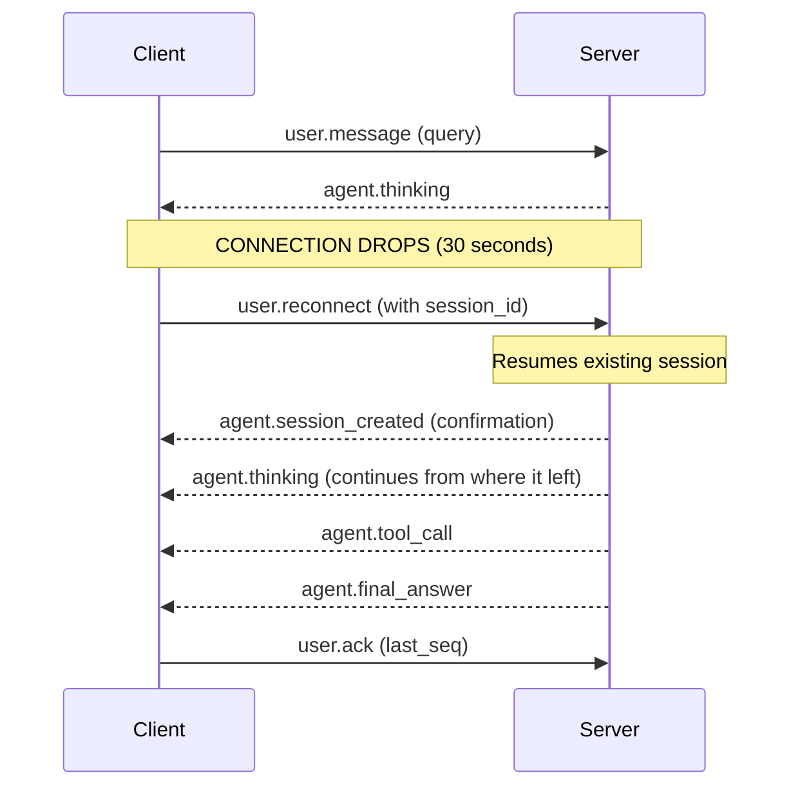
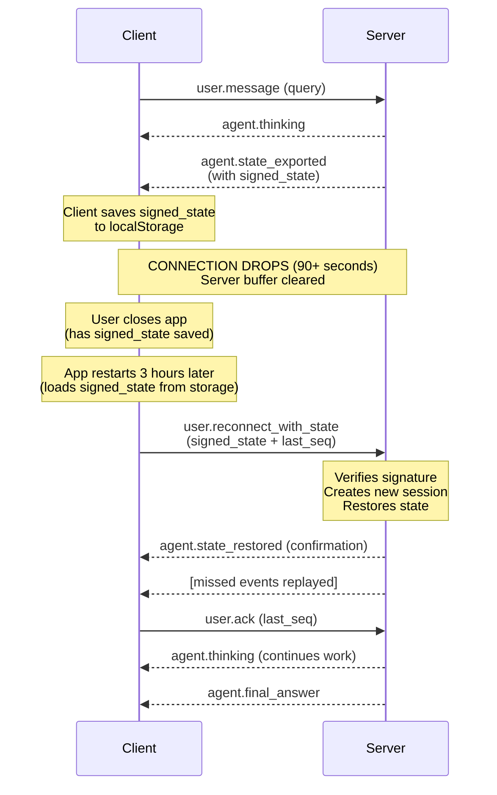
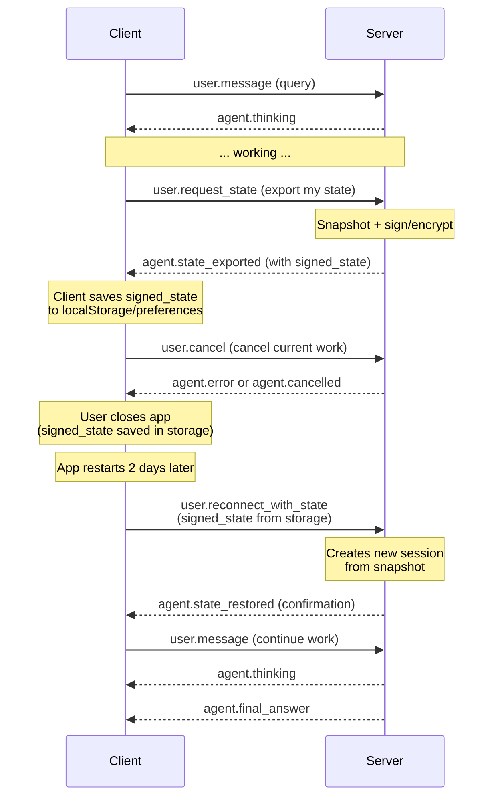

# Reconnection Events Clarification

## Overview

This document clarifies the **three distinct reconnection event types** and their specific use cases, payload structures, and server-side handling. This is critical for developers implementing both client and server reconnection logic.

---

## Three Reconnection Events

### 1. `user.reconnect` - Simple Session Recovery

**Purpose**: Basic reconnection when client connection is lost but wants to resume an existing session.

**When to Use**:
- Connection was lost (<60 seconds typical)
- Client still has the `session_id` in memory
- Client wants to resume from where it left off
- No state export needed

**Client Scenario**:
```
WebSocket connected
    ↓ [Network hiccup - connection drops]
    ↓ [Client detects disconnection]
    ↓ [Client waits briefly, then sends RECONNECT]
    ↓ [Server resumes session]
```

**Payload Structure**:
```javascript
{
  event: "user.reconnect",
  session_id: "sess_xyz789"
  // That's it - no additional fields needed
}
```

**Server Handling**:
```python
async def _handle_reconnect(
    self,
    websocket: WebSocketServerProtocol,
    connection_id: str,
    message: dict[str, Any]
) -> None:
    """
    Simple reconnection to existing session.

    Assumes:
    - Session still exists on server
    - Client has session_id in memory
    - No local state to restore
    - Just re-establish connection
    """
    session_id = message.get("session_id")

    if not session_id:
        # Error: missing session ID
        return

    session = self.sessions.get(session_id)
    if not session:
        # Session expired/not found
        # Tell client to create new session
        return

    # Re-bind session to new connection
    session.connection_id = connection_id
    session.websocket = websocket

    # Send confirmation
    await self._send_event(
        websocket,
        create_event(
            AgentEvents.SESSION_CREATED,
            session_id=session_id,
            content="Session reconnected successfully"
        )
    )
```

**Response Events**:
- ✅ `agent.session_created` - Reconnection successful
- ❌ `agent.error` - Session not found (client should create new)
- ❌ `agent.error` - Session already active (client stale session ID)

---

### 2. `user.reconnect_with_state` - Stateful Reconnection

**Purpose**: Client-side state recovery with server verification. Client provides a signed/encrypted state snapshot to quickly resume.

**When to Use**:
- Connection was lost and buffer might be cleared
- Client has exported state from `agent.state_exported`
- Client wants to restore local state + resume operation
- Server verifies state authenticity before accepting
- Fast path: avoid full state transfer (already have it client-side)

**Client Scenario**:
```
Session active, performing work
    ↓ [Network drops, connection lost]
    ↓ [Client detects timeout after 60+ seconds]
    ↓ [Buffer likely flushed on server]
    ↓ [Client has LOCAL state snapshot from earlier export]
    ↓ [Client sends RECONNECT_WITH_STATE with snapshot]
    ↓ [Server verifies signature, restores state]
    ↓ [Server replays any events after last_seq]
```

**Payload Structure**:
```javascript
{
  event: "user.reconnect_with_state",
  // NO session_id here - client is creating new session from state
  content: {
    last_seq: 42,           // Events before this already received
    last_event_id: "evt_999" // Optional: last event ID for dedup
  },
  signed_state: "eyJhbGc..." // Base64 encoded signed/encrypted state
}
```

**State Format (inside signed_state)**:
```json
{
  "session_id": "sess_abc123_old",
  "current_step": 5,
  "stage": "solving",
  "plan_context": {...},
  "memory_snapshot": "[...]",
  "timestamp": "2024-10-18T12:00:00Z"
}
```

**Server Handling**:
```python
async def _handle_reconnect_with_state(
    self,
    websocket: WebSocketServerProtocol,
    connection_id: str,
    message: dict[str, Any]
) -> None:
    """
    Reconnection with client-provided state export.

    Workflow:
    1. Extract signed_state from message
    2. Verify signature (authenticity + not tampered)
    3. Deserialize and validate state data
    4. Create NEW session with ID (not the old one)
    5. Restore state into new session
    6. Replay buffered events since last_seq
    7. Send confirmation + any missed events

    This is for extended offline periods (60s - 24h) where
    the event buffer might have been cleared.
    """
    signed_state = message.get("signed_state")

    # 1. Verify state authenticity
    is_valid, state_data, error_msg = self.state_manager.verify_state(signed_state)
    if not is_valid:
        await self._send_error("Invalid or tampered state")
        return

    # 2. Validate state is not expired (optional but recommended)
    if is_state_expired(state_data):
        await self._send_error("State snapshot is too old")
        return

    # 3. Create NEW session (don't reuse old ID)
    new_session_id = str(uuid.uuid4())
    agent = self.agent_factory_func()

    session = AgentSession(
        session_id=new_session_id,
        connection_id=connection_id,
        agent=agent,
        websocket=websocket
    )

    # 4. Restore state
    restore_ok = self.state_manager.restore_session_from_state(
        session,
        state_data
    )
    if not restore_ok:
        await self._send_error("Failed to restore state")
        return

    self.sessions[new_session_id] = session

    # 5. Attempt event replay from last_seq
    content = message.get("content") or {}
    last_seq = content.get("last_seq", 0)

    await self._replay_events_on_reconnect(
        websocket,
        connection_id,
        new_session_id,
        original_session_id=state_data.get("session_id"),
        last_seq=last_seq
    )

    # 6. Send confirmation
    await self._send_event(
        websocket,
        create_event(
            AgentEvents.STATE_RESTORED,
            session_id=new_session_id,
            content="State restored successfully",
            metadata={
                "original_session_id": state_data.get("session_id"),
                "new_session_id": new_session_id,
                "restored_step": state_data.get("current_step")
            }
        )
    )
```

**Key Differences from RECONNECT**:
| Aspect | RECONNECT | RECONNECT_WITH_STATE |
|--------|-----------|----------------------|
| **Session ID Required** | YES (existing) | NO (creates new) |
| **State Export Needed** | NO | YES (signed snapshot) |
| **Server Verification** | None | Cryptographic signature |
| **Use Case** | Short disconnection | Extended disconnection |
| **Buffer Requirement** | Events needed in buffer | State snapshot sufficient |
| **New Session ID** | Reuses same | Creates new ID |

**Response Events**:
- ✅ `agent.state_restored` - State successfully restored
- ✅ `system.notice` - Replayed events included
- ❌ `agent.error` - Invalid signature / tampered state
- ❌ `agent.error` - State expired

---

### 3. `user.request_state` - Explicit State Export

**Purpose**: Client explicitly requests current session state export. Not for reconnection, but for planned state persistence (e.g., before closing app intentionally).

**When to Use**:
- Client is about to close/suspend (not accidental disconnect)
- Client wants to save work before exiting
- Client needs to export state for archiving
- NOT an emergency reconnection scenario
- Proactive operation, not reactive

**Client Scenario**:
```
Session active and stable
    ↓ [User clicks "Save Session" button]
    ↓ [Client sends REQUEST_STATE]
    ↓ [Server exports current state]
    ↓ [Client receives signed state]
    ↓ [Client saves to local storage]
    ↓ [User can close app safely]
    ↓ [Later: User reopens app]
    ↓ [Client sends RECONNECT_WITH_STATE using saved snapshot]
```

**Payload Structure**:
```javascript
{
  event: "user.request_state",
  session_id: "sess_xyz789"  // Request state for THIS session
  // Optional: specific aspects to export
  // content: {
  //   include_memory: true,
  //   include_plan: true,
  //   include_work: true
  // }
}
```

**Server Handling**:
```python
async def _handle_request_state(
    self,
    websocket: WebSocketServerProtocol,
    connection_id: str,
    session_id: str,
    message: dict[str, Any]
) -> None:
    """
    Export current session state on demand.

    This is NOT a reconnection recovery.
    This is a client-initiated state snapshot operation.

    Workflow:
    1. Verify session exists and belongs to this connection
    2. Create state snapshot of current session
    3. Sign/encrypt the snapshot
    4. Send signed_state to client
    5. Client can save it locally
    """

    # 1. Verify session
    session = self.sessions.get(session_id)
    if not session:
        await self._send_error("Session not found")
        return

    # 2. Verify connection ownership
    if session.connection_id != connection_id:
        await self._send_error("Session does not belong to this connection")
        return

    # 3. Create state snapshot
    state_data = self.state_manager.create_state_snapshot(session)

    # 4. Sign/encrypt
    signed_state = self.state_manager.sign_state(state_data)

    # 5. Send to client
    await self._send_event(
        websocket,
        create_event(
            AgentEvents.STATE_EXPORTED,
            session_id=session_id,
            content="Session state exported",
            metadata={
                "signed_state": signed_state,
                "state_size": len(signed_state),
                "snapshot_time": datetime.now().isoformat(),
                "expire_after_hours": 24
            }
        )
    )
```

**Key Points**:
- ✅ Can only be called from active session connection
- ✅ Exports current state snapshot, NOT history
- ✅ Does NOT create new session
- ✅ Does NOT trigger reconnection logic
- ✅ Purely export operation
- ✅ Connection remains unchanged

**Response Events**:
- ✅ `agent.state_exported` - State export complete (includes signed_state)
- ❌ `agent.error` - Session not found
- ❌ `agent.error` - Session does not belong to connection

---

## Decision Tree: Which Event to Send?



---

## Sequence Diagrams

### Scenario 1: Brief Network Hiccup (Quick Reconnect)



### Scenario 2: Extended Offline (Stateful Recovery)



### Scenario 3: Planned State Export



---

## Error Handling for Reconnection

### Connection Lost But Session Found (RECONNECT)

```python
# Client tries: user.reconnect
# Server: session not found (expired > 24h)

# Response:
{
  event: "agent.error",
  content: "Session expired, please create new session",
  metadata: {
    error_code: "SESSION_EXPIRED",
    recovery_action: "create_new_session"
  }
}

# Client should:
# 1. Clear old session_id
# 2. Send user.create_session
# 3. Start fresh
```

### Invalid State Signature (RECONNECT_WITH_STATE)

```python
# Client tries: user.reconnect_with_state
# Server: signature verification fails

# Response:
{
  event: "agent.error",
  content: "Invalid or tampered state: signature mismatch",
  metadata: {
    error_code: "STATE_VERIFICATION_FAILED",
    recovery_action: "export_state_again"
  }
}

# Client should:
# 1. Clear corrupted signed_state
# 2. Send user.request_state (if session still exists)
# 3. Get fresh state snapshot
# 4. Try reconnect again
```

### Requesting State From Inactive Session (REQUEST_STATE)

```python
# Client tries: user.request_state
# Server: session found but not active (no agent running)

# Response:
{
  event: "agent.error",
  content: "Session is not active",
  metadata: {
    error_code: "SESSION_INACTIVE",
    recovery_action: "create_new_session"
  }
}

# Client should:
# 1. Create new session
# 2. Resume operation
```

---

## Implementation Checklist

### For Backend Developers (server.py)

- [ ] `_handle_reconnect()` method implemented
  - [ ] Verifies session_id provided
  - [ ] Checks if session exists
  - [ ] Re-binds connection to session
  - [ ] Sends `agent.session_created` confirmation
  - [ ] Handles expired sessions gracefully

- [ ] `_handle_reconnect_with_state()` method implemented
  - [ ] Extracts signed_state
  - [ ] Calls `state_manager.verify_state()`
  - [ ] Validates state not expired
  - [ ] Creates NEW session (new ID)
  - [ ] Restores state into session
  - [ ] Replays buffered events from last_seq
  - [ ] Sends `agent.state_restored` confirmation

- [ ] `_handle_request_state()` method implemented
  - [ ] Verifies session exists and is active
  - [ ] Checks connection ownership
  - [ ] Creates state snapshot
  - [ ] Signs/encrypts state
  - [ ] Sends `agent.state_exported` with signed_state
  - [ ] Does NOT create new session

- [ ] Events are well-documented with these payloads
- [ ] Error handling includes recovery suggestions
- [ ] All three scenarios have test cases

### For Frontend Developers (client)

- [ ] Detect connection loss (timeout vs explicit close)
- [ ] For quick reconnect: send `user.reconnect` immediately
- [ ] Track `agent.state_exported` events and persist `signed_state`
- [ ] For offline recovery: use `user.reconnect_with_state` with saved snapshot
- [ ] For intentional pause: send `user.request_state` before closing
- [ ] Handle error responses and recovery actions
- [ ] Implement exponential backoff for failed reconnection attempts
- [ ] Clear saved state after successful restore (or set expiry)

---

## Summary Table

| Event | Trigger | Session ID | Payload | Use Case | Response |
|-------|---------|-----------|---------|----------|----------|
| **RECONNECT** | Connection lost, <60s | ✅ Required | session_id | Resume existing session | session_created / error |
| **RECONNECT_WITH_STATE** | Connection lost, >60s | ❌ None | signed_state, last_seq | Restore from snapshot | state_restored / error |
| **REQUEST_STATE** | User action | ✅ Required | (empty) | Export current state | state_exported |

---

## References

- **EVENT_PROTOCOL.md**: Core protocol structure
- **RECONNECTION.md**: Connection state machine and event buffering
- **EVENT_PAYLOADS.md**: Complete payload examples
- **server.py**: Implementation of handlers
