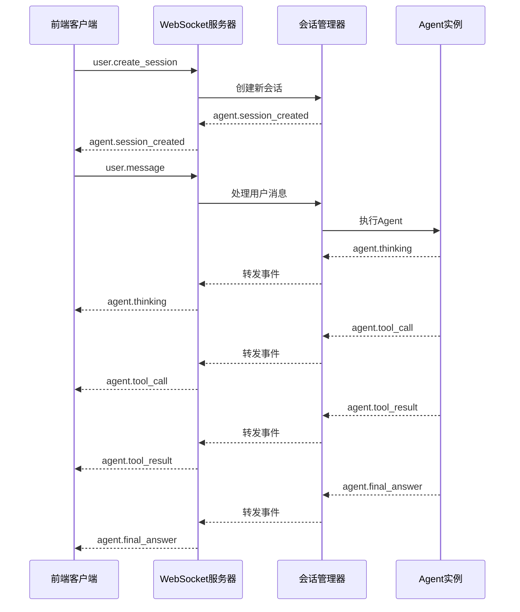

# MyAgent WebSocket 一键部署解决方案

## 🎯 概述

这是一个完整的 MyAgent WebSocket 一键部署解决方案，让您可以将任何 MyAgent 实例瞬间转换为 WebSocket 服务。

### ✨ 核心特性

- **一键部署**: 使用 `myagent-ws server agent.py` 即可启动
- **实时通信**: WebSocket 协议支持双向实时通信
- **流式输出**: Agent 执行过程实时推送给前端
- **会话管理**: 支持多用户并发会话
- **错误处理**: 完善的异常处理和恢复机制
- **生产就绪**: 支持 Docker 部署和集群扩展

## 🏗️ 架构设计

```
用户请求 → WebSocket连接 → 会话管理 → Agent执行 → 实时响应
    ↓           ↓           ↓         ↓         ↓
  前端UI → WebSocket客户端 → 服务网关 → Agent实例 → 工具调用
```

### 核心组件

1. **WebSocket 服务器** (`myagent/ws/server.py`)
   - 连接管理和路由
   - 消息协议处理
   - 会话生命周期管理

2. **会话管理器** (`myagent/ws/session.py`)
   - Agent 实例管理
   - 执行状态追踪
   - 实时事件推送

3. **CLI 工具** (`myagent/cli/server.py`)
   - 动态加载 Agent 文件
   - 命令行参数处理
   - 服务启动和管理

4. **事件协议** (`myagent/ws/events.py`)
   - 标准化消息格式
   - 事件类型定义
   - 协议验证

## 📁 项目结构

```
myagent/
├── ws/                         # WebSocket 集成模块
│   ├── __init__.py
│   ├── server.py              # WebSocket 服务器
│   ├── session.py             # 会话管理
│   └── events.py              # 事件协议
├── cli/                        # 命令行工具
│   ├── __init__.py
│   └── server.py              # CLI 实现
├── examples/
│   └── ws_weather_agent.py    # 示例 Agent
├── scripts/
│   └── myagent-ws             # CLI 入口脚本
├── docs/ws-server/
│   ├── design.md              # 完整技术设计
│   ├── backend-deployment.md  # 后端实现方案
│   ├── quick-start.md         # 快速开始指南
│   └── README.md              # 本文档
├── requirements-ws.txt         # WebSocket 服务依赖
└── setup_ws.py                # 安装脚本
```

## 🚀 使用方法

### 1. 快速开始

```bash
# 1. 安装依赖
pip install -r requirements-ws.txt

# 2. 运行安装脚本
python setup_ws.py

# 3. 创建您的 Agent
cat > my_agent.py << 'EOF'
from myagent import create_react_agent
from myagent.tool.base_tool import BaseTool, ToolResult

class GreetTool(BaseTool):
    name = "greet"
    description = "向用户问好"
    parameters = {
        "type": "object",
        "properties": {
            "name": {"type": "string", "description": "用户名"}
        },
        "required": ["name"]
    }
    
    async def execute(self, name: str) -> ToolResult:
        return ToolResult(output=f"Hello, {name}!")

agent = create_react_agent(
    name="greeter",
    tools=[GreetTool()],
    system_prompt="You are a friendly assistant.",
    max_steps=3
)
EOF

# 4. 一键启动服务
myagent-ws server my_agent.py --host 0.0.0.0 --port 8080
```

### 2. 测试连接

```javascript
// 前端测试代码
const ws = new WebSocket('ws://localhost:8080');

ws.onopen = () => {
    console.log('Connected!');
    // 创建会话
    ws.send(JSON.stringify({
        event: 'user.create_session',
        timestamp: new Date().toISOString()
    }));
};

ws.onmessage = (event) => {
    const data = JSON.parse(event.data);
    console.log('Received:', data);
    
    if (data.event === 'agent.session_created') {
        // 发送消息
        ws.send(JSON.stringify({
            event: 'user.message',
            session_id: data.session_id,
            content: '你好！',
            timestamp: new Date().toISOString()
        }));
    }
};
```

## 📊 WebSocket 事件流



## 🎮 完整示例

### 天气助手 Agent

我们提供了一个功能完整的天气助手示例：

```bash
# 启动天气助手服务
myagent-ws server examples/ws_weather_agent.py --port 8080

# 服务启动后会显示：
🔍 正在加载 Agent 文件: examples/ws_weather_agent.py
✅ Agent 加载成功: weather-assistant
🚀 MyAgent WebSocket 服务启动在 ws://localhost:8080
```

### 支持的功能

- 🌤️ **天气查询**: "北京今天天气怎么样？"
- 🏙️ **城市信息**: "告诉我上海的基本信息"
- 🔄 **实时流式输出**: 执行过程实时显示
- ⚡ **并发会话**: 支持多用户同时使用

## 🛠️ 高级配置

### 生产环境部署

```bash
# Docker 部署
docker build -t myagent-ws .
docker run -p 8080:8080 -v ./agents:/app/agents myagent-ws

# 使用环境变量配置
export OPENAI_API_KEY="your-api-key"
export SERPER_API_KEY="your-serper-key"  # 如果使用搜索功能

myagent-ws server production_agent.py --host 0.0.0.0 --port 8080
```

### 集群部署

```yaml
# docker-compose.yml
version: '3.8'
services:
  myagent-ws:
    build: .
    ports:
      - "8080:8080"
    environment:
      - OPENAI_API_KEY=${OPENAI_API_KEY}
    volumes:
      - ./agents:/app/agents
    command: ["myagent-ws", "server", "/app/agents/my_agent.py", "--host", "0.0.0.0"]
    
  nginx:
    image: nginx:alpine
    ports:
      - "80:80"
    volumes:
      - ./nginx.conf:/etc/nginx/nginx.conf
    depends_on:
      - myagent-ws
```

## 📈 性能和扩展

### 性能指标

- **并发连接**: 支持 1000+ 并发 WebSocket 连接
- **响应延迟**: < 100ms 消息路由延迟
- **内存使用**: 每会话约 10-50MB（取决于 Agent 复杂度）
- **CPU 使用**: 支持多核并行处理

### 扩展选项

1. **水平扩展**: 通过负载均衡器分发连接
2. **Redis 集群**: 使用 Redis 存储会话状态
3. **消息队列**: Kafka/RabbitMQ 处理高并发消息
4. **容器编排**: Kubernetes 自动扩缩容

## 🔒 安全特性

- **输入验证**: JSON Schema 验证所有消息
- **会话隔离**: 每个会话独立的 Agent 实例
- **连接管理**: 自动清理断开的连接
- **错误处理**: 优雅处理各种异常情况
- **资源限制**: 防止单个会话占用过多资源

## 🧪 测试和调试

### 单元测试

```bash
# 测试 Agent 功能
python -c "
import asyncio
from my_agent import agent
result = asyncio.run(agent.arun('测试消息'))
print(result)
"

# 测试 WebSocket 连接
python -c "
import asyncio
import websockets
import json

async def test():
    async with websockets.connect('ws://localhost:8080') as ws:
        await ws.send(json.dumps({'event': 'user.create_session'}))
        response = await ws.recv()
        print(json.loads(response))

asyncio.run(test())
"
```

### 调试模式

```bash
# 启用详细日志
myagent-ws server my_agent.py --debug

# 查看服务状态
curl http://localhost:8081/health  # 如果启用了健康检查
```

## 📚 文档索引

- [快速开始指南](quick-start.md) - 5分钟上手教程
- [完整技术设计](design.md) - WebSocket 协议设计
- [后端实现方案](backend-deployment.md) - 详细实现文档
- [API 参考](../api/) - 完整 API 文档

## 🤝 贡献指南

欢迎贡献代码！请遵循以下步骤：

1. Fork 项目
2. 创建功能分支: `git checkout -b feature/new-feature`
3. 提交更改: `git commit -am 'Add new feature'`
4. 推送分支: `git push origin feature/new-feature`
5. 创建 Pull Request

## 📄 许可证

本项目基于 MIT 许可证开源 - 查看 [LICENSE](../../LICENSE) 文件了解详情。

## 🆘 支持

如需帮助，请：

1. 查看 [快速开始指南](quick-start.md)
2. 搜索 [GitHub Issues](../../issues)
3. 创建新的 Issue 描述问题
4. 参考示例代码和文档

---

**MyAgent WebSocket Server** - 让 AI Agent 部署变得简单高效！ 🚀