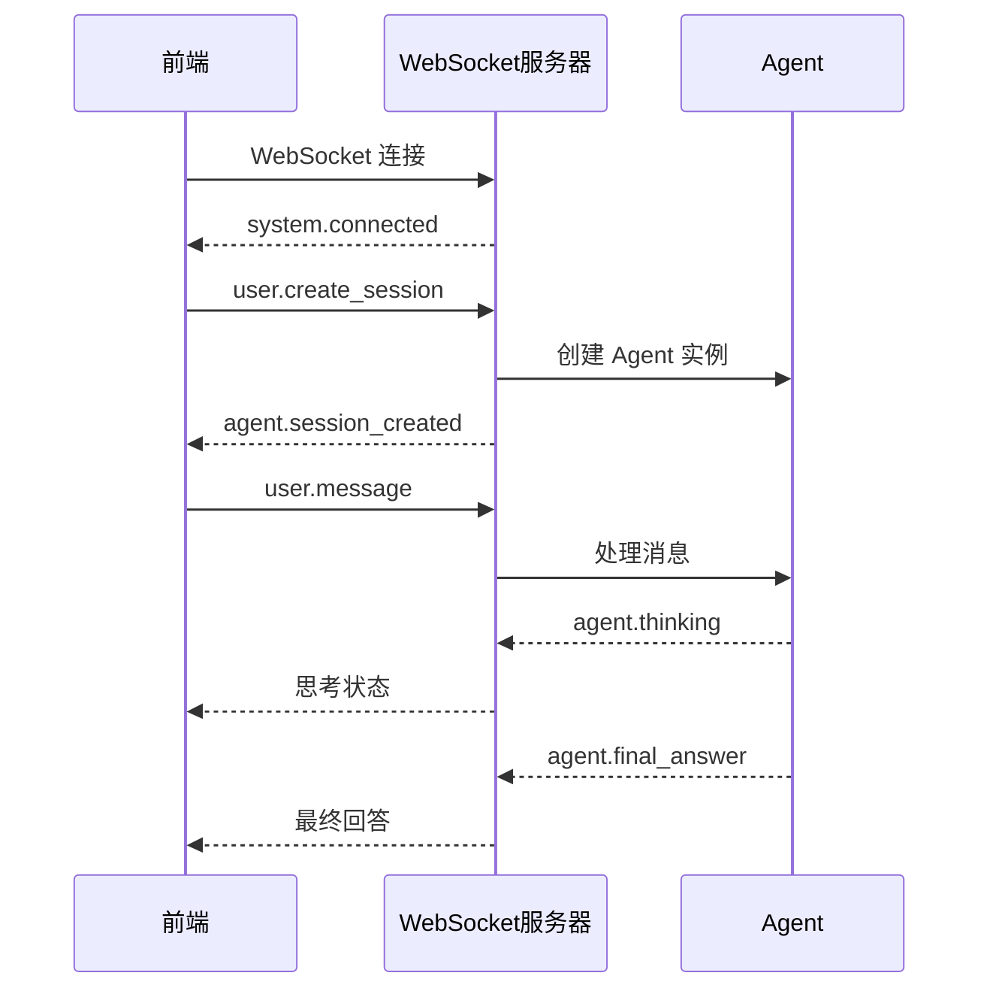
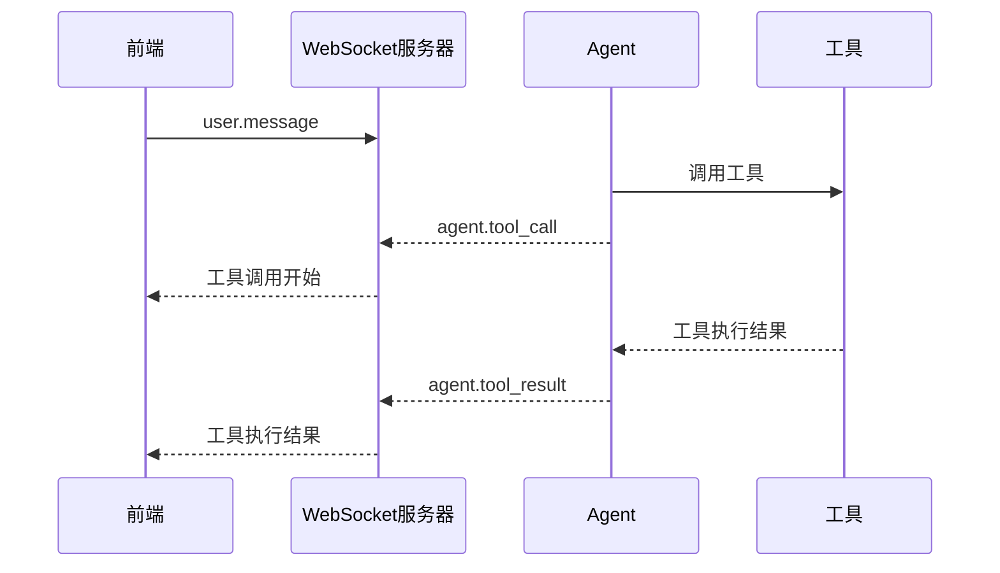
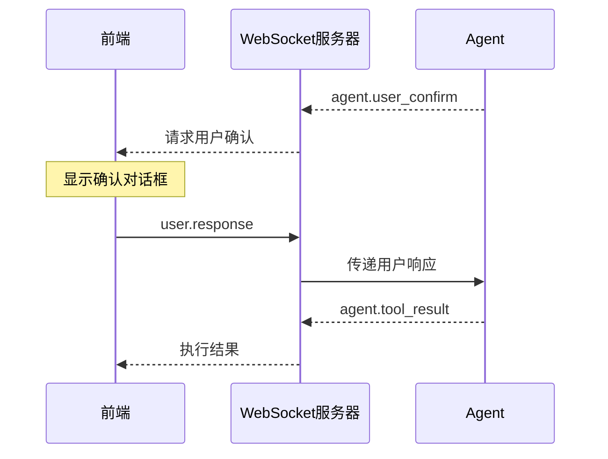

# MyAgent WebSocket 基础概念

## 概述

MyAgent WebSocket 提供了实时的 Agent 交互能力，支持双向通信、流式响应和用户确认机制。

## 核心概念

### 1. 连接管理

#### Connection ID
- **作用**: 唯一标识一个 WebSocket 连接
- **生命周期**: 从连接建立到断开
- **格式**: UUID 字符串

#### Session ID  
- **作用**: 唯一标识一个 Agent 会话
- **生命周期**: 从会话创建到会话结束
- **格式**: UUID 字符串
- **关系**: 一个连接可以创建多个会话

#### Step ID
- **作用**: 唯一标识工具调用和用户确认步骤
- **生命周期**: 单次操作的请求响应周期
- **格式**: `step_{counter}_{tool_name}` 或 `confirm_{uuid}_{tool_name}`

### 2. 事件系统

#### 事件分类
```typescript
type EventCategory = 
  | 'user'    // 用户发送的事件
  | 'agent'   // Agent 发送的事件  
  | 'system'  // 系统级事件
```

#### 事件流向
- **上行** (前端 → 后端): `user.*` 事件
- **下行** (后端 → 前端): `agent.*` 和 `system.*` 事件

#### Session ID 覆盖规则
- ✅ **包含 session_id**: 所有 `agent.*` 事件
- ❌ **不包含 session_id**: 所有 `system.*` 事件

### 3. 消息格式

所有 WebSocket 消息采用统一的 JSON 格式：

```typescript
interface WebSocketMessage {
  event: string;           // 事件类型 (必需)
  timestamp: string;       // ISO 格式时间戳 (自动生成)
  session_id?: string;     // 会话 ID (非系统事件必需)
  connection_id?: string;  // 连接 ID (可选)
  step_id?: string;        // 步骤 ID (用于关联请求响应)
  content?: string | object; // 消息内容
  metadata?: object;       // 元数据
}
```

## 事件类型详解

### 用户事件 (user.*)

| 事件 | 描述 | 必需字段 |
|------|------|----------|
| `user.create_session` | 创建新会话 | `event` |
| `user.message` | 发送用户消息 | `event`, `session_id`, `content` |
| `user.response` | 用户响应确认 | `event`, `session_id`, `step_id`, `content` |
| `user.cancel` | 取消当前执行 | `event`, `session_id` |
| `user.reconnect` | 重连会话 | `event`, `session_id` |

### Agent 事件 (agent.*)

| 事件 | 描述 | 包含 session_id |
|------|------|----------------|
| `agent.session_created` | 会话创建成功 | ✅ |
| `agent.thinking` | Agent 思考状态 | ✅ |
| `agent.tool_call` | 工具调用开始 | ✅ |
| `agent.tool_result` | 工具调用结果 | ✅ |
| `agent.user_confirm` | 请求用户确认 | ✅ |
| `agent.partial_answer` | 流式回答片段 | ✅ |
| `agent.final_answer` | 最终回答 | ✅ |
| `agent.llm_message` | LLM对话记录 | ✅ |
| `agent.error` | Agent 执行错误 | ✅ |
| `agent.interrupted` | 执行被中断 | ✅ |
| `agent.session_end` | 会话结束 | ✅ |

### 系统事件 (system.*)

| 事件 | 描述 | 包含 session_id |
|------|------|----------------|
| `system.connected` | 连接建立 | ❌ |
| `system.heartbeat` | 心跳检测 | ❌ |
| `system.error` | 系统级错误 | ❌ |

## 交互流程

### 基本会话流程



### 工具调用流程



### 用户确认流程



## 环境变量配置

| 变量 | 作用 | 默认值 | 有效值 |
|------|------|--------|--------|
| `SEND_LLM_MESSAGE` | 启用 LLM 消息事件 | `false` | `true`, `1`, `yes`, `on` |

## 错误处理

### 错误类型
- **连接错误**: WebSocket 连接失败
- **协议错误**: JSON 解析失败、格式错误
- **业务错误**: 会话不存在、Agent 执行失败

### 错误响应格式
```javascript
{
  "event": "system.error" | "agent.error",
  "content": "错误描述信息",
  "metadata": {
    "error_code": "OPTIONAL_ERROR_CODE",
    "details": {}
  }
}
```

## 最佳实践

1. **连接管理**: 实现重连机制和连接状态监控
2. **会话隔离**: 使用 session_id 正确路由消息
3. **错误处理**: 区分不同错误类型，提供友好的用户体验
4. **性能优化**: 使用消息缓冲和批处理避免UI卡顿
5. **状态同步**: 正确处理 step_id 关联请求响应

## 下一步

- [快速开始指南](./quick-start.md) - 5分钟上手WebSocket集成
- [用户确认机制](./user-confirmation.md) - 详细的确认流程实现
- [React集成指南](./react-integration.md) - React框架集成示例
- [数据可视化集成](./visualization-integration.md) - 图表展示功能
- [客户端状态管理](./client-state-management.md) - 状态保存和恢复