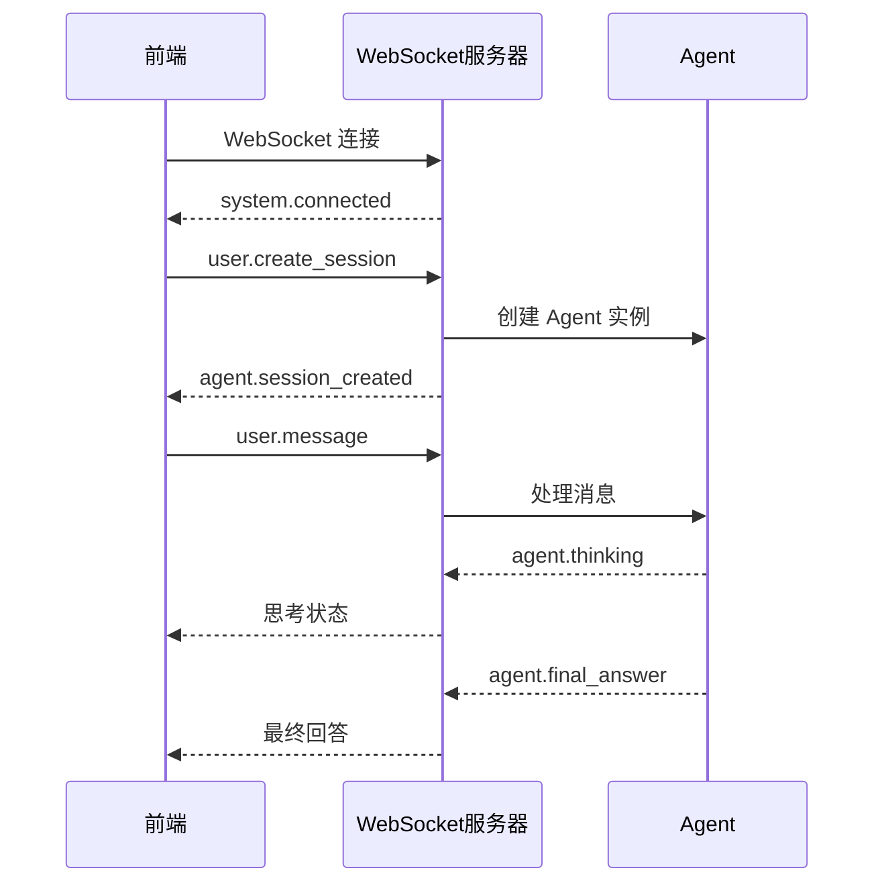
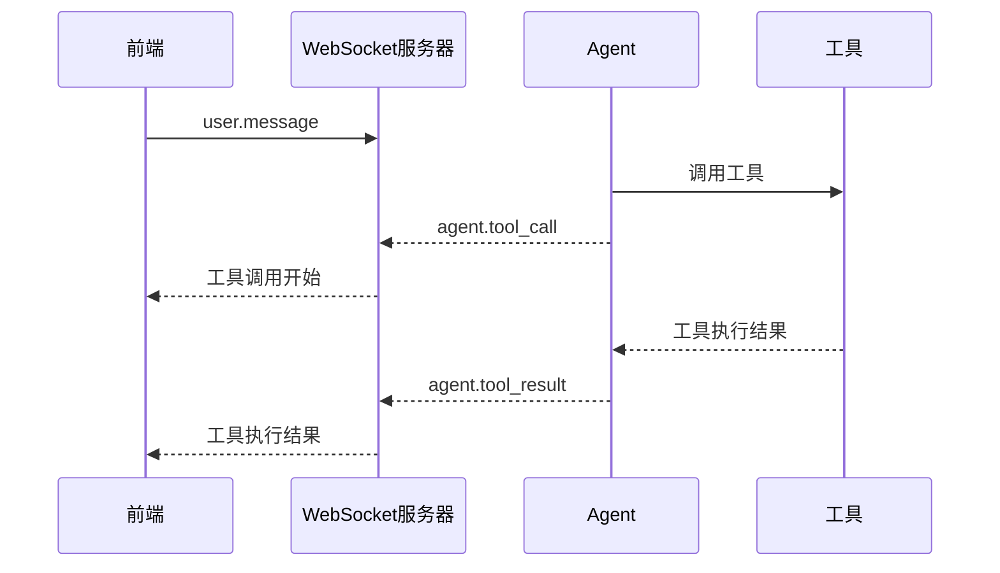
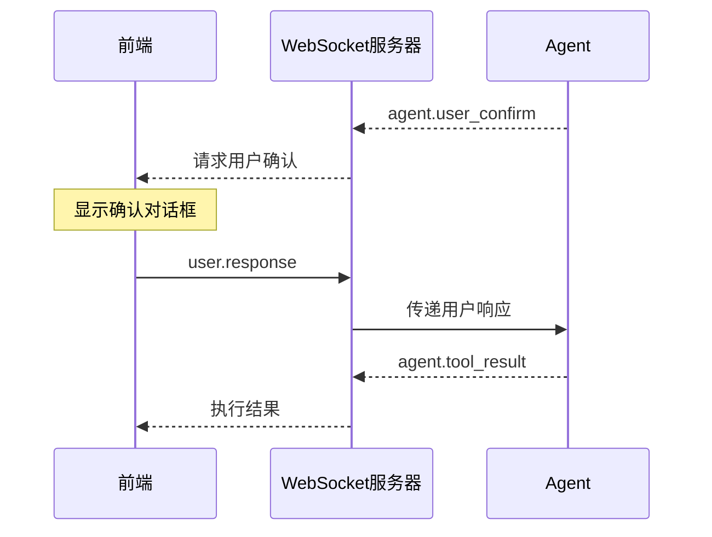

# MyAgent WebSocket 基础概念

## 概述

MyAgent WebSocket 提供了实时的 Agent 交互能力，支持双向通信、流式响应和用户确认机制。

## 核心概念

### 1. 连接管理

#### Connection ID
- **作用**: 唯一标识一个 WebSocket 连接
- **生命周期**: 从连接建立到断开
- **格式**: UUID 字符串

#### Session ID  
- **作用**: 唯一标识一个 Agent 会话
- **生命周期**: 从会话创建到会话结束
- **格式**: UUID 字符串
- **关系**: 一个连接可以创建多个会话

#### Step ID
- **作用**: 唯一标识工具调用和用户确认步骤
- **生命周期**: 单次操作的请求响应周期
- **格式**: `step_{counter}_{tool_name}` 或 `confirm_{uuid}_{tool_name}`

### 2. 事件系统

#### 事件分类
```typescript
type EventCategory = 
  | 'user'    // 用户发送的事件
  | 'agent'   // Agent 发送的事件  
  | 'system'  // 系统级事件
```

#### 事件流向
- **上行** (前端 → 后端): `user.*` 事件
- **下行** (后端 → 前端): `agent.*` 和 `system.*` 事件

#### Session ID 覆盖规则
- ✅ **包含 session_id**: 所有 `agent.*` 事件
- ➕ **可包含 session_id**: 与特定会话相关的 `system.*` 事件（例如 `system.notice`）
- ❌ **通常不包含 session_id**: 与会话无关的连接级系统事件（如 `system.connected`、`system.heartbeat`）

#### 可靠性标识（服务器下行）
- 所有服务器下行事件都会注入单调序号 `seq` 和全局唯一 `event_id`（`<connectionId>-<seq>`）
- 事件的 `metadata.connection_id` 会自动填充为当前连接 ID

### 3. 消息格式

所有 WebSocket 消息采用统一的 JSON 格式：

```typescript
interface WebSocketMessage {
  event: string;           // 事件类型 (必需)
  timestamp: string;       // ISO 格式时间戳 (自动生成)
  session_id?: string;     // 会话 ID (非系统事件必需)
  connection_id?: string;  // 连接 ID (可选)
  step_id?: string;        // 步骤 ID (用于关联请求响应)
  content?: string | object; // 消息内容
  metadata?: object;       // 元数据
  // 服务器下行事件包含：
  seq?: number;            // 连接内单调序号
  event_id?: string;       // 事件唯一ID: <connectionId>-<seq>
}
```

## 事件类型详解

### 用户事件 (user.*)

| 事件 | 描述 | 必需字段 |
|------|------|----------|
| `user.create_session` | 创建新会话 | `event` |
| `user.message` | 发送用户消息 | `event`, `session_id`, `content` |
| `user.response` | 用户响应确认 | `event`, `session_id`, `step_id`, `content` |
| `user.cancel` | 取消当前执行 | `event`, `session_id` |
| `user.solve_tasks` | 直接提交任务给求解器（跳过规划） | `event`, `session_id`, `content.tasks` |
| `user.cancel_task` | 取消指定任务 | `event`, `session_id`, `content.task_id` |
| `user.restart_task` | 重新执行指定任务 | `event`, `session_id`, `content.task_id` |
| `user.cancel_plan` | 取消规划阶段 | `event`, `session_id` |
| `user.replan` | 重新规划（会话空闲或运行内重计划） | `event`, `session_id`（可选 `content.question`） |
| `user.ack` | 客户端 ACK（去重/回放对齐） | `event`, `content.last_event_id` 或 `content.last_seq` |

### Agent 事件 (agent.*)

| 事件 | 描述 | 包含 session_id |
|------|------|----------------|
| `agent.session_created` | 会话创建成功 | ✅ |
| `agent.thinking` | Agent 思考状态 | ✅ |
| `agent.tool_call` | 工具调用开始 | ✅ |
| `agent.tool_result` | 工具调用结果 | ✅ |
| `agent.user_confirm` | 请求用户确认 | ✅ |
| `agent.partial_answer` | 流式回答片段 | ✅ |
| `agent.final_answer` | 最终回答 | ✅ |
| `agent.llm_message` | LLM对话记录 | ✅ |
| `agent.error` | Agent 执行错误 | ✅ |
| `agent.interrupted` | 执行被中断 | ✅ |
| `agent.session_end` | 会话结束 | ✅ |
| `plan.cancelled` | 规划被取消 | ✅ |
| `solver.cancelled` | 单任务被取消 | ✅ |
| `solver.restarted` | 单任务已重启 | ✅ |

### 系统事件 (system.*)

| 事件 | 描述 | 包含 session_id |
|------|------|----------------|
| `system.connected` | 连接建立 | ❌ |
| `system.heartbeat` | 心跳检测 | ❌ |
| `system.error` | 系统级错误 | ❌ |

### 状态管理事件

| 事件 | 方向 | 描述 |
|------|------|------|
| `user.request_state` | 客户端 → 服务器 | 请求导出当前会话状态 |
| `agent.state_exported` | 服务器 → 客户端 | 状态导出完成，包含签名状态 |
| `user.reconnect_with_state` | 客户端 → 服务器 | 使用保存的状态重新连接 |
| `agent.state_restored` | 服务器 → 客户端 | 状态恢复成功确认 |

## 交互流程

### 基本会话流程



> 直接任务模式：当客户端已具备任务时，可使用 `user.solve_tasks` 直接进入求解阶段（将收到 `solver.start` / `solver.completed` 等求解相关事件；不经过 `plan.completed/aggregate.*`）。详见 [Plan & Solve 消息指南](./plan_solver_messages.md)。

### 工具调用流程



### 用户确认流程



## 核心组件

### StateManager（状态管理器）

`myagent.ws.state_manager.StateManager` 负责客户端状态管理：

**功能：**
- 状态快照创建 - `create_state_snapshot(session)`
- 状态签名 - `sign_state(state_data)` 使用 HMAC-SHA256
- 状态验证 - `verify_state(signed_state)` 验证签名和完整性
- 会话恢复 - `restore_session_from_state(session, state_data)`

**安全特性：**
- HMAC-SHA256 签名防止篡改
- 时间戳验证防止重放攻击（7天有效期）
- SHA-256 校验和验证数据完整性
- 自动清理敏感信息（API密钥、令牌等）
- 状态大小限制（100KB，100条消息）

**初始化：**
```python
from myagent.ws.server import AgentWebSocketServer

server = AgentWebSocketServer(
    agent_factory_func=create_agent,
    state_secret_key="your-production-secret-key"  # 生产环境必须提供
)
```

### WebSocket工具函数

`myagent.ws.utils` 提供跨版本兼容的工具函数：

- `is_websocket_closed(websocket)` - 检查连接状态（兼容新旧版本）
- `send_websocket_message(websocket, message)` - 安全发送消息
- `close_websocket_safely(websocket)` - 安全关闭连接
- `get_websocket_info(websocket)` - 获取连接调试信息

### 出站发送与流控（概念）
- 每个连接使用“单写者出站通道”串行发送，避免并发 `send()` 冲突，并提供有界队列背压
- 高频事件（如 `agent.partial_answer`、`agent.llm_message`）采用短窗口合并（默认 75ms）以降低抖动

### 可靠性与断线回放（概念）
- 客户端按需发送 `user.ack`，携带最近收到的 `last_event_id`（推荐）或 `last_seq`，服务端据此裁剪内存缓冲
- 断线后使用 `user.reconnect_with_state`（携带已签名状态）并可提供 `last_event_id/last_seq`，服务端将按会话历史缓冲做差量回放（单次回放最多 200 条）

## 环境变量配置

| 变量 | 作用 | 默认值 | 有效值 |
|------|------|--------|--------|
| `SEND_LLM_MESSAGE` | 启用 LLM 消息事件 | `false` | `true`, `1`, `yes`, `on` |

## 错误处理

### 错误类型
- **连接错误**: WebSocket 连接失败
- **协议错误**: JSON 解析失败、格式错误
- **业务错误**: 会话不存在、Agent 执行失败

### 错误响应格式
```javascript
{
  "event": "system.error" | "agent.error",
  "content": "错误描述信息",
  "metadata": {
    "error_code": "OPTIONAL_ERROR_CODE",
    "details": {}
  }
}
```

## 最佳实践

1. **连接管理**: 实现重连机制和连接状态监控
2. **会话隔离**: 使用 session_id 正确路由消息
3. **错误处理**: 区分不同错误类型，提供友好的用户体验
4. **性能优化**: 使用消息缓冲和批处理避免UI卡顿
5. **状态同步**: 正确处理 step_id 关联请求响应

## 下一步

- [快速开始指南](./quick-start.md) - 5分钟上手WebSocket集成
- [用户确认机制](./user-confirmation.md) - 详细的确认流程实现
- [React集成指南](./react-integration.md) - React框架集成示例
- [数据可视化集成](./visualization-integration.md) - 图表展示功能
- [客户端状态管理](./client-state-management.md) - 状态保存和恢复
- [Plan & Solve 消息指南](./plan_solver_messages.md) - 规划/求解流水线与细粒度控制
- [WebSocket 通信方案现状问题记录](../websocket-known-issues.md) - 可靠性与改进方向
