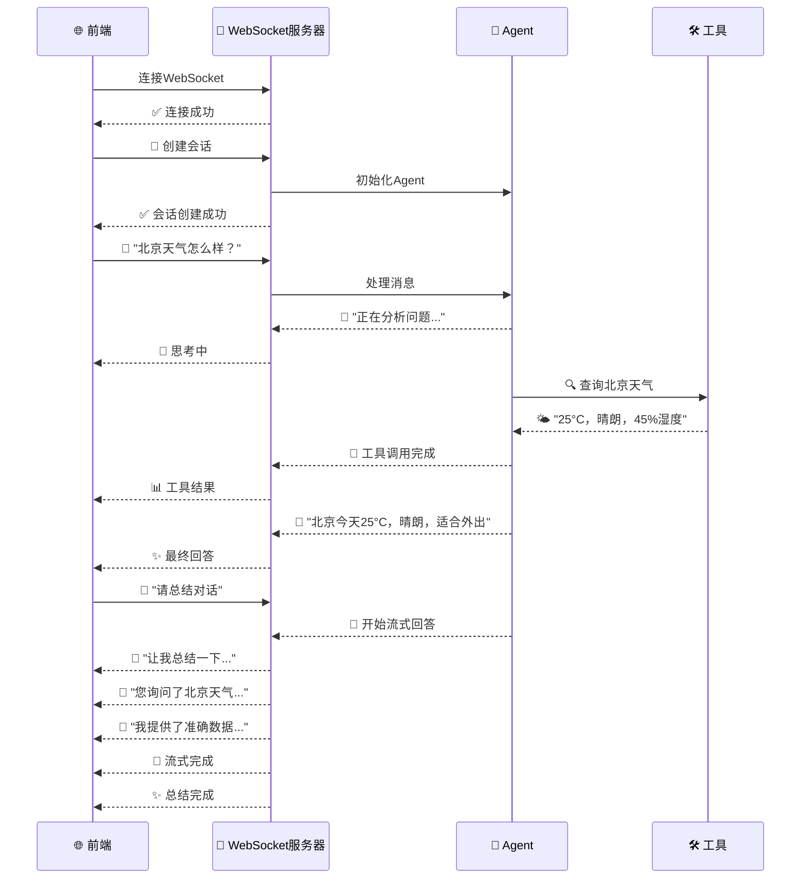
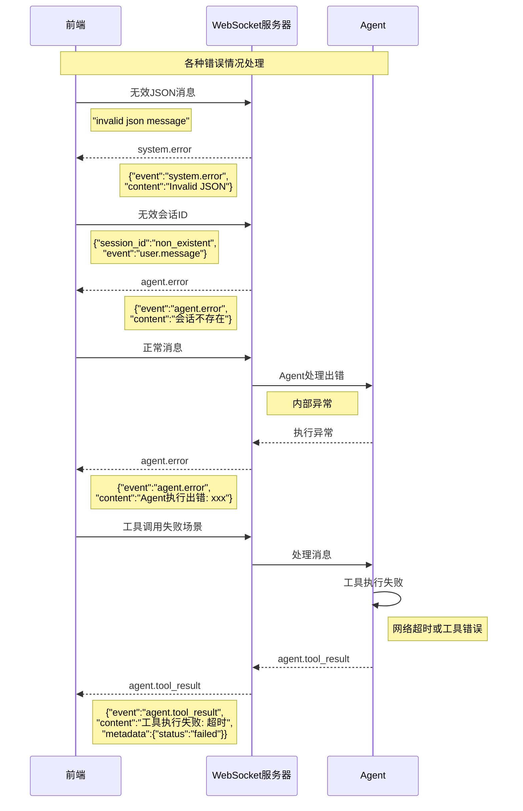
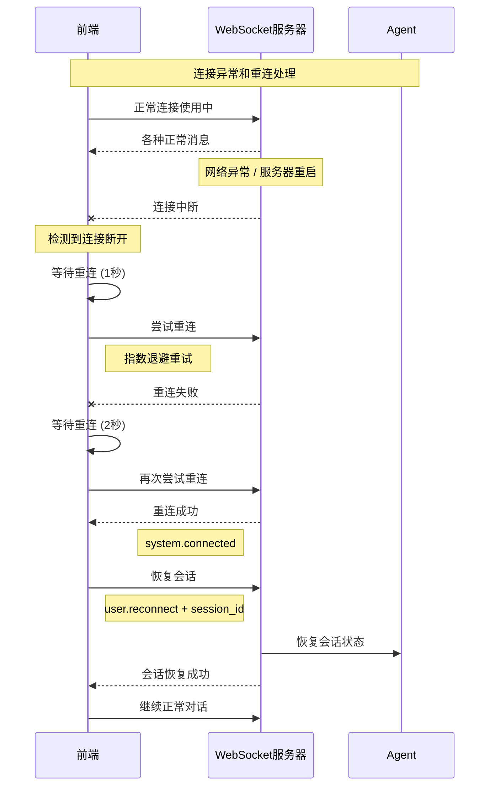
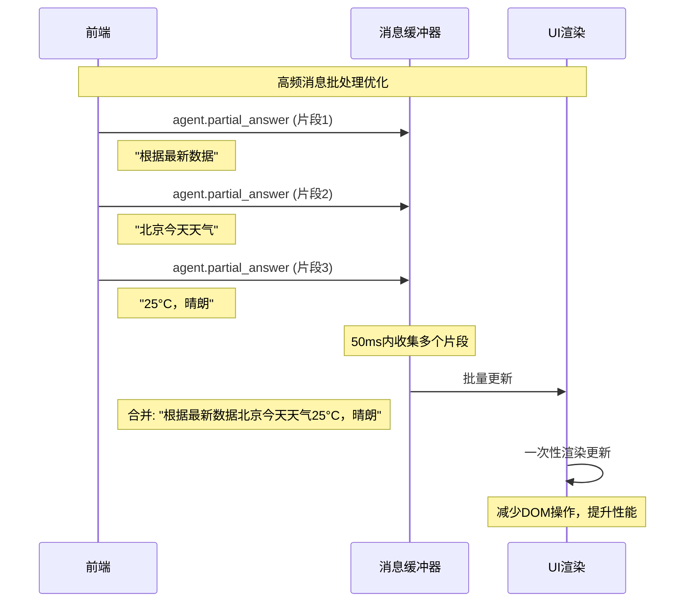
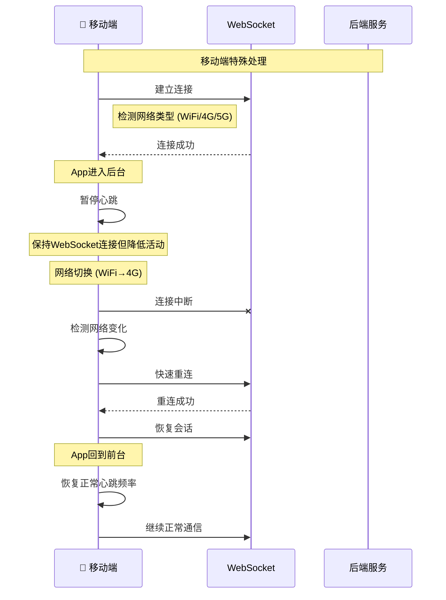

# MyAgent WebSocket 前后端消息时序图

## 完整对话流程时序图

```mermaid
sequenceDiagram
    participant F as 前端客户端
    participant WS as WebSocket服务器
    participant A as Agent实例
    participant T as 工具服务
    participant LLM as 大语言模型

    Note over F,LLM: 1. 建立连接和创建会话
    
    F->>WS: WebSocket连接请求
    Note right of F: ws://localhost:8080
    
    WS-->>F: system.connected
    Note left of WS: {"event":"system.connected",<br/>"content":"Connected to MyAgent WebSocket Server",<br/>"metadata":{"connection_id":"conn_123"}}
    
    F->>WS: user.create_session
    Note right of F: {"event":"user.create_session",<br/>"timestamp":"2024-01-01T12:00:00Z",<br/>"content":"create_session"}
    
    WS->>A: 创建Agent实例
    WS-->>F: agent.session_created
    Note left of WS: {"event":"agent.session_created",<br/>"session_id":"sess_abc123",<br/>"content":"会话创建成功",<br/>"metadata":{"agent_name":"weather-assistant"}}

    Note over F,LLM: 2. 用户发送消息 - 天气查询

    F->>WS: user.message
    Note right of F: {"session_id":"sess_abc123",<br/>"event":"user.message",<br/>"content":"北京今天的天气怎么样？"}

    WS->>A: 处理用户消息
    
    A-->>WS: agent.thinking
    WS-->>F: agent.thinking
    Note left of WS: {"event":"agent.thinking",<br/>"session_id":"sess_abc123",<br/>"content":"正在分析您的问题...",<br/>"metadata":{"step":1}}

    A->>LLM: 分析用户意图
    Note right of A: messages: [<br/>{"role":"system","content":"你是天气助手..."},<br/>{"role":"user","content":"北京今天的天气怎么样？"}]
    
    LLM-->>A: 返回工具调用决策
    Note left of LLM: tool_calls: [{"function":{"name":"get_weather","arguments":"{\"city\":\"北京\"}"}}]

    A-->>WS: agent.tool_call
    WS-->>F: agent.tool_call
    Note left of WS: {"event":"agent.tool_call",<br/>"step_id":"step_1_weather",<br/>"content":"调用工具: get_weather",<br/>"metadata":{"tool":"get_weather","args":{"city":"北京"},"status":"running"}}

    A->>T: 执行天气查询工具
    Note right of A: get_weather(city="北京")
    
    T-->>A: 返回天气数据
    Note left of T: {"temp":"25°C","desc":"晴朗","humidity":"45%"}

    A-->>WS: agent.tool_result
    WS-->>F: agent.tool_result
    Note left of WS: {"event":"agent.tool_result",<br/>"step_id":"step_1_weather",<br/>"content":"北京的天气：25°C，晴朗，湿度45%",<br/>"metadata":{"tool":"get_weather","status":"success"}}

    A->>LLM: 生成最终回答
    Note right of A: messages: [..., <br/>{"role":"tool","content":"北京的天气：25°C，晴朗，湿度45%"}]

    LLM-->>A: 返回回答
    Note left of LLM: "根据最新数据，北京今天天气晴朗，气温25°C，湿度45%。适合外出活动。"

    A-->>WS: agent.final_answer
    WS-->>F: agent.final_answer
    Note left of WS: {"event":"agent.final_answer",<br/>"session_id":"sess_abc123",<br/>"content":"根据最新数据，北京今天天气晴朗，气温25°C，湿度45%。适合外出活动。"}

    Note over F,LLM: 3. 用户发送新消息 - 请求总结

    F->>WS: user.message
    Note right of F: {"session_id":"sess_abc123",<br/>"event":"user.message",<br/>"content":"请总结一下我们的对话"}

    WS->>A: 处理总结请求
    
    A-->>WS: agent.thinking
    WS-->>F: agent.thinking
    Note left of WS: {"event":"agent.thinking",<br/>"session_id":"sess_abc123",<br/>"content":"开始处理您的请求..."}

    A-->>WS: agent.thinking (生成总结)
    WS-->>F: agent.thinking
    Note left of WS: {"event":"agent.thinking",<br/>"session_id":"sess_abc123",<br/>"content":"正在生成最终总结...",<br/>"metadata":{"streaming":true}}

    A->>LLM: 流式生成总结 (启用streaming)
    Note right of A: 启用WebSocket流式传输

    LLM-->>A: 流式返回内容片段1
    Note left of LLM: "您好！让我为您总结一下"

    A-->>WS: agent.partial_answer
    WS-->>F: agent.partial_answer
    Note left of WS: {"event":"agent.partial_answer",<br/>"session_id":"sess_abc123",<br/>"content":"您好！让我为您总结一下",<br/>"metadata":{"is_streaming":true,"word_count":10,"is_final":false}}

    LLM-->>A: 流式返回内容片段2
    Note left of LLM: "我们刚才的对话内容：\n\n1. 您询问了北京"

    A-->>WS: agent.partial_answer
    WS-->>F: agent.partial_answer
    Note left of WS: {"event":"agent.partial_answer",<br/>"session_id":"sess_abc123",<br/>"content":"我们刚才的对话内容：\n\n1. 您询问了北京",<br/>"metadata":{"is_streaming":true,"word_count":25,"is_final":false}}

    LLM-->>A: 流式返回内容片段3
    Note left of LLM: "今天的天气情况\n2. 我通过天气查询工具为您获取了"

    A-->>WS: agent.partial_answer
    WS-->>F: agent.partial_answer
    Note left of WS: {"event":"agent.partial_answer",<br/>"session_id":"sess_abc123",<br/>"content":"今天的天气情况\n2. 我通过天气查询工具为您获取了",<br/>"metadata":{"is_streaming":true,"word_count":45,"is_final":false}}

    LLM-->>A: 流式返回内容片段4 (最后一段)
    Note left of LLM: "准确的天气数据：25°C，晴朗，湿度45%\n3. 最后建议您适合外出活动"

    A-->>WS: agent.partial_answer
    WS-->>F: agent.partial_answer
    Note left of WS: {"event":"agent.partial_answer",<br/>"session_id":"sess_abc123",<br/>"content":"准确的天气数据：25°C，晴朗，湿度45%\n3. 最后建议您适合外出活动",<br/>"metadata":{"is_streaming":true,"word_count":70,"is_final":false}}

    A-->>WS: agent.partial_answer (结束标记)
    WS-->>F: agent.partial_answer
    Note left of WS: {"event":"agent.partial_answer",<br/>"session_id":"sess_abc123",<br/>"content":"",<br/>"metadata":{"is_streaming":true,"is_final":true,"total_length":70}}

    A-->>WS: agent.final_answer
    WS-->>F: agent.final_answer
    Note left of WS: {"event":"agent.final_answer",<br/>"session_id":"sess_abc123",<br/>"content":"完整的总结内容..."}

    Note over F,LLM: 4. 系统心跳和连接维护

    WS-->>F: system.heartbeat
    Note left of WS: {"event":"system.heartbeat",<br/>"metadata":{"active_sessions":1,"uptime":3600}}

    Note over F,LLM: 5. 用户取消操作示例

    F->>WS: user.message
    Note right of F: {"session_id":"sess_abc123",<br/>"event":"user.message",<br/>"content":"请详细分析一下全球气候变化..."}

    A-->>WS: agent.thinking
    WS-->>F: agent.thinking
    Note left of WS: {"event":"agent.thinking",<br/>"content":"正在分析复杂问题..."}

    F->>WS: user.cancel
    Note right of F: {"session_id":"sess_abc123",<br/>"event":"user.cancel",<br/>"content":"cancel"}

    WS->>A: 取消当前执行
    
    A-->>WS: agent.interrupted
    WS-->>F: agent.interrupted
    Note left of WS: {"event":"agent.interrupted",<br/>"session_id":"sess_abc123",<br/>"content":"执行已取消"}

    Note over F,LLM: 6. 错误处理示例

    F->>WS: user.message (无效会话)
    Note right of F: {"session_id":"invalid_session",<br/>"event":"user.message",<br/>"content":"测试消息"}

    WS-->>F: agent.error
    Note left of WS: {"event":"agent.error",<br/>"session_id":"invalid_session",<br/>"content":"会话不存在"}

    Note over F,LLM: 7. 连接关闭

    F->>WS: WebSocket断开连接
    
    WS->>A: 清理会话资源
    
    WS-->>F: connection closed
    Note left of WS: WebSocket连接已关闭
```

## 简化版对话流程

## 错误处理流程

## 重连机制流程

## 性能优化：消息批处理

## 移动端适配流程

## 时序图说明

### 关键消息内容说明：

1. **连接建立**: 前端发起WebSocket连接，后端确认连接并返回connection_id
2. **会话创建**: 前端请求创建会话，后端创建Agent实例并返回session_id
3. **用户消息**: 前端发送用户问题，包含session_id和具体内容
4. **Agent思考**: 后端发送thinking事件，告知前端Agent正在处理
5. **工具调用**: Agent调用外部工具时发送tool_call和tool_result事件
6. **流式回答**: 通过multiple partial_answer事件实现实时流式显示
7. **最终回答**: 发送完整的最终回答内容
8. **错误处理**: 各种异常情况的错误消息返回
9. **连接维护**: 心跳检测和重连机制

这个时序图展示了完整的前后端交互流程，包含了实际的消息内容格式，方便前端开发者理解和实现。