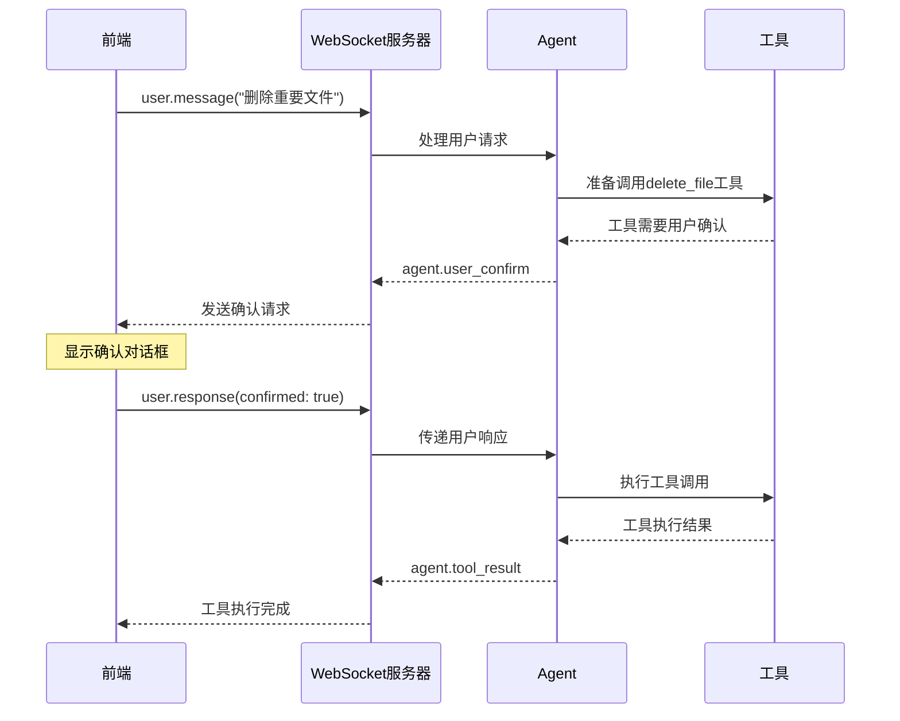

# 用户确认机制详细指南

## 概述

用户确认机制用于处理需要用户明确同意才能执行的危险或重要操作，如删除文件、发送邮件、执行系统命令等。

## 工作流程

### 基础流程图



## 事件详解

### 1. agent.user_confirm 事件

**服务器发送给前端的确认请求**

```javascript
{
    "event": "agent.user_confirm",
    "session_id": "sess_abc123",
    "step_id": "confirm_abc123_delete_file",
    "timestamp": "2024-01-01T12:00:00.000Z",
    "content": "确认执行工具: delete_file",
    "metadata": {
        "tool_name": "delete_file",
        "tool_description": "删除指定文件",
        "tool_args": {
            "file_path": "/important/document.txt"
        },
        "requires_confirmation": true
    }
}
```

**字段说明:**
- `step_id`: 唯一标识这次确认请求，格式为 `confirm_{uuid}_{tool_name}`
- `content`: 向用户显示的确认消息
- `metadata.tool_name`: 需要确认的工具名称
- `metadata.tool_description`: 工具的描述信息
- `metadata.tool_args`: 工具调用的参数
- `metadata.requires_confirmation`: 标识这是一个需要确认的操作

### 2. user.response 事件

**前端发送给服务器的用户响应**

```javascript
{
    "session_id": "sess_abc123",
    "event": "user.response",
    "step_id": "confirm_abc123_delete_file",
    "timestamp": "2024-01-01T12:00:00.000Z",
    "content": {
        "confirmed": true,
        "message": "确认删除文件"
    }
}
```

**字段说明:**
- `step_id`: 必须与 `agent.user_confirm` 中的 `step_id` 完全匹配
- `content.confirmed`: 布尔值，`true` 表示确认执行，`false` 表示取消
- `content.message`: 可选的用户备注信息

## 前端实现

### 1. React Hook 实现

```typescript
interface ConfirmationRequest {
    stepId: string;
    toolName: string;
    toolDescription: string;
    toolArgs: Record<string, any>;
    message: string;
}

export function useMyAgentWithConfirmation() {
    const [pendingConfirmation, setPendingConfirmation] = useState<ConfirmationRequest | null>(null);
    
    const handleMessage = (data: any) => {
        const { event, step_id, content, metadata } = data;
        
        switch (event) {
            case 'agent.user_confirm':
                setPendingConfirmation({
                    stepId: step_id,
                    toolName: metadata.tool_name,
                    toolDescription: metadata.tool_description,
                    toolArgs: metadata.tool_args,
                    message: content
                });
                break;
                
            // ... 其他事件处理
        }
    };

    const respondToConfirmation = (confirmed: boolean, message?: string) => {
        if (!pendingConfirmation || !sessionId) return;

        const response = {
            session_id: sessionId,
            event: 'user.response',
            step_id: pendingConfirmation.stepId,
            timestamp: new Date().toISOString(),
            content: {
                confirmed: confirmed,
                message: message || (confirmed ? '确认执行' : '用户取消')
            }
        };

        websocket.send(JSON.stringify(response));
        setPendingConfirmation(null);
    };

    return {
        pendingConfirmation,
        respondToConfirmation,
        // ... 其他返回值
    };
}
```

### 2. 确认对话框组件

```tsx
interface ConfirmationDialogProps {
    confirmation: ConfirmationRequest;
    onConfirm: (confirmed: boolean, message?: string) => void;
}

export function ConfirmationDialog({ confirmation, onConfirm }: ConfirmationDialogProps) {
    const [customMessage, setCustomMessage] = useState('');

    return (
        <div className="confirmation-modal">
            <div className="confirmation-content">
                <h3>⚠️ 确认操作</h3>
                
                <div className="confirmation-details">
                    <p><strong>工具:</strong> {confirmation.toolName}</p>
                    <p><strong>描述:</strong> {confirmation.toolDescription}</p>
                    
                    <div className="tool-args">
                        <strong>参数:</strong>
                        <pre>{JSON.stringify(confirmation.toolArgs, null, 2)}</pre>
                    </div>
                    
                    <p className="confirmation-message">{confirmation.message}</p>
                </div>

                <div className="custom-message">
                    <label>备注 (可选):</label>
                    <input
                        type="text"
                        value={customMessage}
                        onChange={(e) => setCustomMessage(e.target.value)}
                        placeholder="添加备注信息..."
                    />
                </div>

                <div className="confirmation-buttons">
                    <button
                        onClick={() => onConfirm(true, customMessage)}
                        className="confirm-button"
                    >
                        ✅ 确认执行
                    </button>
                    <button
                        onClick={() => onConfirm(false, customMessage || '用户取消')}
                        className="cancel-button"
                    >
                        ❌ 取消操作
                    </button>
                </div>
            </div>
        </div>
    );
}
```

### 3. 在主组件中使用

```tsx
export function ChatInterface() {
    const {
        messages,
        pendingConfirmation,
        sendMessage,
        respondToConfirmation
    } = useMyAgentWithConfirmation();

    return (
        <div className="chat-container">
            {/* 消息列表 */}
            <div className="messages">
                {messages.map(msg => (
                    <div key={msg.id} className={`message ${msg.type}`}>
                        {msg.content}
                    </div>
                ))}
            </div>

            {/* 确认对话框 */}
            {pendingConfirmation && (
                <ConfirmationDialog
                    confirmation={pendingConfirmation}
                    onConfirm={respondToConfirmation}
                />
            )}

            {/* 输入区域 */}
            <div className="input-area">
                <input
                    type="text"
                    disabled={!!pendingConfirmation} // 有待确认时禁用输入
                    onKeyPress={(e) => {
                        if (e.key === 'Enter') {
                            sendMessage(e.target.value);
                            e.target.value = '';
                        }
                    }}
                />
            </div>
        </div>
    );
}
```

## 高级功能

### 1. 超时处理

```javascript
class ConfirmationManager {
    constructor() {
        this.timeoutHandlers = new Map();
    }

    handleConfirmation(confirmationData, timeout = 30000) {
        const { stepId } = confirmationData;
        
        // 设置超时处理
        const timeoutId = setTimeout(() => {
            this.handleTimeout(stepId);
        }, timeout);
        
        this.timeoutHandlers.set(stepId, timeoutId);
        
        // 显示确认对话框
        this.showConfirmationDialog(confirmationData);
    }

    handleUserResponse(stepId, response) {
        // 清除超时
        const timeoutId = this.timeoutHandlers.get(stepId);
        if (timeoutId) {
            clearTimeout(timeoutId);
            this.timeoutHandlers.delete(stepId);
        }

        // 发送响应
        this.sendResponse(stepId, response);
    }

    handleTimeout(stepId) {
        console.warn(`确认请求超时: ${stepId}`);
        
        // 自动发送取消响应
        this.sendResponse(stepId, {
            confirmed: false,
            message: '操作超时，自动取消'
        });
        
        // 移除超时处理器
        this.timeoutHandlers.delete(stepId);
    }
}
```

### 2. 批量确认

```javascript
class BatchConfirmationManager {
    constructor() {
        this.pendingBatch = [];
        this.batchWindow = 5000; // 5秒内的确认请求合并
        this.batchTimer = null;
    }

    addConfirmation(confirmationData) {
        this.pendingBatch.push(confirmationData);
        
        // 如果是第一个确认请求，启动批次定时器
        if (this.pendingBatch.length === 1) {
            this.batchTimer = setTimeout(() => {
                this.processBatch();
            }, this.batchWindow);
        }
    }

    processBatch() {
        if (this.pendingBatch.length === 0) return;

        if (this.pendingBatch.length === 1) {
            // 单个确认
            this.showSingleConfirmation(this.pendingBatch[0]);
        } else {
            // 批量确认
            this.showBatchConfirmation(this.pendingBatch);
        }

        this.pendingBatch = [];
        this.batchTimer = null;
    }

    showBatchConfirmation(confirmations) {
        // 显示批量确认对话框
        const dialog = this.createBatchDialog(confirmations);
        
        dialog.onConfirm = (decisions) => {
            confirmations.forEach((confirmation, index) => {
                this.sendResponse(confirmation.stepId, {
                    confirmed: decisions[index] || false,
                    message: decisions[index] ? '批量确认' : '批量取消'
                });
            });
        };
    }
}
```

### 3. 确认历史记录

```javascript
class ConfirmationHistory {
    constructor() {
        this.history = JSON.parse(localStorage.getItem('confirmation_history') || '[]');
    }

    addRecord(stepId, toolName, confirmed, message) {
        const record = {
            stepId,
            toolName,
            confirmed,
            message,
            timestamp: new Date().toISOString()
        };

        this.history.push(record);
        
        // 只保留最近100条记录
        if (this.history.length > 100) {
            this.history = this.history.slice(-100);
        }

        this.saveHistory();
    }

    getRecentConfirmations(toolName, limit = 5) {
        return this.history
            .filter(record => record.toolName === toolName)
            .slice(-limit);
    }

    hasRecentConfirmation(toolName, timeWindow = 300000) { // 5分钟
        const now = new Date().getTime();
        return this.history.some(record => 
            record.toolName === toolName && 
            record.confirmed === true &&
            (now - new Date(record.timestamp).getTime()) < timeWindow
        );
    }

    saveHistory() {
        localStorage.setItem('confirmation_history', JSON.stringify(this.history));
    }
}
```

## 样式示例

```css
/* 确认对话框样式 */
.confirmation-modal {
    position: fixed;
    top: 0;
    left: 0;
    right: 0;
    bottom: 0;
    background-color: rgba(0, 0, 0, 0.7);
    display: flex;
    align-items: center;
    justify-content: center;
    z-index: 1000;
    animation: fadeIn 0.2s ease-out;
}

.confirmation-content {
    background: white;
    padding: 32px;
    border-radius: 12px;
    max-width: 600px;
    width: 90%;
    box-shadow: 0 25px 50px -12px rgba(0, 0, 0, 0.25);
    animation: slideUp 0.3s ease-out;
}

.confirmation-content h3 {
    margin: 0 0 20px 0;
    color: #f59e0b;
    font-size: 20px;
    display: flex;
    align-items: center;
    gap: 8px;
}

.confirmation-details p {
    margin: 12px 0;
    color: #374151;
    line-height: 1.5;
}

.tool-args {
    margin: 16px 0;
}

.tool-args pre {
    background: #f8fafc;
    border: 1px solid #e2e8f0;
    padding: 12px;
    border-radius: 8px;
    font-size: 13px;
    max-height: 200px;
    overflow-y: auto;
    white-space: pre-wrap;
}

.confirmation-message {
    font-weight: 600;
    color: #1f2937;
    background: #fef3c7;
    padding: 12px;
    border-radius: 8px;
    border-left: 4px solid #f59e0b;
}

.custom-message {
    margin: 20px 0;
}

.custom-message label {
    display: block;
    margin-bottom: 8px;
    font-weight: 500;
    color: #374151;
}

.custom-message input {
    width: 100%;
    padding: 10px 12px;
    border: 1px solid #d1d5db;
    border-radius: 6px;
    font-size: 14px;
}

.custom-message input:focus {
    outline: none;
    border-color: #3b82f6;
    box-shadow: 0 0 0 3px rgba(59, 130, 246, 0.1);
}

.confirmation-buttons {
    display: flex;
    gap: 12px;
    justify-content: flex-end;
    margin-top: 24px;
}

.confirm-button, .cancel-button {
    padding: 12px 24px;
    border: none;
    border-radius: 8px;
    font-size: 14px;
    font-weight: 600;
    cursor: pointer;
    transition: all 0.2s ease;
    display: flex;
    align-items: center;
    gap: 8px;
}

.confirm-button {
    background-color: #22c55e;
    color: white;
}

.confirm-button:hover {
    background-color: #16a34a;
    transform: translateY(-1px);
    box-shadow: 0 4px 12px rgba(34, 197, 94, 0.3);
}

.cancel-button {
    background-color: #ef4444;
    color: white;
}

.cancel-button:hover {
    background-color: #dc2626;
    transform: translateY(-1px);
    box-shadow: 0 4px 12px rgba(239, 68, 68, 0.3);
}

/* 动画效果 */
@keyframes fadeIn {
    from { opacity: 0; }
    to { opacity: 1; }
}

@keyframes slideUp {
    from {
        opacity: 0;
        transform: translateY(20px);
    }
    to {
        opacity: 1;
        transform: translateY(0);
    }
}

/* 禁用状态样式 */
.input-area input:disabled {
    background-color: #f3f4f6;
    color: #9ca3af;
    cursor: not-allowed;
}

/* 响应式设计 */
@media (max-width: 640px) {
    .confirmation-content {
        padding: 24px;
        margin: 16px;
        max-width: none;
        width: calc(100% - 32px);
    }
    
    .confirmation-buttons {
        flex-direction: column;
    }
    
    .confirm-button, .cancel-button {
        width: 100%;
        justify-content: center;
    }
}
```

## 错误处理

### 1. Step ID 不匹配

```javascript
// 服务器端会验证 step_id 是否存在
if (!this.pendingConfirmations.has(stepId)) {
    return {
        error: 'INVALID_STEP_ID',
        message: `No pending confirmation found for step ${stepId}`
    };
}
```

### 2. 会话超时

```javascript
// 前端检测会话是否有效
if (!sessionId || !websocket || websocket.readyState !== WebSocket.OPEN) {
    showError('会话已断开，请重新连接');
    return;
}
```

### 3. 重复响应

```javascript
// 前端防止重复点击
const [responding, setResponding] = useState(false);

const handleConfirm = async (confirmed) => {
    if (responding) return;
    
    setResponding(true);
    try {
        await respondToConfirmation(confirmed);
    } finally {
        setResponding(false);
    }
};
```

## 最佳实践

1. **清晰的确认信息**: 确认对话框应该清晰说明将要执行的操作和可能的后果
2. **参数展示**: 显示工具调用的具体参数，让用户了解操作细节
3. **超时处理**: 设置合理的超时时间，避免长时间等待
4. **操作记录**: 记录用户的确认历史，便于审计
5. **批量处理**: 对于连续的确认请求，提供批量确认选项
6. **键盘支持**: 支持 Enter 确认、Escape 取消等快捷键
7. **状态同步**: 确保前后端状态一致，避免重复响应

## 故障排除

### 确认请求未显示
- 检查 `agent.user_confirm` 事件处理是否正确
- 确认 `step_id` 字段存在

### 响应无效果  
- 检查 `step_id` 是否与请求匹配
- 确认响应消息格式正确

### 重复确认请求
- 检查工具的 `user_confirm` 设置
- 确认前端正确处理了响应

更多问题请参考 [完整故障排除指南](./troubleshooting.md)。