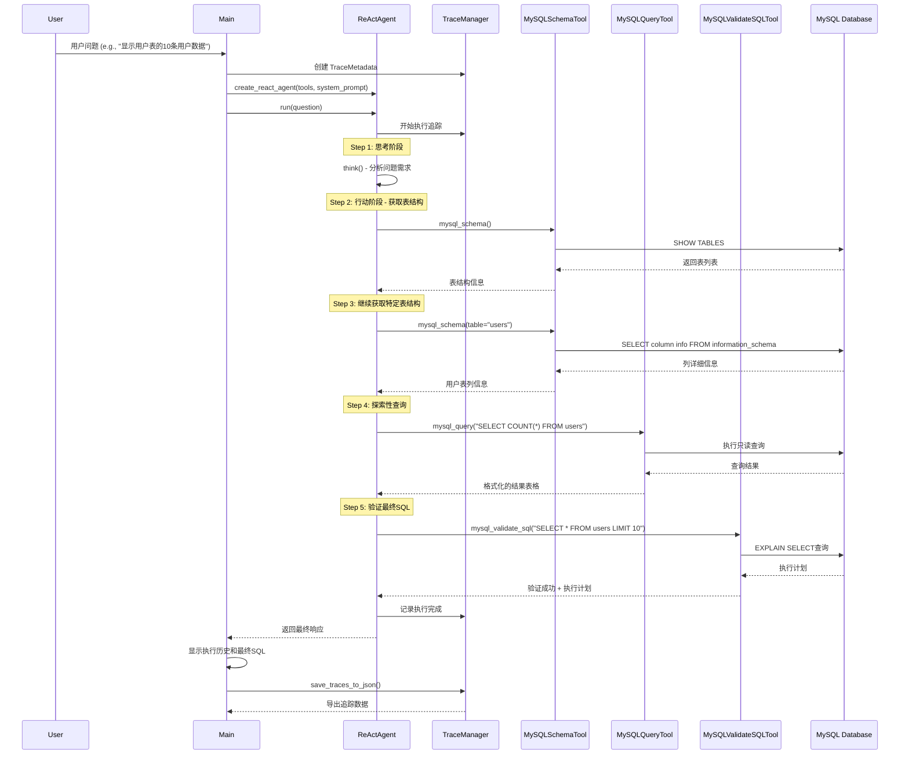
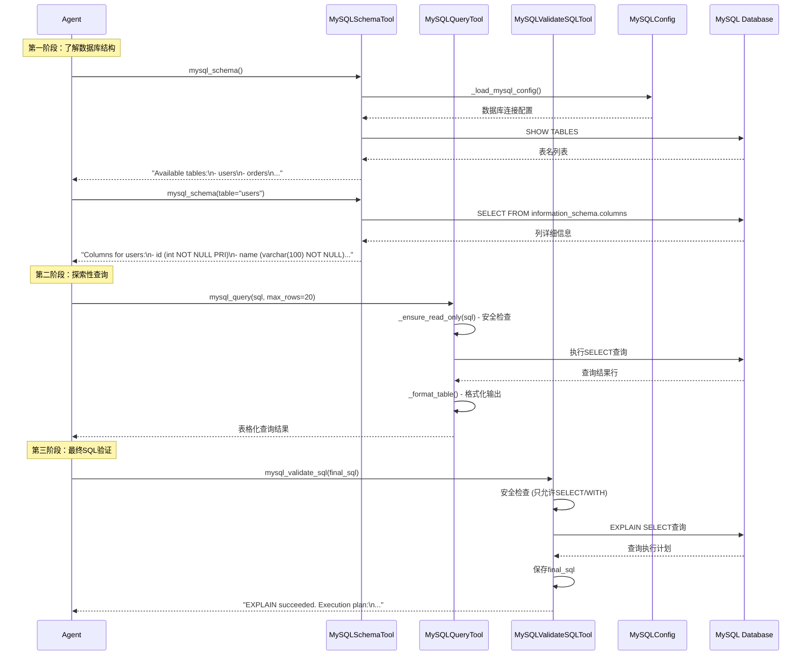
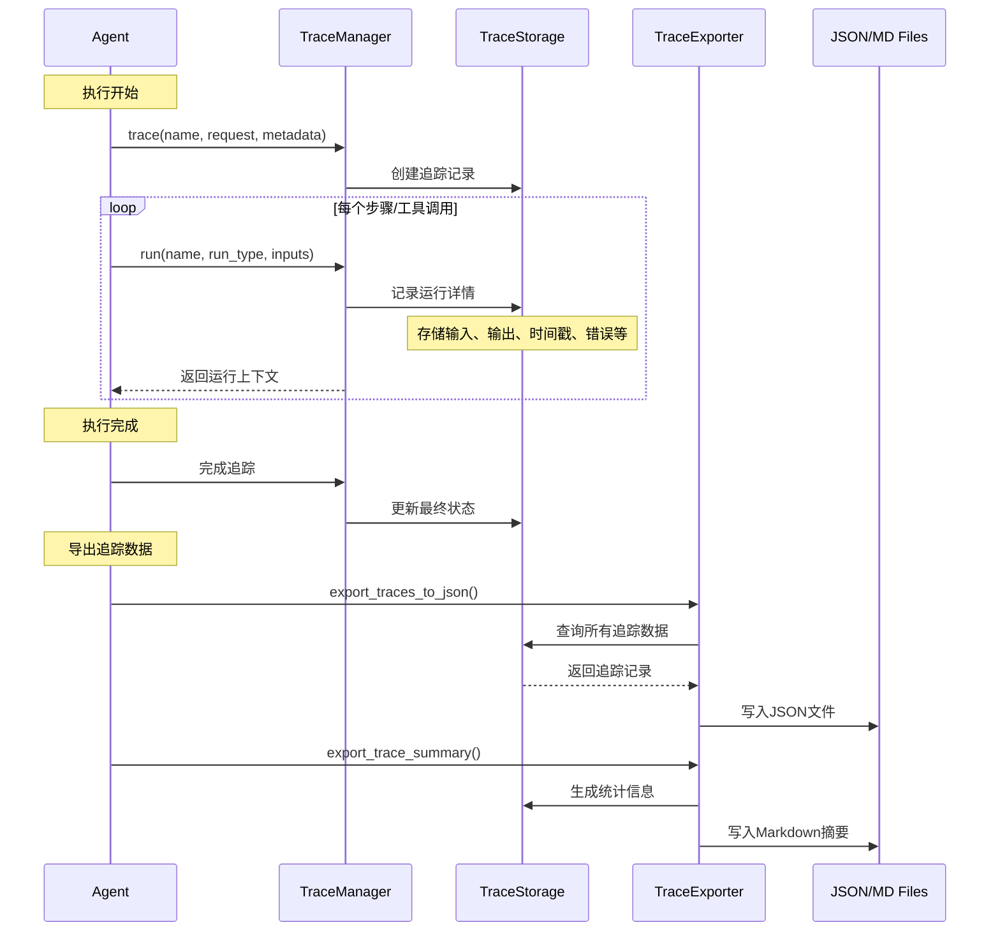
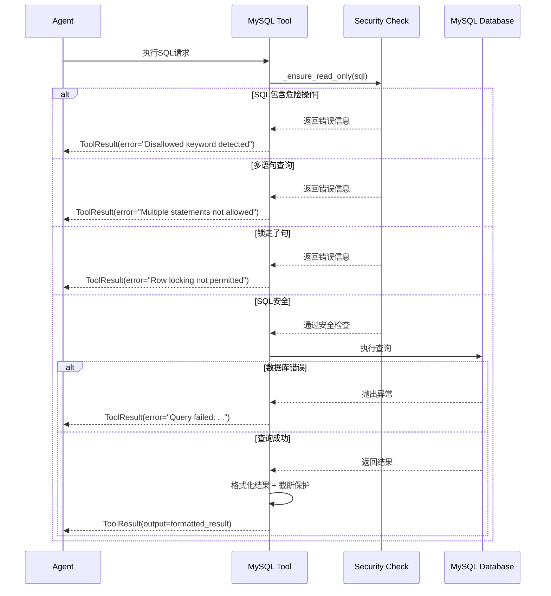

# MySQL Text-to-SQL Agent Execution Sequence Diagrams

本文档展示了 MySQL Text-to-SQL Agent 执行用户问题的完整流程序列图。

## 1. 完整执行流程



## 2. Agent内部ReAct循环详细流程

```mermaid
sequenceDiagram
    participant Agent as ReActAgent
    participant Memory
    participant LLM
    participant Tools as Tool System
    participant Trace as TraceManager

    loop 每个执行步骤 (max_steps=15)
        Agent->>Trace: 开始步骤追踪
        
        Note over Agent: Think Phase
        Agent->>Agent: think() - 决策是否需要行动
        Agent->>Memory: 获取对话历史
        Agent->>LLM: 发送思考提示
        LLM-->>Agent: 返回思考结果
        
        alt 需要使用工具
            Note over Agent: Act Phase
            Agent->>Agent: act() - 选择并执行工具
            Agent->>LLM: 发送工具调用请求
            LLM-->>Agent: 返回工具调用指令
            
            Agent->>Tools: 执行指定工具
            Tools->>Trace: 工具执行追踪
            Tools-->>Agent: 工具执行结果
            
            Agent->>Memory: 更新对话记录
        else 完成任务
            Agent->>Agent: 设置状态为FINISHED
            break
        end
        
        Agent->>Trace: 记录步骤完成
        
        alt 达到最大步数
            Agent->>Agent: 强制终止
            break
        end
    end
```

## 3. MySQL工具详细交互流程



## 4. 追踪系统记录流程



## 5. 错误处理和安全机制



## 主要特性说明

### 安全机制
- **只读限制**: 只允许 SELECT、SHOW、DESCRIBE、EXPLAIN、WITH 语句
- **关键词检测**: 阻止 INSERT、UPDATE、DELETE 等修改操作
- **多语句防护**: 不允许包含分号的多语句查询
- **锁定防护**: 禁止 FOR UPDATE/SHARE 子句

### 输出保护
- **行数限制**: 查询结果默认最多返回20行，最大200行
- **字符长度限制**: 输出超过2000字符时自动截断
- **EXPLAIN截断**: 执行计划输出超过1200字符时截断

### 追踪能力
- **完整记录**: 记录每个步骤、工具调用、思考过程
- **性能统计**: 计算执行时间、错误率等指标
- **多格式导出**: 支持JSON和Markdown格式的追踪数据导出

### ReAct模式
- **思考阶段**: Agent分析当前状态，决定下一步行动
- **行动阶段**: 根据需要调用相应的MySQL工具
- **循环执行**: 重复思考-行动循环直到任务完成或达到步数限制