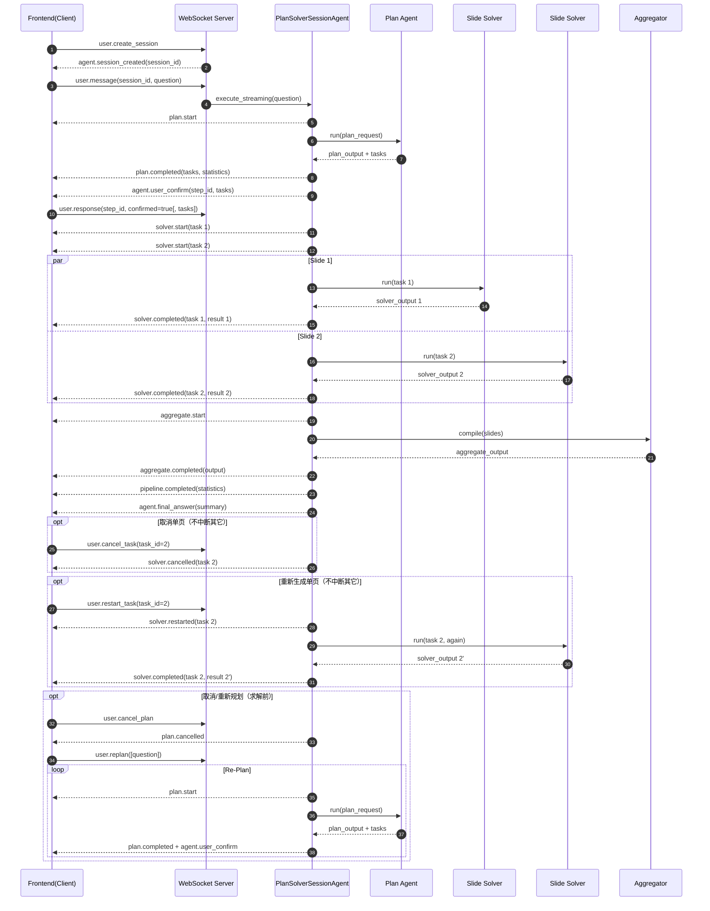

# WebSocket 消息对接说明（slide_agent_ws）

本文档面向前端接入，概述 slide_agent_ws 提供的 WebSocket 事件与交互流程。该服务实现的是“规划 → 并行求解 → 聚合”的多智能体流水线，并支持：
- 规划阶段确认/编辑
- 单页 PPT 的中断与重新生成（互不影响）
- 规划的取消与重新规划（限未开始求解前）

> 更完整的背景与扩展示例可参考仓库中的 docs/ws-server/plan_solver_messages.md。

---

## 1. 连接与会话

- 连接：`ws://<host>:<port>`
- 创建会话：
  ```json
  { "event": "user.create_session" }
  ```
- 服务端返回：
  ```json
  {
    "event": "agent.session_created",
    "session_id": "<sid>",
    "content": "Session created successfully",
    "metadata": { "agent_name": "plan_solve_data2ppt_ws", "connection_id": "..." },
    "timestamp": "..."
  }
  ```
- 提交问题（触发执行）：
  ```json
  { "event": "user.message", "session_id": "<sid>", "content": "请根据数据生成多页PPT" }
  ```

- 直接提交任务（跳过规划）：
  ```json
  {
    "event": "user.solve_tasks",
    "session_id": "<sid>",
    "content": {
      "tasks": [ { "id": 1, "title": "销售概览", "objective": "..." } ],
      "question": "可选，问题背景",
      "plan_summary": "可选，计划摘要标签"
    }
  }
  ```
  - 服务端不会发送 `plan.completed`、`aggregate.*`、`pipeline.completed`、`agent.final_answer`。仅推送每个任务的 `solver.start` 与 `solver.completed`。

> 如需取消整次执行，可发送：`{ "event": "user.cancel", "session_id": "<sid>" }`

---

## 2. 进度事件（概览）

- 规划阶段：
  - `plan.start` → `{ "question": "..." }`
  - `plan.completed` → `{ "tasks": [...], "plan_summary": "...", "statistics": { ... } }`
  - `agent.user_confirm`（scope=plan，附带 tasks）
  - 客户端使用 `user.response` 回复确认（详见 §3）
  - 取消规划时：`plan.cancelled`

- 求解阶段（并行，每页独立）：
  - `solver.start` → `{ "task": { ... } }`
  - `solver.completed` → `{ "task": { ... }, "result": { "output": {...}, "summary": "...", "agent_name": "...", "statistics": { ... } } }`
  - 单页取消：`solver.cancelled`
  - 单页重启：`solver.restarted`（随后会出现该页新的 `solver.start`/`solver.completed`）

- 直接任务模式：
  - 客户端通过 `user.solve_tasks` 提交任务后，不发送 `plan.completed`，直接按求解与聚合事件流推送结果。

- 聚合阶段：
  - `aggregate.start`
  - `aggregate.completed` → `{ "output": { "slides": [...], "ppt_result": { ... } } }`
  - `pipeline.completed`（统计汇总在 `statistics` 字段）
  - `agent.final_answer`

- 常见通用事件：
  - `agent.tool_call` / `agent.tool_result`：工具调用明细
  - `agent.error` / `system.error` / `agent.timeout` / `agent.interrupted`
  - `system.heartbeat`：心跳

---

## 3. 规划确认交互（可选）

当服务端要求规划确认时，在 `plan.completed` 之后会推送：

```json
{
  "event": "agent.user_confirm",
  "session_id": "<sid>",
  "step_id": "confirm_plan_xxxx",
  "content": "Confirm plan before solving",
  "metadata": {
    "requires_confirmation": true,
    "scope": "plan",
    "plan_summary": "...",
    "tasks": [ { "id": 1, "title": "...", "objective": "..." }, ... ]
  }
}
```

客户端需使用 `user.response` 回复，携带相同 `step_id`：

- 确认并沿用原任务：
  ```json
  { "event": "user.response", "session_id": "<sid>", "step_id": "confirm_plan_xxxx", "content": { "confirmed": true } }
  ```
- 确认并覆盖任务（数组结构需与原始任务一致）：
  ```json
  { "event": "user.response", "session_id": "<sid>", "step_id": "confirm_plan_xxxx", "content": { "confirmed": true, "tasks": [ { "id": 1, "title": "(修改)", "objective": "..." }, ... ] } }
  ```
- 拒绝：
  ```json
  { "event": "user.response", "session_id": "<sid>", "step_id": "confirm_plan_xxxx", "content": { "confirmed": false } }
  ```

超时或拒绝将结束本次执行（会有 `agent.final_answer` 提示）。

---

## 4. 细粒度控制（不影响其他页）

- 取消单页（中断某页正在执行的求解）：
  ```json
  { "event": "user.cancel_task", "session_id": "<sid>", "content": { "task_id": 2 } }
  ```
  - 服务端响应：`system.notice`（确认受理），随后该页推送 `solver.cancelled`。

- 重新生成单页（若正在执行则先取消后重启）：
  ```json
  { "event": "user.restart_task", "session_id": "<sid>", "content": { "task_id": 2 } }
  ```
  - 服务端响应：`system.notice`（确认受理），稍后看到该页新的 `solver.start` 与 `solver.completed`。

- 取消规划（规划运行中或等待确认时）：
  ```json
  { "event": "user.cancel_plan", "session_id": "<sid>" }
  ```
  - 服务端推送：`plan.cancelled`

- 重新规划（仅限未开始求解前）：
  ```json
  { "event": "user.replan", "session_id": "<sid>", "content": { "question": "可选，新问题" } }
  ```
  - 若允许，将重新进入 `plan.start` → `plan.completed` → 确认流程。

---

## 5. 数据结构（任务与结果）

- 任务（来自规划阶段，单个示例）：
  ```json
  {
    "id": 1,
    "title": "销售概览",
    "objective": "总结本季度销售表现",
    "insights": ["同比增长 12%"],
    "query_suggestions": ["SELECT region, sum(amount) ..."],
    "chart_hint": "bar",
    "notes": "聚焦前三大品类"
  }
  ```

- 求解结果（`solver.completed.result`）：
  ```json
  {
    "output": {
      "id": 1,
      "title": "销售概览",
      "text": "本季度销售额同比增长 12%...",
      "charts": [
        { "type": "bar", "title": "地区销售额对比", "data": [ {"name": "华东", "value": 540}, {"name": "华南", "value": 420} ] }
      ]
    },
    "summary": "Slide 1: 销售概览 draft ready.",
    "agent_name": "ppt_slide_solver_1",
    "statistics": { "total_calls": 2, "total_input_tokens": 684, "total_output_tokens": 412, "total_tokens": 1096 }
  }
  ```

- 聚合结果（`aggregate.completed.output`）：
  ```json
  {
    "slides": [ { "id": 1, "title": "...", "text": "...", "charts": [...] }, ... ],
    "ppt_result": { "output": "... PPT JSON generated ...", "system": "PPT generation completed with N slides" }
  }
  ```

---

## 6. 事件顺序示例

```
user.create_session
└─ agent.session_created (含 session_id)
user.message (带 session_id)
├─ plan.start
├─ plan.completed
├─ agent.user_confirm (scope=plan)
user.response (confirmed=true)
├─ solver.start (task 1)
├─ solver.completed (task 1)
├─ solver.start (task 2)
├─ solver.completed (task 2)
├─ aggregate.start
├─ aggregate.completed
├─ pipeline.completed
└─ agent.final_answer
```

含取消单页（示例）：
```
...（前同）
user.cancel_task (task_id=2)
├─ system.notice (ack)
└─ solver.cancelled (task 2)
```

---

## 7. 约定与注意事项

- 并发执行：多页可并行，取消/重启某页不影响其它页。
- 规划确认：未确认前不会进入求解；可在确认时替换 tasks 数组。
- 重新规划：仅在未开始求解前有效；一旦进入求解，将返回错误提示。
- 统计字段：`statistics` 结构用于展示 LLM 调用成本，可能因模型或实现差异而略有不同。

以上即为前端接入所需的关键事件与数据面向。若有需要可提供示例客户端或交互式测试脚本参数说明。

---

## 8. 消息时序图（Mermaid）

下图展示典型“规划→确认→并行求解→聚合”的完整消息与执行流程，并包含可选的取消/重启分支：


