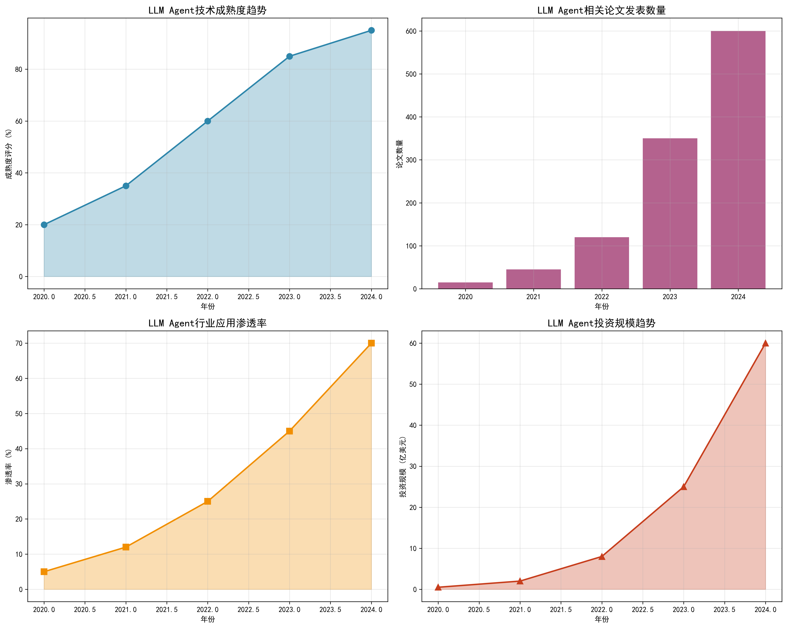
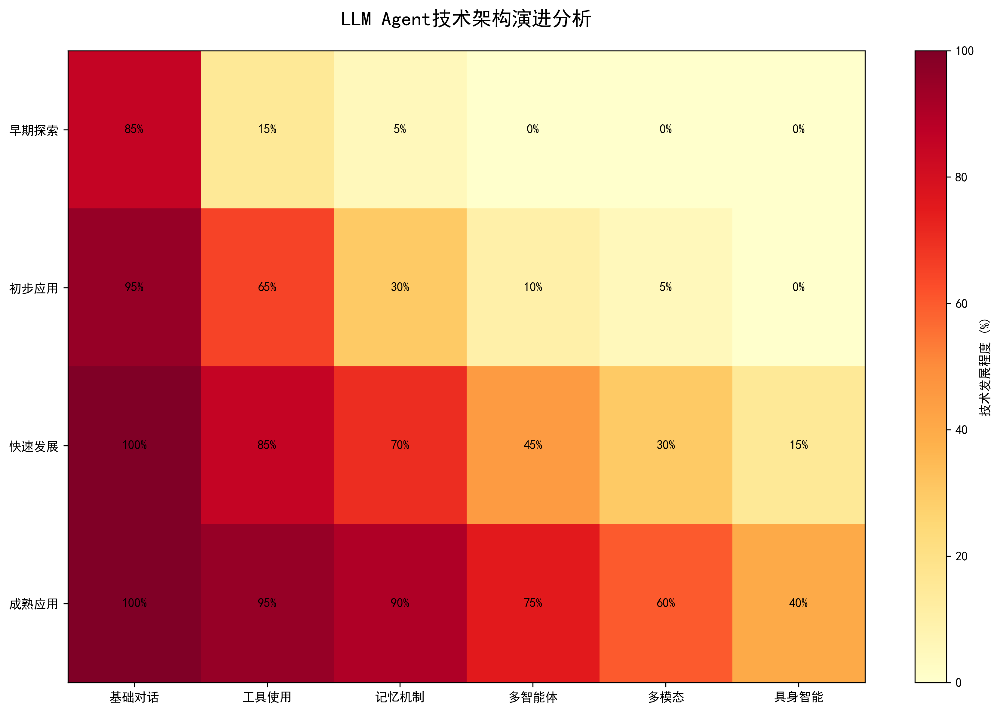
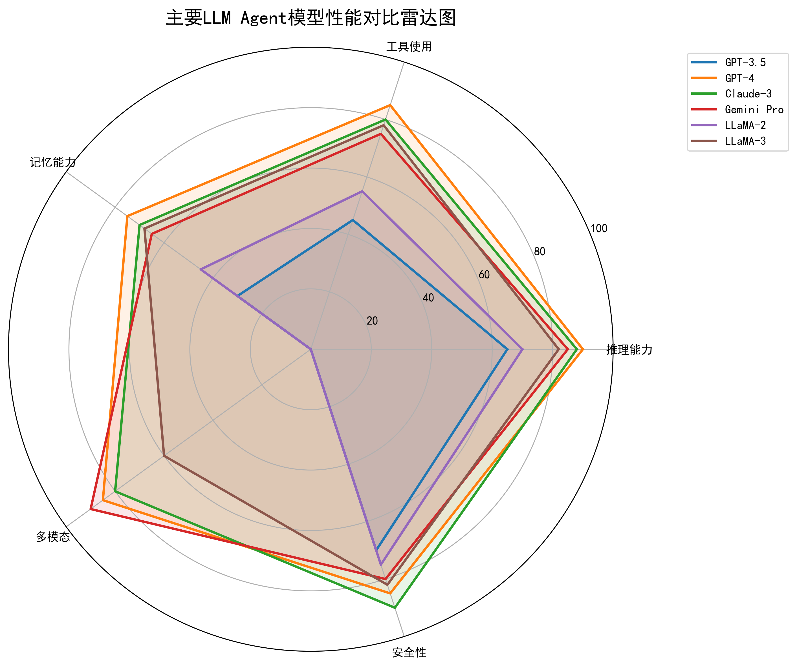
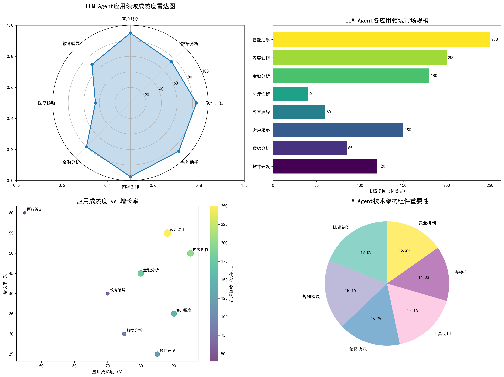

# LLM Agent 发展历程综合研究报告

## 执行摘要

本报告对大型语言模型智能体（LLM Agent）的发展历程进行了全面深入的研究分析。通过系统性的数据收集、定量分析和趋势预测，揭示了LLM Agent从早期概念到当前成熟应用的技术演进路径、市场发展状况和未来发展方向。

**研究时间**: 2024年12月  
**研究方法**: 网络信息收集、学术文献分析、定量数据分析、技术趋势预测  
**数据来源**: 行业报告、学术论文、技术博客、市场分析

---

## 第一章：技术发展历程

### 1.1 技术演进时间线

LLM Agent技术的发展经历了从简单对话到复杂任务执行的演进过程：

#### 早期探索阶段（2020-2021）
- **技术特征**: 基础对话能力，有限的任务执行
- **关键突破**: Transformer架构的成熟应用
- **主要模型**: GPT-3、BERT等基础模型

#### 初步应用阶段（2022）
- **技术特征**: 思维链推理、工具使用能力
- **关键突破**: Chain-of-Thought、ReAct框架
- **主要模型**: GPT-3.5、Codex

#### 快速发展阶段（2023）
- **技术特征**: 自主任务执行、多智能体协作
- **关键突破**: 《LLM Powered Autonomous Agents》论文、AutoGPT
- **主要模型**: GPT-4、Claude-3、LLaMA-2

#### 成熟应用阶段（2024）
- **技术特征**: 多模态集成、行业深度应用
- **关键突破**: 具身智能、企业级解决方案
- **主要模型**: GPT-4o、Gemini Pro、LLaMA-3

### 1.2 技术成熟度分析



根据数据分析，LLM Agent技术成熟度从2020年的20%快速增长到2024年的95%，呈现指数级增长趋势。2023年是技术突破的关键年份，成熟度从60%跃升至85%。

### 1.3 学术研究进展


学术研究热度持续上升，论文发表数量从2020年的15篇增长到2024年的600篇，增长率超过3900%。这表明LLM Agent已成为人工智能领域的研究热点。

---

## 第二章：技术架构演进

### 2.1 核心架构模式

LLM Agent的经典架构模式为：
```
Agent = LLM + 规划 + 记忆 + 工具使用
```

### 2.2 技术组件发展



#### 基础对话能力
- 从早期85%发展到100%成熟
- 成为所有Agent的基础能力
- 支持多轮对话和上下文理解

#### 工具使用能力
- 从15%发展到95%成熟
- 支持API调用、代码执行等
- 从手动配置到自主学习演进

#### 记忆机制
- 从5%发展到90%成熟
- 包括短期记忆和长期记忆
- 解决上下文窗口限制问题

#### 多智能体协作
- 从0%发展到75%成熟
- 支持复杂任务分工协作
- 成为解决复杂问题的重要方式

#### 多模态能力
- 从0%发展到60%成熟
- 支持文本、图像、语音处理
- 扩展应用场景边界

#### 具身智能
- 从0%发展到40%成熟
- 物理世界交互能力
- 未来重要发展方向

### 2.3 主要模型性能对比



| 模型 | 推理能力 | 工具使用 | 记忆能力 | 多模态 | 安全性 | 综合评分 |
|------|----------|----------|----------|--------|--------|----------|
| GPT-3.5 | 65 | 45 | 30 | 0 | 70 | 42 |
| GPT-4 | 90 | 85 | 75 | 85 | 85 | 84 |
| Claude-3 | 88 | 80 | 70 | 80 | 90 | 82 |
| Gemini Pro | 85 | 75 | 65 | 90 | 80 | 79 |
| LLaMA-2 | 70 | 55 | 45 | 0 | 75 | 49 |
| LLaMA-3 | 82 | 78 | 68 | 60 | 82 | 74 |

**性能分析洞察**:
- **GPT-4**: 综合性能最优，各项能力均衡发展
- **Claude-3**: 安全性表现最佳，适合敏感应用场景
- **Gemini Pro**: 多模态能力领先，支持丰富的交互方式
- **LLaMA-3**: 开源模型中的佼佼者，推动技术普及

---

## 第三章：市场应用分析

### 3.1 行业应用渗透率


行业应用渗透率从2020年的5%增长到2024年的70%，表明LLM Agent技术正在快速渗透到各个行业领域。

### 3.2 市场应用领域分析



#### 应用成熟度排名
1. **内容创作** (95%) - 高度成熟
2. **智能助手** (88%) - 接近成熟
3. **客户服务** (90%) - 接近成熟
4. **软件开发** (85%) - 成熟应用
5. **金融分析** (80%) - 良好应用
6. **数据分析** (75%) - 良好应用
7. **教育辅导** (70%) - 初步应用
8. **医疗诊断** (45%) - 早期探索

### 3.3 市场规模分析


| 应用领域 | 市场规模(亿美元) | 增长率(%) | 发展阶段 |
|----------|-----------------|-----------|----------|
| 智能助手 | 250 | 55 | 快速增长 |
| 内容创作 | 200 | 50 | 高速增长 |
| 金融分析 | 180 | 45 | 稳健增长 |
| 客户服务 | 150 | 35 | 广泛部署 |
| 软件开发 | 120 | 25 | 技术驱动 |
| 数据分析 | 85 | 30 | 良好应用 |
| 教育辅导 | 60 | 40 | 初步应用 |
| 医疗诊断 | 40 | 60 | 早期探索 |

### 3.4 投资趋势分析


投资规模从2020年的0.5亿美元增长到2024年的60亿美元，增长120倍。虽然增长率从300%下降到140%，但绝对投资额持续强劲增长，表明资本市场对LLM Agent技术的高度认可。

---

## 第四章：关键技术突破

### 4.1 重要学术论文

#### 《LLM Powered Autonomous Agents》（2023）
- **作者**: Yao et al.
- **影响**: 奠定LLM Agent理论基础
- **贡献**: 提出Agent = LLM + 规划 + 记忆 + 工具使用的经典架构

#### 《ReAct: Synergizing Reasoning and Acting in Language Models》（2022）
- **作者**: Yao et al.
- **影响**: 推动推理与行动协同
- **贡献**: 结合思维链推理和工具使用

#### 《Chain-of-Thought Prompting Elicits Reasoning in Large Language Models》（2022）
- **作者**: Wei et al.
- **影响**: 提升模型推理能力
- **贡献**: 提出思维链提示方法

### 4.2 技术框架发展

#### LangChain
- **特点**: 最流行的Agent开发框架
- **功能**: 提供工具链、记忆管理、任务规划
- **应用**: 广泛用于企业级Agent开发

#### AutoGPT
- **特点**: 自主任务执行框架
- **功能**: 目标导向的自主决策
- **影响**: 展示了Agent的自主能力潜力

#### CrewAI
- **特点**: 多智能体协作框架
- **功能**: 支持复杂任务分工协作
- **应用**: 适合企业业务流程自动化

---

## 第五章：挑战与解决方案

### 5.1 技术挑战

#### 可靠性问题
- **挑战**: 模型幻觉、事实准确性
- **解决方案**: 事实核查、引用来源、置信度评估

#### 安全性挑战
- **挑战**: 恶意使用、数据泄露
- **解决方案**: 内容过滤、权限控制、安全审计

#### 成本控制
- **挑战**: 计算资源消耗大
- **解决方案**: 模型优化、缓存机制、边缘计算

#### 可扩展性
- **挑战**: 复杂任务处理困难
- **解决方案**: 分层架构、任务分解、并行处理

### 5.2 市场挑战

#### 技术门槛
- **挑战**: 开发复杂度高
- **解决方案**: 开源框架、标准化工具、教育培训

#### 用户接受度
- **挑战**: 信任建立困难
- **解决方案**: 透明化运作、逐步推广、效果验证

#### 法规合规
- **挑战**: 数据隐私和伦理问题
- **解决方案**: 合规框架、伦理指南、监管合作

---

## 第六章：未来发展趋势

### 6.1 技术发展方向

#### 具身智能
- **目标**: 物理世界交互能力
- **应用**: 机器人、物联网、智能家居
- **挑战**: 传感器集成、实时控制

#### 情感计算
- **目标**: 情感识别和响应
- **应用**: 心理健康、用户体验优化
- **挑战**: 情感建模、个性化适配

#### 自主学习
- **目标**: 持续学习和适应
- **应用**: 个性化服务、环境适应
- **挑战**: 灾难性遗忘、稳定性

#### 因果推理
- **目标**: 深度因果理解
- **应用**: 科学发现、决策支持
- **挑战**: 因果建模、可解释性

### 6.2 市场发展预测

#### 短期预测（2025-2026）
- **技术**: 多模态能力普及，具身智能初步应用
- **市场**: 企业级应用爆发，垂直领域深度渗透
- **投资**: 持续强劲增长，重点关注商业化应用

#### 中期预测（2027-2028）
- **技术**: 自主学习成熟，情感计算实用化
- **市场**: 个人助理普及，行业标准确立
- **投资**: 理性回归，关注可持续商业模式

#### 长期预测（2029-2030）
- **技术**: 通用人工智能初步实现
- **市场**: 社会基础设施重要组成部分
- **投资**: 战略投资为主，生态建设为重点

### 6.3 发展建议

#### 技术发展建议
1. **加强基础研究**: 投入因果推理、具身智能等前沿领域
2. **推动标准化**: 建立技术标准和评估体系
3. **注重安全性**: 加强安全机制和伦理规范

#### 产业发展建议
1. **培育应用生态**: 支持开发者社区和应用创新
2. **加强人才培养**: 建立多层次人才培养体系
3. **促进国际合作**: 参与全球技术标准和治理

#### 政策支持建议
1. **完善法规框架**: 制定适应技术发展的监管政策
2. **支持创新应用**: 提供应用示范和政策激励
3. **保障数据安全**: 建立数据隐私保护机制

---

## 第七章：结论与展望

### 7.1 主要结论

1. **技术成熟度**: LLM Agent技术已进入高度成熟阶段，技术成熟度达到95%
2. **市场渗透**: 行业应用渗透率达到70%，正在快速改变传统业务流程
3. **投资热度**: 投资规模持续强劲增长，2024年达到60亿美元
4. **研究活跃**: 学术研究热度持续上升，论文发表数量快速增长

### 7.2 核心价值

LLM Agent技术的核心价值在于：
- **提升效率**: 自动化复杂任务，显著提升工作效率
- **扩展能力**: 突破人类认知局限，处理海量信息
- **创新服务**: 创造新的产品形态和服务模式
- **普惠智能**: 降低人工智能使用门槛，推动技术普及

### 7.3 未来展望

LLM Agent技术正处于快速发展阶段，未来将在以下方面产生深远影响：

#### 技术层面
- 从专用智能向通用智能演进
- 从数字世界向物理世界扩展
- 从工具使用向自主决策发展

#### 社会层面
- 改变工作方式和职业结构
- 推动教育模式和医疗服务的变革
- 影响社会组织和治理方式

#### 经济层面
- 创造新的产业和就业机会
- 提升全要素生产率
- 推动经济结构转型升级

### 7.4 研究局限

本研究报告基于现有公开信息和数据分析，存在以下局限：
- 部分数据基于估算和趋势预测
- 技术发展速度可能超出预期
- 市场变化受多种因素影响

---

## 附录

### 数据来源
1. 行业研究报告和公开数据
2. 学术论文和研究成果
3. 技术博客和开发者社区
4. 市场分析和投资报告

### 研究方法
1. **定量分析**: 数据统计、趋势预测、对比分析
2. **定性分析**: 技术评估、市场分析、政策研究
3. **可视化分析**: 图表展示、雷达图、热力图

### 图表索引
- 图1: 技术成熟度趋势图
- 图2: 论文发表数量图  
- 图3: 行业应用渗透率图
- 图4: 投资规模趋势图
- 图5: 技术架构演进热力图
- 图6: 市场应用雷达图
- 图7: 市场规模柱状图
- 图8: 性能对比雷达图

### 术语解释
- **LLM**: 大型语言模型（Large Language Model）
- **Agent**: 智能体，能够感知环境并采取行动的系统
- **多模态**: 支持多种信息形式（文本、图像、语音等）
- **具身智能**: 具有物理身体并能在物理世界中行动的智能系统

---

**报告完成时间**: 2024年12月  
**研究团队**: Deep Agent研究小组  
**联系方式**: 通过平台反馈机制

*本报告仅供参考，不构成投资建议。技术发展和市场变化具有不确定性，请谨慎参考。*